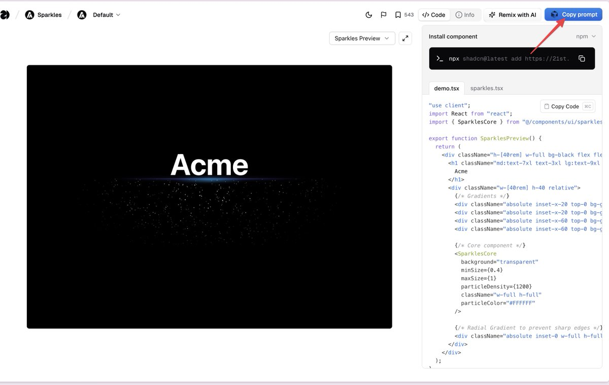

# 21st.dev 組件庫：用 Cursor 打造炫酷前端

> **來源**: [@Yangyixxxx](https://x.com/Yangyixxxx/status/1940599140045799443) | [原文連結](https://21st.dev/community/components)
>
> **日期**: 
>
> **標籤**: `UI 元件` `前端設計` `Cursor 工具`

---

★ Insight ─────────────────────────────────────
這篇文章展示了如何結合 AI 程式設計工具（Cursor/v0/lovable）與現成組件庫（21st.dev）來提升前端開發效率。核心思路是：使用 21st.dev 的高品質組件作為範本，透過 Cursor 等工具進行客製化調整，避免從零開始設計 UI 的困境。
─────────────────────────────────────────────────

> **來源**: [@Yangyixxxx (Yangyi)](https://x.com/Yangyixxxx)  
> **日期**: 2026-02-18  
> **標籤**: `前端開發` `UI組件` `Cursor` `AI工具` `21st.dev`

---

## 使用 21st.dev 組件庫優化 AI 生成的前端介面

用 Cursor/v0/lovable 做前端時，如果生成的介面不夠美觀，可以使用 **21st.dev** 組件庫來解決。

### 操作流程

1. 在 21st.dev 找到想要的效果（例如粒子特效）
2. 複製對應的 prompt
3. 將內容發給 Cursor，告訴它你要調整哪個部分的組件
4. 逐個優化，即可打造炫酷的前端介面

### 21st.dev 組件庫分類

**Marketing Blocks（行銷模組）**
- Backgrounds（背景）- 33 個
- Borders（邊框）- 12 個  
- Calls to Action（行動呼籲）- 34 個
- Clients（客戶展示）- 16 個
- Comparisons（比較表）- 6 個
- Docks（停靠欄）- 6 個
- Features（特色功能）- 36 個
- Footers（頁尾）- 14 個
- Heroes（首屏英雄區）- 73 個
- Hooks（吸引標語）- 31 個
- Images（圖片展示）- 26 個
- Maps（地圖）- 2 個
- Navigation Menus（導航選單）- 11 個
- Pricing Sections（定價區塊）- 17 個
- Scroll Areas（滾動區域）- 24 個
- Shaders（著色器特效）- 15 個
- Testimonials（見證推薦）- 15 個
- Texts（文字排版）- 58 個
- Videos（影片展示）- 9 個

**UI Components（介面組件）**
- Accordions（手風琴）- 40 個
- AI Chats（AI 聊天介面）- 30 個
- Alerts（警告提示）- 23 個
- Avatars（頭像）- 17 個
- Badges（徽章）- 25 個
- Buttons（按鈕）- 130 個
- Calendars（日曆）- 34 個
- Cards（卡片）- 79 個
- Carousels（輪播）- 16 個
- Checkboxes（核取方塊）- 19 個
- Date Pickers（日期選擇器）- 12 個
- Dialogs / Modals（對話框/模態視窗）- 37 個
- Dropdowns（下拉選單）- 25 個
- Empty States（空狀態）- 1 個
- File Trees（檔案樹）- 2 個
- File Uploads（檔案上傳）- 7 個
- Forms（表單）- 23 個
- Icons（圖示）- 10 個
- Inputs（輸入框）- 102 個
- Links（連結）- 13 個
- Menus（選單）- 18 個
- Notifications（通知）- 5 個
- Numbers（數字顯示）- 18 個
- Paginations（分頁）- 20 個
- Popovers（彈出提示）- 23 個
- Radio Groups（單選按鈕組）- 22 個
- Selects（選擇器）- 62 個
- Sidebars（側邊欄）- 10 個
- Sign Ins（登入頁）- 4 個
- Sign ups（註冊頁）- 4 個
- Sliders（滑桿）- 45 個
- Spinner Loaders（載入動畫）- 21 個
- Tables（表格）- 30 個
- Tabs（分頁標籤）- 38 個
- Tags（標籤）- 6 個
- Text Areas（文字區域）- 22 個
- Toasts（提示訊息）- 2 個
- Toggles（開關）- 12 個
- Tooltips（工具提示）- 28 個

### 平台特色

- **Magic Chat UI**：重新設計的聊天體驗介面
- **1Code**：Claude Code 和 Codex 的最佳 UI 介面
- **YC 支持**：獲得 Y Combinator 投資支持
- **社群驅動**：由社群貢獻的高品質 UI 組件庫
