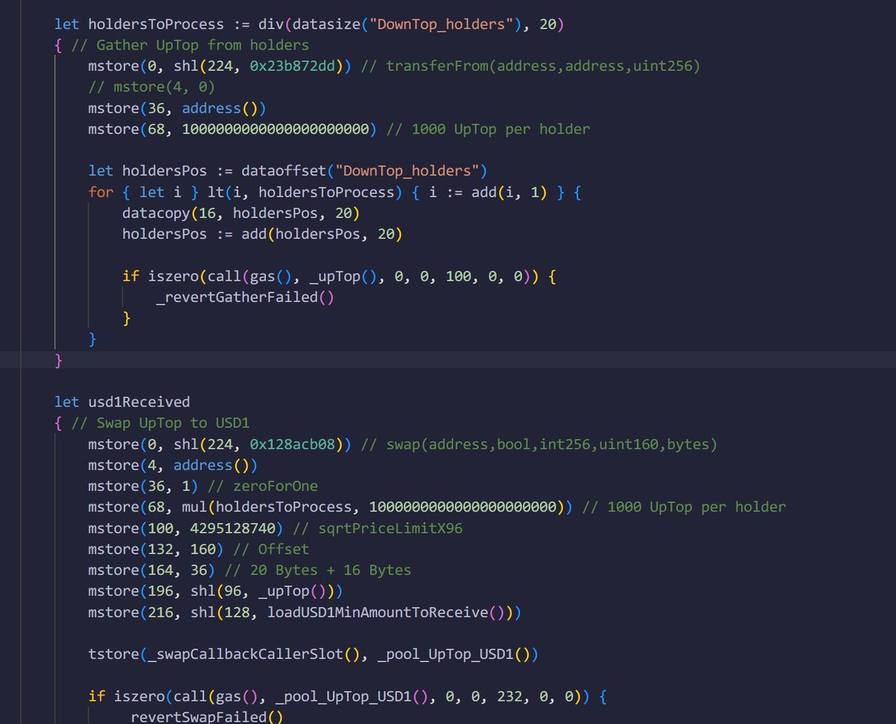

# Yul 純手工實現：1000 個號批量交易僅花 12937574 gas 的合約優化

> **來源**: [@CryptoNyaRu](https://x.com/CryptoNyaRu/status/1937103386522042703) | [原文連結](https://bscscan.com/tx/0x03975c906b85d18871c3b73be00cf99867f210dfe034213235eaff65ba30b2e3)
>
> **日期**: Mon Jun 23 11:00:11 +0000 2025
>
> **標籤**: `Yul` `Gas 優化` `智能合約`

---

> **來源**: [@CryptoNyaRu (加密猫雷)](https://twitter.com/CryptoNyaRu)  
> **日期**: 2026-02-18  
> **標籤**: `Solidity` `Yul` `Gas優化` `智能合約`

---

## 成果展示

作者成功將 1000 個帳號的歸集和賣出交易，僅花費 **12937574 gas**。

交易記錄：https://t.co/KS5UNiCZ5T

## 技術實現

### 核心特點

該合約採用**純 Yul 實現**，具備以下特色：

- **Holder 存儲優化**：將 holder 數據直接存儲至合約的 runtime bytecode 本身
- **極致 Gas 優化**：盡可能多地使用各種節省 gas 的技巧

### 開源資訊

合約已開源，歡迎交流學習：https://t.co/fyE9JaY6WR

## 作者寄語

致那些用腳本沒打進去，反過來想讓項目方燒我幣的人：

> 我砸完能把合約開源，而你沒打進去就要噁心打進去的，你看看你賤的吧  
> 不會就去學，沒人攔著你
