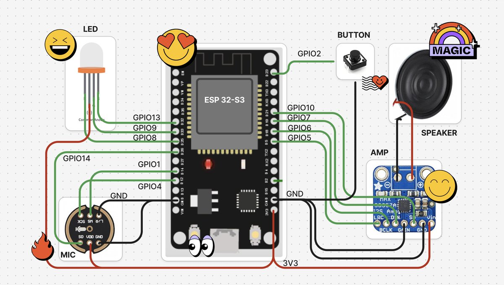

# ElatoAI：基於 ESP32 的實時語音 AI 代理系統

> **來源**: [@GitHub_Daily](https://x.com/GitHub_Daily/status/1915922659575271556) | [原文連結](https://github.com/akdeb/ElatoAI)
>
> **日期**: Sat Apr 26 00:15:32 +0000 2025
>
> **標籤**: `物聯網` `語音 AI` `開源硬體`

---



> **來源**: [@GitHub_Daily](https://twitter.com/GitHub_Daily/status/xxx)
> **日期**: 2025-01-XX
> **標籤**: `ESP32` `OpenAI-Realtime-API` `語音AI` `物聯網` `開源硬體`

---

## 專案簡介

想要讓玩具、公仔變得會說話、有情感，現有的方案要麼太貴太複雜，要麼就是需要一直連著手機，用起來特別不方便。

為了解決這些問題，GitHub 上開源專案 **ElatoAI** 給出了解決方案，基於 ESP32 微控制器和 OpenAI Realtime API 開發。它能讓你的玩具變成真正的 AI 夥伴，支援超過 15 分鐘的連續自然對話，語音識別和回應都非常流暢。

**專案地址**: https://github.com/akdeb/ElatoAI

**官網**: https://www.elatoai.com

## 主要功能

- **即時語音轉語音（Realtime Speech-to-Speech）**: 基於 OpenAI Realtime API、Gemini Live API、xAI Grok Voice Agent API、Eleven Labs Conversational AI Agents 和 Hume AI EVI-4，對話極其自然流暢
- **自訂 AI 角色（Create Custom AI Agents）**: 可以設定不同的性格和聲音
- **簡單硬體設計**: 只需一塊 ESP32-S3 開發板即可實現
- **安全通訊（Secure WebSockets）**: 使用加密 WebSocket 傳輸資料
- **全球低延遲**: 依靠 Deno Edge Functions 實現全球範圍內低於 2 秒的延遲
- **伺服器 VAD 轉換檢測（Server VAD Turn Detection）**: 智慧對話流程處理，確保互動流暢
- **Opus 音訊壓縮**: 高品質音訊串流，最小頻寬佔用
- **ESP32 Arduino 框架**: 優化且易於使用的硬體整合
- **對話歷史**: 查看你的對話歷史
- **裝置管理和身份驗證**: 註冊和管理你的裝置
- **使用者身份驗證**: 安全的使用者身份驗證和授權
- **WebRTC 和 WebSockets 對話**: 在 NextJS 網頁應用上使用 WebRTC 與 AI 對話，在 ESP32 上使用 WebSockets
- **音量控制**: 從 NextJS 網頁應用控制 ESP32 揚聲器的音量
- **即時轉錄（Realtime Transcripts）**: 你的對話即時轉錄儲存在 Supabase 資料庫中
- **OTA 更新（Over the Air Updates）**: ESP32 韌體的空中更新
- **Wifi 管理與強制入口（Captive Portal）**: 從 ESP32 裝置連接到你的 Wifi 網路或熱點
- **恢復出廠設定（Factory Reset）**: 從 NextJS 網頁應用恢復 ESP32 裝置的出廠設定
- **按鈕和觸控支援**: 使用按鈕或觸控感測器控制 ESP32 裝置
- **不需要 PSRAM**: ESP32 裝置不需要 PSRAM 即可執行語音轉語音 AI
- **網頁客戶端 OAuth**: OAuth 讓你的使用者管理他們的 AI 角色和裝置
- **音調因子（Pitch Factor）**: 從 NextJS 網頁應用控制 AI 語音的音調，創造卡通般的聲音
- **工具呼叫（Tool Calling）**: 從 ESP32 裝置呼叫工具和函式到 Deno Edge Functions，實現完整的語音 AI 代理
- **點按喚醒（Tap to Turn On）**: 點擊觸控板從睡眠狀態喚醒

## 專案架構

ElatoAI 由三個主要元件組成：

1. **前端客戶端（Frontend Client）**: Next.js，託管在 Vercel - 用於創建和與 AI 代理對話，並「發送」到 ESP32 裝置
2. **邊緣伺服器函式（Edge Server Functions）**: Deno 執行在 Deno/Supabase Edge - 處理來自 ESP32 裝置的 WebSocket 連接和 LLM Provider API 呼叫
3. **ESP32 物聯網客戶端（ESP32 IoT Client）**: PlatformIO/Arduino - 接收來自邊緣伺服器函式的 WebSocket 連接，並透過 Deno 邊緣伺服器將音訊發送到 LLM Provider

## 技術棧

| 元件 | 技術 |
|------|------|
| 前端 | Next.js, Vercel |
| 後端 | Supabase DB |
| 邊緣函式 | Deno Edge Functions (Deno/Supabase) |
| 物聯網客戶端 | PlatformIO, Arduino Framework, ESP32-S3 |
| 音訊編解碼器 | Opus |
| 通訊 | Secure WebSockets |
| 函式庫 | ArduinoJson, WebSockets, AsyncWebServer, ESP32_Button, Arduino Audio Tools, ArduinoLibOpus |

## 高階流程圖

```
使用者語音輸入 → ESP32 裝置 → [WebSocket] → Deno Edge Function
                                              ↓
                         ┌────────────────────┴────────────────────┐
                         ↓                    ↓                    ↓
                   OpenAI API          Gemini API            xAI API
                   Realtime API        Live API         Grok Voice Agent
                         ↓                    ↓                    ↓
                         └────────────────────┬────────────────────┘
                                              ↓
                 Deno Edge Function → [WebSocket] → ESP32 裝置
                                                         ↓
                                              AI 生成語音輸出
```

## 重要統計數據

- **延遲**: 全球往返延遲低於 2 秒
- **音訊品質**: Opus 編解碼器，12kbps（高清晰度），24kHz 採樣率
- **不間斷對話**: 全球範圍內最多 15 分鐘連續對話
- **全球可用性**: 透過邊緣運算優化

## 安全性

- 使用安全 WebSockets (WSS) 進行加密資料傳輸
- 可選：使用 256 位元 AES 進行 API 金鑰加密
- Supabase 資料庫用於安全身份驗證
- 所有資料表使用 Postgres RLS（Row Level Security）

## 限制

- 連接到邊緣伺服器時有 3-4 秒冷啟動時間
- 已測試最多 17 分鐘不間斷對話
- 超過時鐘時間時邊緣伺服器會停止
- ESP32 上無語音打斷檢測

## 快速開始

專案提供三種建置方式：

1. **使用 PlatformIO 建置**
2. **使用 Arduino IDE 建置**
3. **全球部署**

詳細步驟請參考專案 GitHub 頁面。

## 演示影片

- [OpenAI Demo](影片連結)
- [Gemini Demo](影片連結)
- [Eleven Labs Demo](影片連結)
- [Hume AI EVI-4 Demo](影片連結)

## 貢獻方向

專案歡迎以下方向的貢獻：

- ESP32 上的語音打斷檢測
- 新增 Arduino IDE 支援
- 新增 Hume API 客戶端進行情緒檢測
- 在 Deno Edge 上新增 MCP 支援
- 整合 Eleven Labs API 進行語音生成
- 新增 Azure OpenAI 支援（審核中）
- 新增 Cartesia 支援
- 新增 Amazon Nova 支援
- 新增 Deepgram 支援

## 授權

本專案採用 MIT 授權 - 詳見 LICENSE 檔案。

---

**專案統計**: ⭐ 1.4k stars | 🍴 159 forks | 👀 24 watching

該專案的前端、伺服器和韌體程式碼已開源，對 AI 玩具或 AI 伴侶等產品感興趣的開發者可以參考。硬體產品可參考 [ElatoAI Products](https://www.elatoai.com)。
