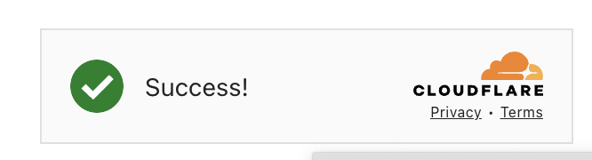

# 小刷子打碼服務 - 自建驗證碼解決方案

> **來源**: [@0xbrush_bots](https://x.com/0xbrush_bots/status/1912837119313322058) | [原文連結](https://github.com/Brush-Bot/brush-captcha)
>
> **日期**: 
>
> **標籤**: `驗證碼破解` `開源工具` `分布式架構`

---



> **來源**: [@0xbrush_bots (小刷子)](https://github.com/Brush-Bot/brush-captcha)
> **日期**: 2025-04-18
> **標籤**: `驗證碼` `自動化` `打碼服務` `Turnstile` `hCaptcha` `Camoufox`

---

## 專案概述

brush-captcha 是基於 Camoufox 指紋偽裝方案的自建打碼平台,包含前端頁面、後端 API 服務和分散式打碼客戶端,支援多實例並行運行。完全按照 Capsolver 介面實現,能完美相容小刷子 Capsolver 打碼。

## 為什麼需要自建打碼服務

### 打碼成本問題

驗證碼作為人機檢查手段,各種平台的「攔截器」讓使用者需要點擊按鈕或拖動圖片等操作。市場上的打碼平台(如 Capsolver、2Captcha)雖然能繞過驗證,但並非免費。

**成本計算範例**:
- 100 個帳號,每 24 小時打碼一次
- 按 Capsolver 平台單次單號費用計算
- 持續使用成本: $10-$20/天
- 遇到大量「領水」專案時成本更高

### 解決方案

開源自建服務讓打碼成本大幅降低,只需 99 元騰訊雲輕量伺服器即可一鍵啟動。

## 版本記錄

| 版本號 | 日期 | 更新內容 | 備註 |
|--------|------|----------|------|
| v1.1.0 | 2025-04-18 | 1. 使用靜態代理打碼,由 server 端統一排程<br>2. 增加 server 鑑權機制<br>3. 支援 hCaptcha(Gemini 打碼)<br>4. 最佳化 Turnstile 效能<br>5. 任務排程最佳化 | 關鍵功能升級 |
| v1.0.0 | - | 首個正式版本發布,僅支援 Turnstile 和動態 IP 打碼 | 初始穩定版本 |

## 驗證碼支援情況

| 驗證碼類型 | 支援狀態 | 說明 |
|-----------|---------|------|
| Turnstile | ✅ 支援 | - |
| hCaptcha | ✅ 支援 | 整合 QIN2DIM/hcaptcha-challenger,需 Gemini API Key(效能待最佳化) |
| ReCaptchaV2 | 🚧 計劃支援 | 當前僅支援 Turnstile |
| ReCaptchaV3 | 🚧 計劃支援 | 需模擬使用者行為,未整合 |
| FunCaptcha | ❌ 不支援 | 結構複雜,暫不支援 |
| Geetest | ❌ 不支援 | 無互動元件模擬邏輯 |
| ImageToText | ❌ 不支援 | 不處理純打碼圖片 |
| RotateCaptcha | ❌ 不支援 | 需模擬旋轉互動 |
| SlideCaptcha | ❌ 不支援 | 缺乏滑動行為模擬 |

## 專案結構

```
.
├── backend/              # Server:提供鑑權、任務排程與 WebSocket 服務
├── frontend/             # 管理頁面:React + Ant Design
├── client/               # 分散式打碼客戶端(基於 Camoufox)
├── docker-compose.yml
└── README.md
```

## 部署指南

### 環境準備

- Python 3.11+
- Node.js 20+
- Docker & Docker Compose
- Nginx(建議部署 SSL)
- Gemini API Key(如使用 hCaptcha)

### Server 端與前端頁面部署

1. **Clone 專案**
```bash
git clone https://github.com/Brush-Bot/brush-captcha.git
cd brush-captcha
```

2. **準備設定檔** (放入 `tmp/` 目錄)
   - `proxies.txt`: 代理 IP 列表,一行一條,支援多種格式(包括 `user:pass@ip:port`)
   - `user_keys.txt`: 使用者 Key 列表,可直接填寫 Gemini API Key
   - `*.crt / *.key / *.pem`: SSL 證書(支援自動拆分辨識)
   - `nginx.conf.template / nginx.ssl.template`: Nginx 模板

3. **產生自簽證書**(範例)
```bash
openssl req -x509 -newkey rsa:2048 -nodes \
  -keyout server.key -out server.crt -days 365 \
  -subj "/C=CN/ST=Beijing/L=Beijing/O=MyCompany/OU=Dev/CN=localhost"
```

4. **執行安裝指令碼**
```bash
bash install_server_and_frontend.sh
```

### Client 端部署

1. **設定檔案**
```bash
cd client
nano config.yaml
```

2. **設定範例**
```yaml
# 並行數設定(可選,不填則自動根據系統資源計算)
concurrency: null

# Camoufox 參數設定
camoufox:
  # 當前裝置支援的打碼類型,支援的類型 server 端才會分配任務
  solver_type:
    - HcaptchaCracker
    - AntiTurnstileTaskProxyLess
  # 無頭模式,預設開啟即可
  headless: "true"

worker:
  # 當前裝置名稱
  name: "test"
  # 後端 api 位址,替換 ip 和 port 即可
  # 如果沒有設定 ssl,協定頭改成 ws
  # 切記不能用 127.0.0.1 和 localhost
  wss_url: "wss://ip:8080/ws/worker/"
```

3. **啟動**
```bash
docker compose up -d
```

### 注意事項

- 映像檔較大,首次建置需耐心等待
- 請確保代理連通性(科學上網)
- 預設監控位址: `http://{ip}:8080`(預設帳號密碼均為 `admin`)

## 手動部署方式

### Backend 部署

```bash
cd backend
python -m venv .venv && source .venv/bin/activate
pip install -r requirements.txt
uvicorn main:app --host 0.0.0.0 --port 8000
```

或使用 Docker:
```bash
docker build -t brush-backend ./backend
docker run -d -p 8000:8000 brush-backend
```

### Frontend 部署

```bash
cd frontend
npm install
npm run build

# 本地預覽(可選)
npm install -g serve
serve -s dist -l 3000
```

推薦使用 Nginx 進行反向代理部署。

### Client 部署

```bash
cd client
python -m venv .venv && source .venv/bin/activate
pip install -r requirements.txt
python run_client.py
```

## Nginx 設定範例

```nginx
server {
    listen 8998 ssl;
    server_name yourdomain;
    
    ssl_certificate /path/to/server.crt;
    ssl_certificate_key /path/to/server.key;
    
    location / {
        root /path/to/frontend/dist;
        index index.html;
        try_files $uri /index.html;
    }
    
    location /api/ {
        proxy_pass http://127.0.0.1:8000/;
        proxy_http_version 1.1;
        proxy_set_header Host $host;
        proxy_set_header X-Real-IP $remote_addr;
    }
    
    location /ws/ {
        proxy_pass http://127.0.0.1:8000/;
        proxy_http_version 1.1;
        proxy_set_header Upgrade $http_upgrade;
        proxy_set_header Connection "upgrade";
    }
}
```

## 後續計劃

- ✅ 支援更多驗證碼類型(ReCaptcha、FunCaptcha)
- ⚙️ 引入打碼節點優先順序排程策略
- 📈 增加打碼成功率統計模組

## 專案資訊

- **GitHub**: https://github.com/Brush-Bot/brush-captcha
- **首版實作**: @web3anan123
- **支援**: 歡迎提交 Issues 或 PR
