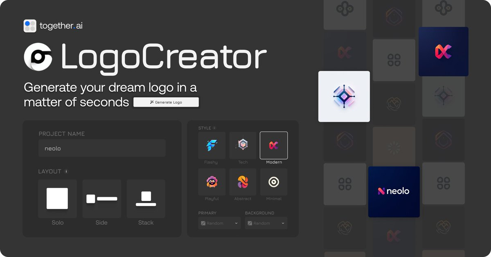

# LogoCreator：開源 AI Logo 生成器

> **來源**: [@GitHub_Daily](https://x.com/GitHub_Daily/status/1904141156189098141) | [原文連結](https://github.com/Nutlope/logocreator)
>
> **日期**: Mon Mar 24 12:00:03 +0000 2025
>
> **標籤**: `AI工具` `Logo設計` `開源專案`

---



> **來源**: [@GitHub_Daily (GitHubDaily)](https://twitter.com/GitHub_Daily)
> **日期**: 2026-02-18
> **標籤**: `AI` `Logo設計` `開源專案` `Flux` `Next.js`

---

## 專案簡介

LogoCreator 是一款開源的 AI Logo 生成器，使用 Flux Pro 1.1 模型能夠快速生成 Logo 圖標，並且支援編輯樣式。代碼完全開源，同時提供免費線上體驗。

**專案連結**：
- GitHub: https://github.com/Nutlope/logocreator
- 線上體驗: https://www.logo-creator.io/

## 技術架構

| 技術元件 | 用途 |
|---------|------|
| Flux Pro 1.1 on Together AI | Logo 生成 |
| Next.js + TypeScript | 應用程式框架 |
| Shadcn + Tailwind | UI 元件與樣式 |
| Upstash Redis | 速率限制 |
| Clerk | 身份驗證 |
| Plausible & Helicone | 分析與可觀測性 |

## 快速開始

### 複製並執行

```bash
# 複製專案
git clone https://github.com/Nutlope/logocreator

# 建立 .env 檔案並加入 Together AI API key
TOGETHER_API_KEY=

# 安裝依賴並本地執行
npm install
npm run dev
```

## 未來開發計劃

專案規劃中的功能包括：

- **使用者儀表板**：顯示使用者的 Logo 歷史記錄
- **SVG 匯出**：支援 SVG 格式匯出（目前僅支援 PNG）
- **更多樣式**：新增更多 Logo 風格選項
- **尺寸選擇**：新增圖片尺寸下拉選單（最高支援 1440x1440）
- **價格顯示**：使用自己的 Together AI key 時顯示大約費用
- **參考圖片上傳**：允許上傳參考 Logo（使用視覺模型讀取）
- **品牌重設計展示**：用 Logo 生成器重新設計知名品牌 Logo 並展示

## 專案數據

- ⭐ Stars: 6.2k
- 🔀 Forks: 586
- 👀 Watchers: 31
- 💻 語言構成: TypeScript 96.7%, CSS 2.9%, JavaScript 0.4%
