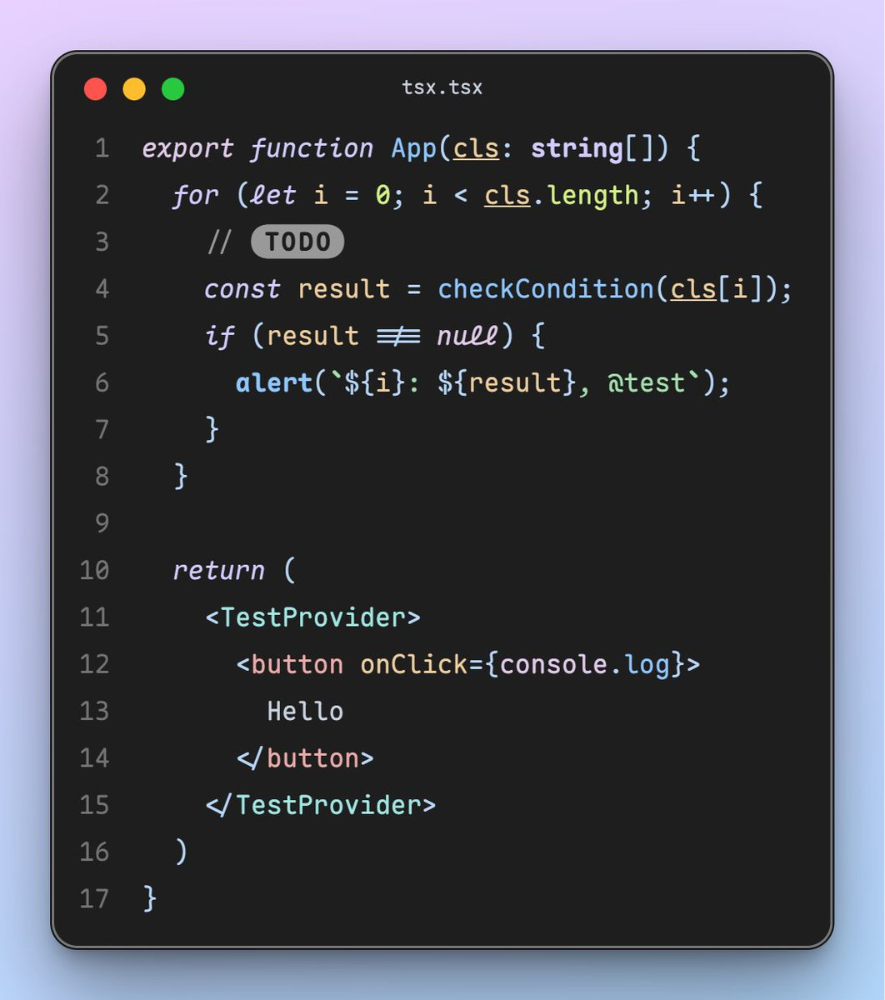

# Maple Mono：完美對齊的編程字體

> **來源**: [@nishuang](https://x.com/nishuang/status/1903675225901772930) | [原文連結](https://twitter.com/nishuang/status/1903675225901772930/photo/1)
>
> **日期**: Sun Mar 23 05:08:37 +0000 2025
>
> **標籤**: `編程字體` `設計工具` `開發環境`

---

> **來源**: [@nishuang (倪爽)](https://twitter.com/nishuang)
> **日期**: 2025-02-18
> **標籤**: `字體` `編程工具` `設計`

---

## 字體特色

Maple Mono 是目前最漂亮的編程字體/等寬字體之一,具備以下特點:

- **中英文 2:1 完美對齊** - 中文字符寬度剛好是英文的兩倍,排版整齊美觀
- **多種連字符** - 類似 Fira Code 的連字符支持,將多個字符組合成單一符號(如 `=>` `!=` `>=`)
- **斜體花體字** - 斜體字以 script font/花體字形式顯示,增加視覺層次
- **柔和圓角設計** - 字體採用圓角處理,長時間閱讀更舒適

## 下載資訊

官方下載地址: https://t.co/D1cmMQ2V1z
