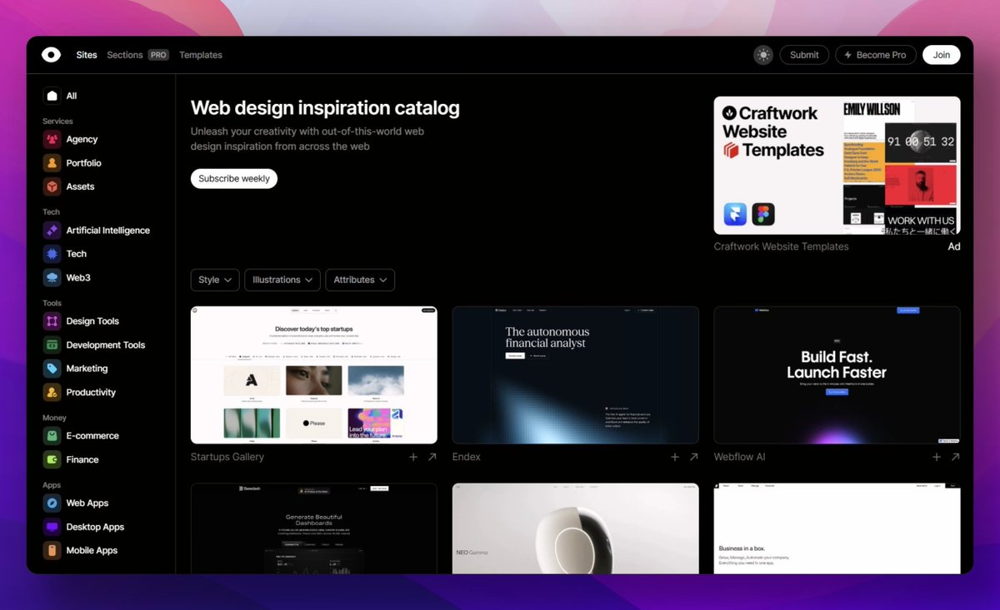

# 現代化網頁設計靈感站點集合

> **來源**: [@hellokaton](https://x.com/hellokaton/status/1901235981581430843) | [原文連結](https://craftwork.design/curated/websites/)
>
> **日期**: Sun Mar 16 11:35:55 +0000 2025
>
> **標籤**: `UI設計` `網頁設計` `設計資源`

---

> **來源**: [@hellokaton](https://twitter.com/hellokaton)  
> **日期**: 2026-02-18  
> **標籤**: `網頁設計` `設計靈感` `UI/UX` `工具集`

---

## 現代化網頁設計靈感站點

以下是精選的現代化網頁設計靈感站點集合：

### 綜合設計靈感平台

- **Godly** - 最佳的網頁設計靈感來源
- **Lapa Ninja** - 全領域篩選的設計靈感庫
- **SaaS Pages** - SaaS 相關的網頁設計案例
- **Landingfolio** - 精心挑選的落地頁（Landing Page）設計
- **Mobbin** - 最大的 UI/UX 參考資料庫
- **Dark Mode Design** - 暗色模式設計靈感站點

### Craftwork 設計資源平台

Craftwork 是一個綜合性的設計資源平台，提供多種類型的設計素材：

**設計資源類別**：
- 插圖（Illustrations）
- 3D 素材（3D Assets）
- Framer 範本
- Webflow 範本
- 程式碼範本（Coded Templates）
- Figma 範本
- UX/UI 工具組（UI Kits）
- 模型圖（Mockups）
- 字體（Fonts）
- 圖形素材（Graphics）
- 圖示（Icons）
- Notion 範本
- 簡報範本（Presentations）
- 教學資源（Tutorials）
- 免費資源（Freebies）

**服務分類**：
- 代理商（Agency）
- 作品集（Portfolio）
- 技術（Tech）
- Web3 技術
- 人工智慧工具
- 行銷
- 設計工具
- 開發工具
- 金融（Money）
- 電子商務（E-commerce）
- 生產力工具（Apps）

**訂閱方案**：
- Pro 訂閱：每月 $16 起，可存取不斷增長的獨立螢幕截圖庫和設計資源
