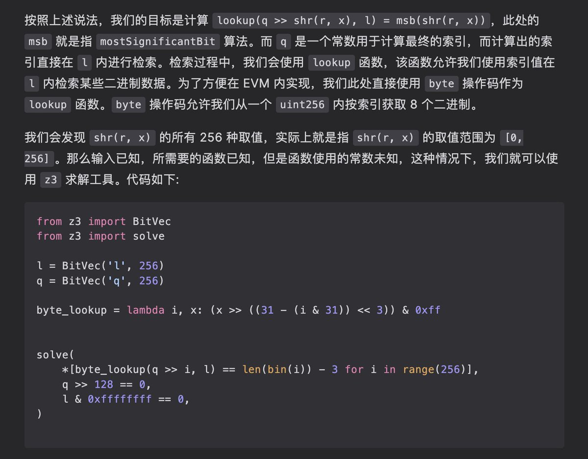

# Uniswap V4 中的 LibBit 二進制操作深度分析

> **來源**: [@wong_ssh](https://x.com/wong_ssh/status/1878452926865457303) | [原文連結](https://twitter.com/wong_ssh/status/1878452926865457303/photo/1)
>
> **日期**: Sun Jan 12 14:44:12 +0000 2025
>
> **標籤**: `智能合約` `二進制操作` `Solidity`

---

> **來源**: [@wong_ssh (WongSSH)](https://twitter.com/wong_ssh)
> **日期**: 2026-02-18
> **標籤**: `Uniswap V4` `Solidity` `二進制操作` `LibBit` `智能合約`

---

## 概述

Uniswap V4 使用了 solady 提供的 LibBit 庫，這是一個充滿了 magic number 的關於二進制數據的庫。作者花了大概十幾個小時分析了這個庫內的 msb（最高有效位）和 lsb（最低有效位）函數。

## 學習建議

非常建議讀者使用紙和筆進行一些推算，以更好地理解這些二進制操作的原理和實現細節。

## 相關資源

- 作者感謝 @optimizoor 的交流討論
- 詳細分析文章連結：https://t.co/HQfwE24S3H
