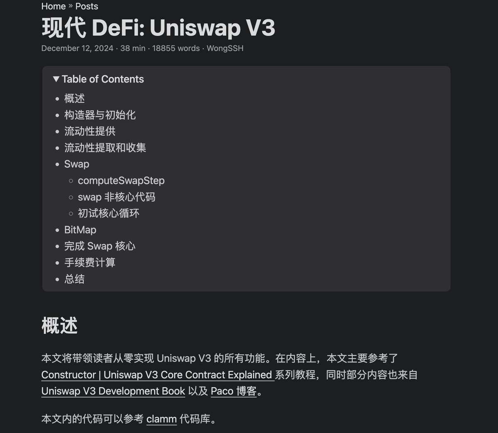

# Uniswap V3 代碼分析與數學推導

> **來源**: [@wong_ssh](https://x.com/wong_ssh/status/1870792535075172801) | [原文連結](https://twitter.com/wong_ssh/status/1870792535075172801/photo/1)
>
> **日期**: Sun Dec 22 11:24:32 +0000 2024
>
> **標籤**: `智能合約` `Uniswap V3` `DeFi開發`

---

> **來源**: [@wong_ssh (WongSSH)](https://twitter.com/wong_ssh)
> **日期**: 2026-02-18
> **標籤**: `Uniswap V3` `智能合約` `DeFi` `數學推導` `代碼分析`

---

## 文章簡介

終於寫完了 Uniswap V3 的代碼分析文章，該文章主要內容其實來自 @ProgrammerSmart 的 Uniswap V3 的系列教程視頻，這些視頻的優點是完整的數學推導 + 逐行實現的代碼。

文章的部分內容也參考 Uniswap V3 Book 之類的內容。特別感謝 @jeffishjeff 和我的討論推動我更進一步理解 V3。

## 相關資源

- 原文連結：https://t.co/2bccISW3ma
- 參考來源：
  - @ProgrammerSmart 的 Uniswap V3 系列教程視頻
  - Uniswap V3 Book

## 核心特點

文章涵蓋以下內容：
- **完整的數學推導**：詳細解析 Uniswap V3 的數學原理
- **逐行代碼實現**：深入分析智能合約的具體實現細節
- **理論與實踐結合**：從數學模型到實際代碼的完整鏈路
