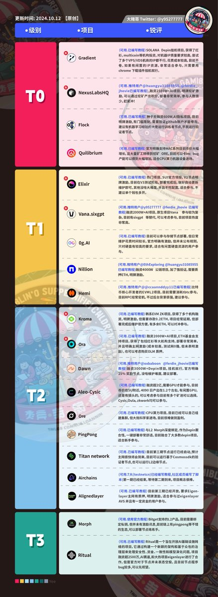

# 節點部署基礎教程——一鍵腳本命令解析

> **來源**: [@Nazarick_eth](https://x.com/Nazarick_eth/status/1865964441398808853) | [原文連結](https://twitter.com/Nazarick_eth/status/1865964441398808853/photo/1)
>
> **日期**: Mon Dec 09 03:39:25 +0000 2024
>
> **標籤**: `節點部署` `DePin` `VPS`

---

> **來源**: [@Nazarick_eth (安兹大人 🦅)](https://twitter.com/Nazarick_eth)
> **日期**: 2026-02-18
> **標籤**: `DePin` `節點部署` `VPS` `一鍵腳本`

---

## 教學說明

節點的基礎教程來了。

為新人解決看一鍵部署腳本的命令不知所措的問題。

這幾天我持續更新一些部署節點的專案。正兒八經的節點專案推薦可以看大賭哥的圖。

最近很多人都拿 VPS 掛 DePin 專案,也是可行的。

## 相關資源

- 節點專案推薦:參考大賭哥的推薦圖
- 部署方式:使用 VPS 執行一鍵腳本
- 專案類型:DePin 節點挖礦專案
