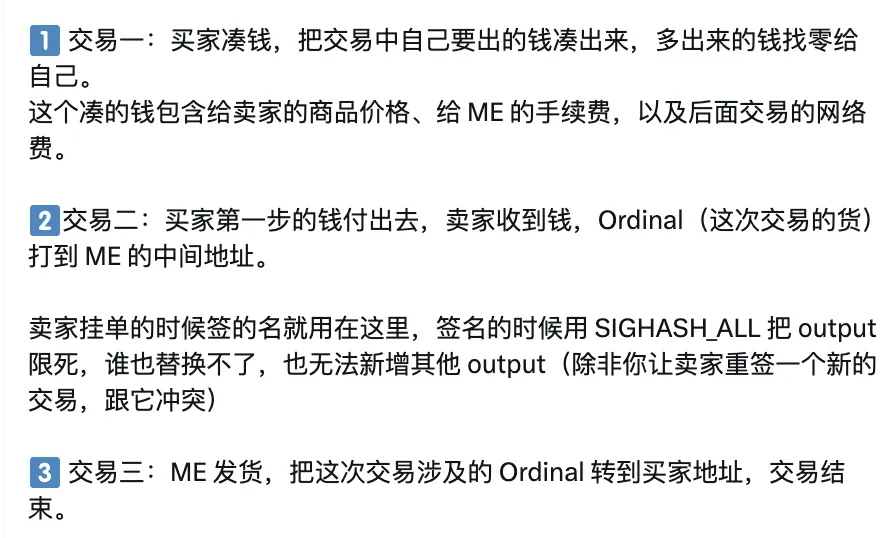
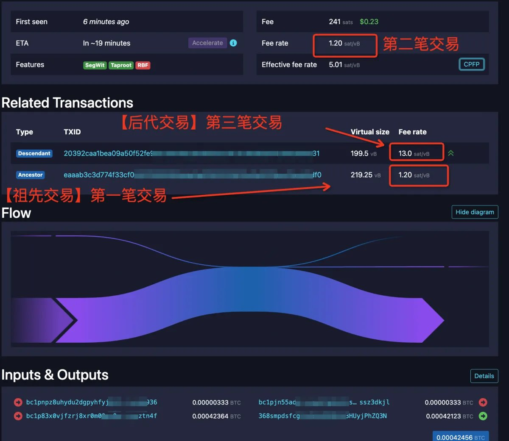
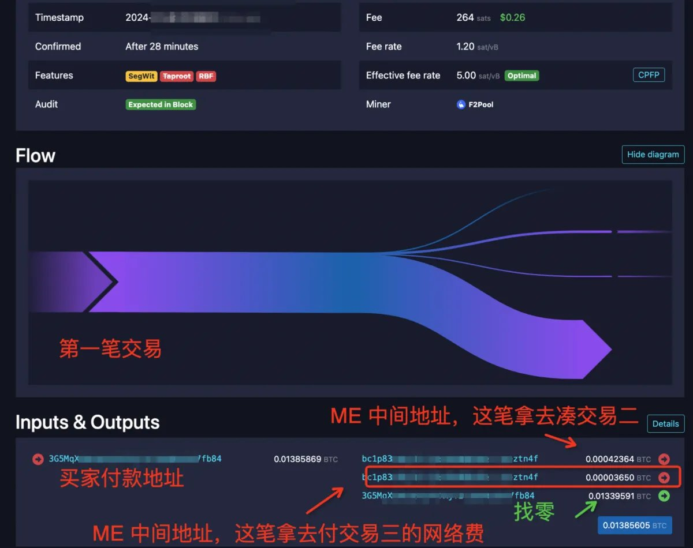
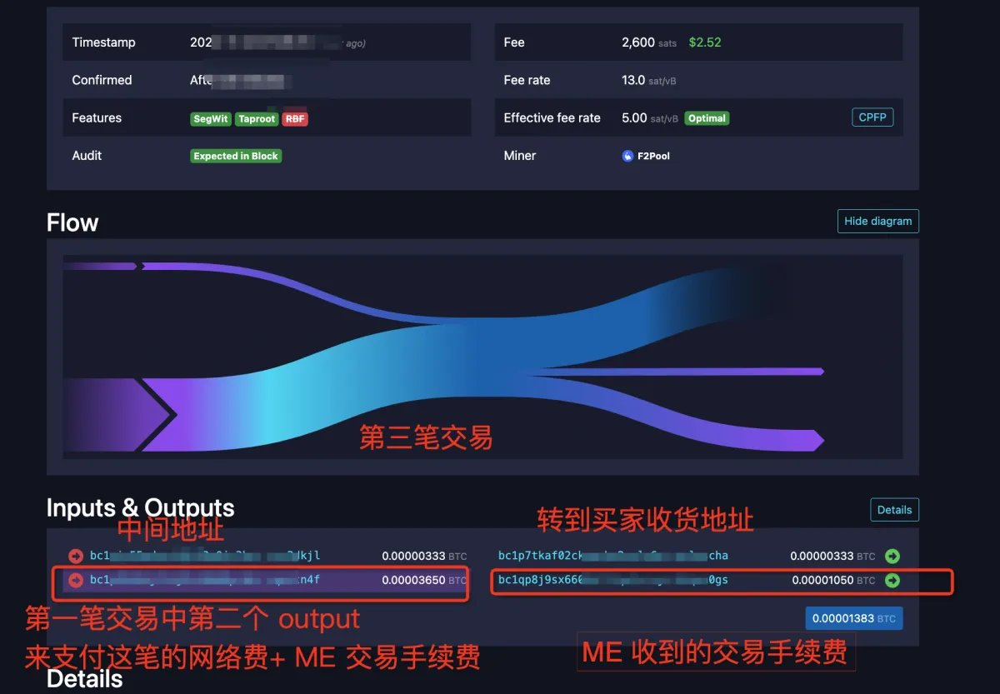
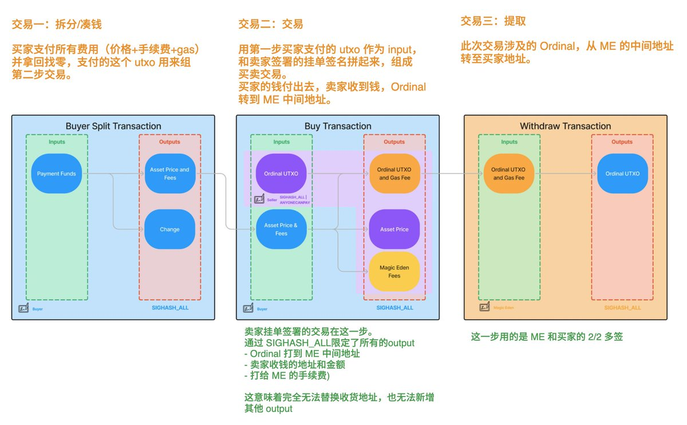
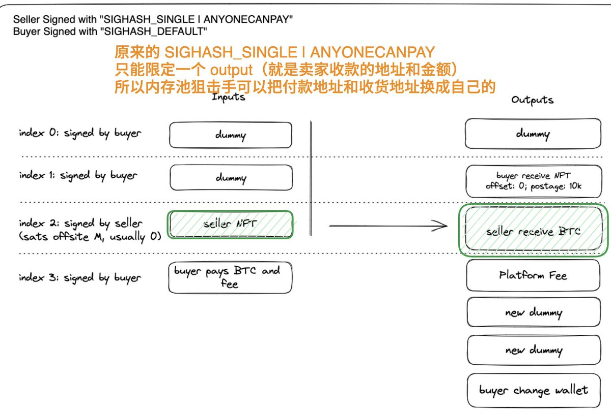

# Magic Eden 費率機制與 CPFP 加速原理解析

> **來源**: [@lilyanna_btc](https://x.com/lilyanna_btc/status/1862795119931617397)
>
> **日期**: Sat Nov 30 09:45:40 +0000 2024
>
> **標籤**: `比特幣交易` `序數市場` `交易費率`

---








> **來源**: [@lilyanna_btc](https://twitter.com/lilyanna_btc)  
> **日期**: 2025-02-18  
> **標籤**: `Bitcoin` `Magic Eden` `CPFP` `交易機制` `費率優化`

---

## 問題：為什麼 Magic Eden 選擇的費率與實際簽名費率不同？

在 Magic Eden 上購買時，明明選擇的是 6 sats/vB 的費率，為什麼錢包簽名時卻顯示只有 1.2 sats/vB？購買完成後查看內存池，費率也只有 1.2，是否會永遠無法上鏈？該如何加速？

**答案：不要慌，不要急著加速！**

## ME 的防狙擊交易機制

Magic Eden 的防狙擊交易機制將整個購買流程分為 **3 筆交易**：

1. **買家湊錢**
2. **錢貨交換到中間地址**
3. **發貨給買家**

作為買家，在下單時錢包裡待簽名、顯示 1.2 費率的交易，其實是 **交易一**。

## CPFP 費率加速機制

ME 在構建交易時採用了差異化費率策略：

- **交易一和交易二**：採用默認的 1.2 sats/vB 費率
- **交易三**：採用更高的費率，通過 **CPFP（Child Pays For Parent）** 進行加速

這樣可以將整串 3 筆交易的平均費率調整到你選擇的目標費率。

## 為什麼要設置費率差異？

### 避免交易分離風險

這三筆交易存在前後依賴關係，必須依次廣播。大多數情況下時間差幾乎無感知，會同時進入內存池。

但在極端情況下，如果：
- 第一筆和第二筆廣播成功
- 第三筆還在等待廣播

若三筆交易都直接使用目標費率，可能導致：
- 前兩筆已經被打包上鏈
- 第三筆還未上鏈
- **購買流程被分開**（買家錢付了，貨還在中間地址）

### 保護機制

前兩筆採用較低費率（1.2 sats/vB），可以保證：
- 只要第三筆交易未成功廣播，前兩筆無法獨立被打包上鏈
- 1.2 的費率幾乎不可能上鏈（2 以下的區塊非常少見）
- 只有第三筆交易進入內存池，將費率提升至目標費率後，三筆交易才會集體被打包

## 為什麼選擇 1.2 這個特殊值？

比特幣有 **relay fee（中繼費用）** 的最小值限制：
- 低於 1 sats/vB 的交易無法廣播到內存池
- ME 基本上選擇了可行範圍內接近最小值的數值

## ⚠️ 警告：不要手動加速 1.2 費率的交易！

如果你通過第三方加速服務 RBF 了 1.2 這個交易：
- txid 會改變
- 很可能導致後續交易全部失效無法廣播
- 最終購買失敗

**千萬不要著急加速，很可能適得其反！**

---

## 附錄：ME 全內存池保護（TMP）科普

### 一、內存池狙擊是什麼？

#### 傳統 PSBT 簽名的漏洞

大部分 Ordinals 和 Runes 交易市場，賣家掛單時使用的 PSBT 簽名類型是：
```
SIGHASH_SINGLE | ANYONECANPAY
```

這種簽名類型只能約束一個 output（確保賣家能收到約定的錢），具體來說：
- 賣家簽名時只限定了要賣的東西（input 裡自己的 ordinal）
- 限定了要收到的金額（一個收款地址為賣家的、固定金額的 output）
- **但是誰付錢、ordinal 打給誰，都沒有約束**

#### 狙擊原理

一旦購買交易進入內存池：
1. 狙擊手解析出簽名
2. 給更高的費率
3. 將付款人和收貨人替換為自己
4. 讓礦工選擇打包這筆高費率的交易，拋棄原買家的交易

因為 input 能換、output 裡的收貨地址也能換，只要有利可圖，狙擊手就會出手。

### 二、ME 的全內存池保護（Total Mempool Protection, TMP）原理

#### 核心改變

**拋棄了導致內存池狙擊的罪魁禍首 `SIGHASH_SINGLE | ANYONECANPAY`**，新流程全部使用 `SIGHASH_ALL`。

**一句話概括**：收貨地址定死了，你可以搶著替原買家付錢，但收貨地址換不了，即使換成你付錢，貨也不會到你手裡。

#### 新的購買流程三步驟

**1️⃣ 交易一：買家湊錢**
- 把交易中自己要出的錢湊出來
- 多出來的錢找零給自己
- 這筆錢包含：賣家的商品價格 + ME 的手續費 + 後續交易的網路費

**2️⃣ 交易二：錢貨交換**
- 買家第一步的錢付出去
- 賣家收到錢
- Ordinal（貨）打到 ME 的中間地址
- 賣家掛單時簽的名用在這裡，使用 `SIGHASH_ALL` 將 output 限死
- 誰也替換不了，也無法新增其他 output

**3️⃣ 交易三：ME 發貨**
- 把 Ordinal 轉到買家地址
- 交易結束
- 這一步是 ME 和買家的 2/2 雙簽
- 在買家發起交易流程時，ME 就會先給出自己那部分的簽名（避免中心化作惡風險）

### 三、什麼時候能用上？

ME 表示 TMP 將在近期上線，上線後：
- 可以用 TMP 方式購買的 Ordinal，將在列表中用**盾牌**標識
- 賣家掛單的簽名方式已經改變，為功能上線做準備
- 舊的掛單簽名無法直接切換到 TMP 方式交易

### 常見問題

#### 1. 為什麼要先進行第一步（買家支付費用，拿回找零）？直接在第二步交易找零不行嗎？

不可以。因為第二步的賣家掛單簽名時用 `SIGHASH_ALL` 對所有 output 做了約束，因此無法再增加找零的 output。

#### 2. 為什麼要多一個提取的第三步？第二步直接 Ordinal 打給買家不就好了？

賣家簽名的時候還不知道買家是誰，但需要提前確定收貨地址（因為要用 `SIGHASH_ALL`，而不是 `SIGHASH_SINGLE`），所以引入一個 ME 的中間地址來構造簽名。成交時再通過第三步打給買家。

#### 3. 採用這種方式以後，就不會被別人狙擊了嗎？

嚴謹來說，是**不會被人「通過在內存池解析簽名後用 RBF 來狙擊」**。

理論上，如果 ME 因為緩存或其他原因，讓兩個買家先後簽了同一個賣單，這兩個買家依然可能互相競爭。但實踐上，ME 沒有做這件事的動機，相信 ME 會從各種機制上杜絕這種情況的發生。

#### 4. TMP 上線後，買家/賣家能取消訂單嗎？

在交易上鏈前，買家和賣家應該還是能通過自己構造衝突交易來 RBF 掉這筆訂單，所以這個取消訂單的問題依然無法避免。

#### 5. 會不會出現交易已經上鏈，但卡在第三步提取流程的情況？

不會。這三筆交易實際上是一起推進內存池的，且構成 CPFP 共享費率，會在同區塊內完成所有操作，不存在卡中間的情況。

#### 6. 這個過程中，如何保證買家地址在第一個交易和第三個交易中的一致？

ME 提到構建交易的過程中用到了 **Tapscript** 來對用戶白名單進行編碼。

---

## 參考資料

- @rexzh0u 
- @BobBodily 
- @lifofifo
