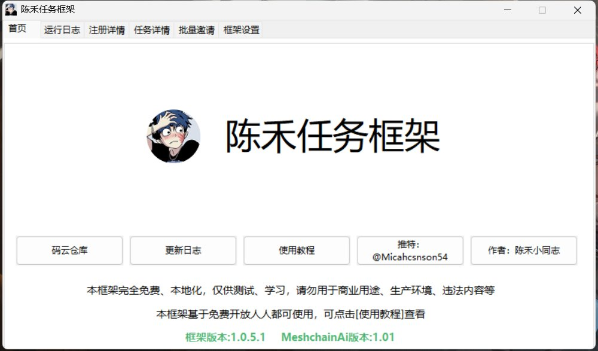
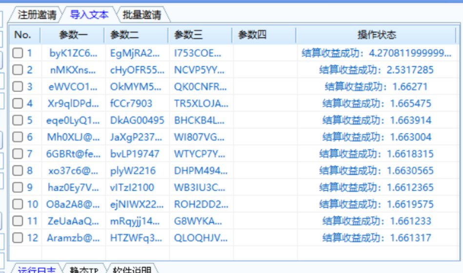

# MeshChain AI 批量註冊掛機工具框架更新

> **來源**: [@Micahcsnson54](https://x.com/Micahcsnson54/status/1862837267309670702) | [原文連結](https://gitee.com/a203400698/meshchain-ai1)
>
> **日期**: Sat Nov 30 12:33:09 +0000 2024
>
> **標籤**: `自動化指令碼` `批量操作` `開源工具`

---

> **來源**: [@Micahcsnson54 (陈禾小同志)](https://twitter.com/Micahcsnson54)
> **日期**: 2026-02-18
> **標籤**: `MeshChain` `AI` `自動化工具` `批量註冊` `掛機腳本`

---

## 專案更新

MeshChain 腳本框架迎來更新，採用全新框架架構。

### 支援功能

- 批量註冊邀請
- 批量掛機
- 傻瓜式一鍵操作

### 相關連結

- **腳本地址**: [Gitee 儲存庫](https://gitee.com/a203400698/meshchain-ai1)
- **教程地址**: [騰訊文檔](https://docs.qq.com/doc/DRlBvalZWeHduQUhD)

---

## 專案背景

MeshChain AI 推出獨家空投計畫，旨在增強社區能力並擴大去中心化計算能力的訪問。

- **專案官方推特**: [@MeshchainAi](https://twitter.com/MeshchainAi)
- **腳本特色**: 支援批量邀請排線
- **附帶**: 哈勃分析

---

## 技術架構

根據 Gitee 儲存庫資訊，該專案採用以下技術架構：

- **開發語言**: 易語言
- **框架組成**: RSCProject + 鱼刺多線程框架 + 全新設計架構

### 使用說明

1. **教程地址**: [https://docs.qq.com/doc/DRlBvalZWeHduQUhD](https://docs.qq.com/doc/DRlBvalZWeHduQUhD)
2. **安全檢測**: 可透過騰訊哈勃分析系統（https://habo.qq.com/）查毒、查後門
3. **驗證平台**: Google 驗證平台地址 - https://capmonster.cloud/

### 檔案結構

專案儲存庫包含以下檔案：

- `.gitignore`
- `README.md`
- `任務框架-MeshchainAi.exe`
- `任務框架-MeshchainAi.rar`

---

## 注意事項

- 該儲存庫未聲明開源許可證文件（LICENSE），使用請關注具體專案描述及其程式碼上游依賴
- 專案儲存庫所選許可證以儲存庫主分支所使用許可證為準（當前為 master 分支）
