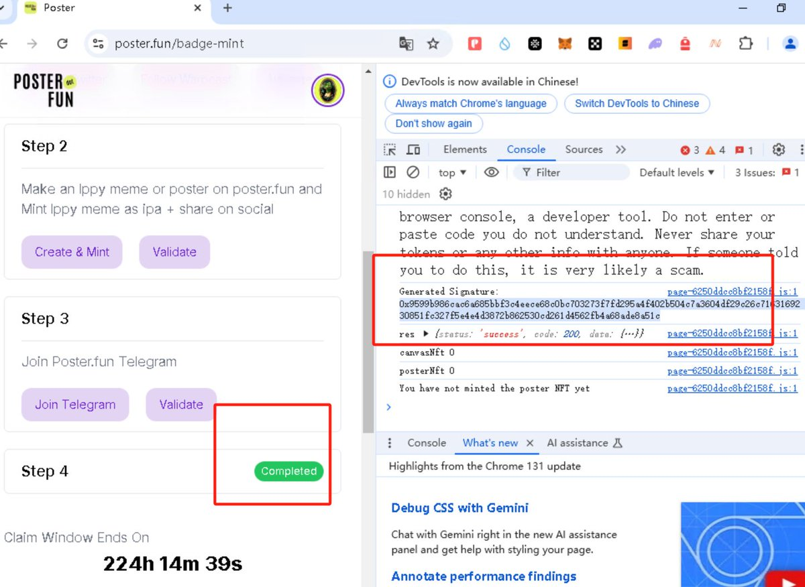
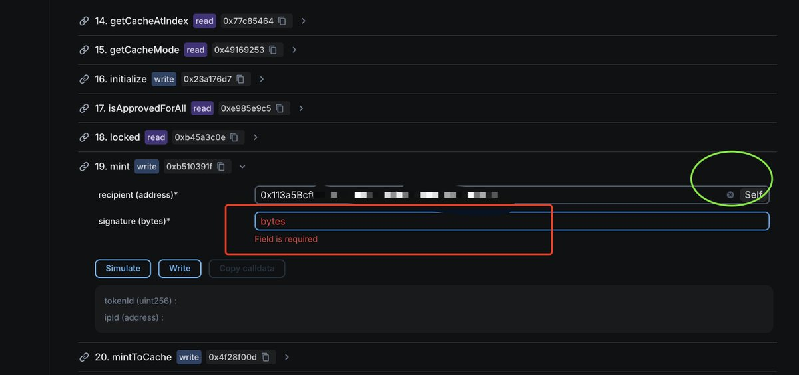
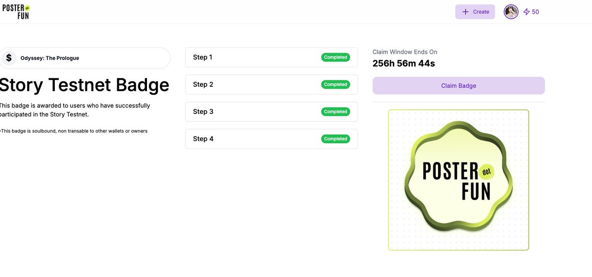

# Story 徽章合約 Mint 完整指南

> **來源**: [@lumaodaren](https://x.com/lumaodaren/status/1862406384899502544) | [原文連結](https://www.poster.fun/badge-mint)
>
> **日期**: Fri Nov 29 08:00:58 +0000 2024
>
> **標籤**: `NFT` `智能合約` `Story Testnet`

---

★ Insight ─────────────────────────────────────
- **知識整理策略**：處理 Web3 技術教學時，必須保留所有操作步驟細節（URL、合約地址、具體方法名稱）
- **測試網項目特性**：Story 徽章活動有明確截止時間（12.8），需在文章中保留時效性資訊作為歷史記錄
- **跨平台驗證流程**：涉及多個平台（X、Warpcast、Telegram）的驗證步驟，順序和細節不可省略
─────────────────────────────────────────────────

> **來源**: [@lumaodaren (就是那個東東 ❤️ GL)](https://twitter.com/lumaodaren)  
> **日期**: 2024-12-01（推測，距離 12.8 結束還有一週）  
> **標籤**: `Story` `測試網` `NFT` `智能合約` `Mint`

---

## 合約 Mint 方法（更新）

看到幾個大佬都發了用合約去 mint 的方法，整理如下：

### 操作步驟

1. **連接錢包**  
   打開徽章網站並連接錢包：https://badge.story.foundation

2. **先 Mint 第四個 NFT**  
   在網站上先手動 mint 第四個 NFT

3. **獲取簽名信息**  
   - 按 `F12` 打開控制台
   - 按 `F5` 刷新網頁
   - 在 Network 標籤中找到簽名信息並複製

4. **合約寫操作**  
   前往合約頁面：https://testnet.storyscan.xyz/address/0x37f9c63b99e6Ec2795Ba0e3a68eB26d56E0dfF80  
   找到第 19 個 `mint` 方法，進行寫操作，貼上剛才複製的簽名信息

### 進度提醒

- 目前大概有 **28 個徽章**可以領取
- 活動將於 **12.8 結束**（還有一週時間）
- 檢查一下你做了多少個，抓緊時間完成

---

## Story Badge x Poster 徽章獲取

這個稍微有點麻煩，需要用到 Warpcast。目前 X 登錄尚未恢復，如果恢復了可以用 X 登錄。

### 操作步驟

1. **平台驗證**  
   - 關注 Story 的 X 帳號和 Warpcast 帳號
   - 輸入 Warpcast 用戶名進行驗證

2. **創建並分享內容**  
   - 在 Poster 上創建一個 Meme 或 Poster
   - 分享到 X 或 Warpcast
   - **注意**：如果一次不成功，可以創建 2 次 Poster/Meme 並分享出去

3. **TG 弱驗證**  
   完成 Telegram 的簡單驗證

4. **Mint 官方 NFT**  
   Mint 一個官方的 NFT

---

## 背景與心得

醒來看到以太坊奔向 3700 了，真不錯，終於揚眉吐氣了。希望能堅持下去。

做 Story 的朋友們，也要堅持下去，12.8 還有一週就結束了～

一起來做 Story！
