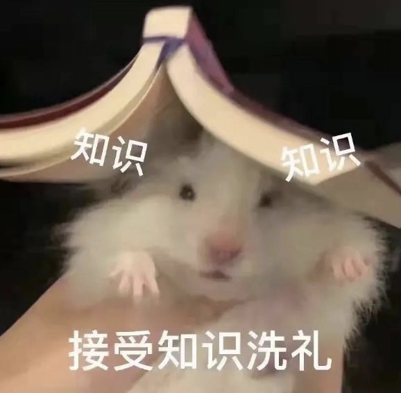

# 乾貨知識整理與分享論壇

> **來源**: [@leo_0s1](https://x.com/leo_0s1/status/1859072244221149199) | [原文連結](https://twitter.com/leo_0s1/status/1859072244221149199/photo/1)
>
> **日期**: Wed Nov 20 03:12:17 +0000 2024
>
> **標籤**: `知識管理` `內容組織` `社群分享`

---

> **來源**: [@leo_0s1 (玖年🌿🌿🌿)](https://twitter.com/leo_0s1)
> **日期**: 2025-01-18（推測）
> **標籤**: `知識整理` `乾貨分享` `學習資源`

---

## 論壇建立說明

作者建立了一個專門的 thread 用於整理乾貨知識板塊，目的是方便新人查找學習資源。

## 內容組織方式

- 按照發帖時間排序
- 持續更新維護
- 作者的整理技術也在不斷進步

## 互動支持

作者表示乾貨整理不易，希望獲得讀者的點讚轉發支持。

---

**註**：此為論壇建立公告，具體乾貨內容在後續帖子中（原推文包含連結）。
