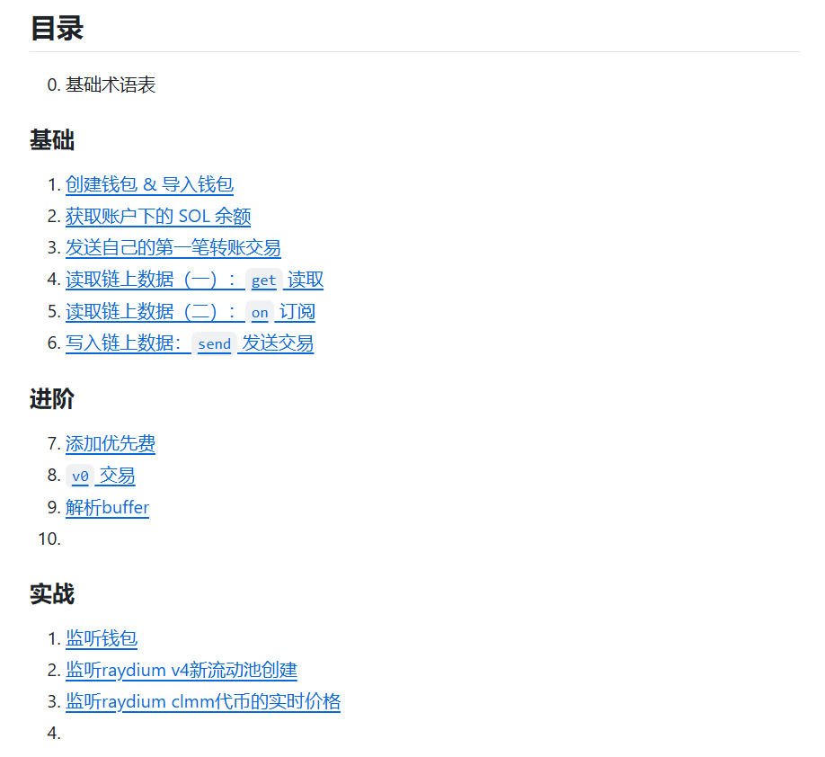

# Solana Web3.js 初學者教程

> **來源**: [@InkyWang](https://x.com/InkyWang/status/1857759018015666478) | [原文連結](https://github.com/ChainBuff/solana-web3js)
>
> **日期**: Sat Nov 16 12:14:00 +0000 2024
>
> **標籤**: `Solana開發` `Web3.js` `區塊鏈開發`

---



> **來源**: [@InkyWang (Inky | IBRL)](https://github.com/ChainBuff/solana-web3js)
> **日期**: 2026-02-18
> **標籤**: `Solana` `Web3.js` `教學` `區塊鏈開發`

---

## 專案簡介

Solana Web3.js 函式庫是用於與 Solana 區塊鏈進行互動的 JavaScript 基礎庫。本教程由 Buff 社區成員編寫，每週更新 1-3 節，旨在透過簡單的範例幫助開發者快速上手 Solana 區塊鏈開發。

## 安裝與執行

本教程使用的版本為 `@solana/web3.js@1.95.4`：

```bash
npm install @solana/web3.js@1.95.4
```

執行教程程式碼：

```bash
npx esrun xxx/index.ts
```

## 教程目錄

### 基礎

1. **創建錢包 & 導入錢包**
2. **獲取帳戶下的 SOL 餘額**
3. **發送第一筆轉帳交易**
4. **讀取鏈上資料（一）：get 讀取**
5. **讀取鏈上資料（二）：on 訂閱**
6. **寫入鏈上資料：send 發送交易**

### 進階

7. **添加優先費**
8. **v0 交易**
9. **解析 buffer**

### 實戰

- **監聽錢包**
- **監聽 Raydium V4 新流動池創建**
- **監聽 Raydium CLMM 代幣的實時價格**
- **獲取代幣持有比例**
- **關閉代幣帳戶退租**

## 參考資源

- [Solana Web3.js 官方文件](https://solana-labs.github.io/solana-web3.js/v1.x)
- [Solana 開發者手冊](https://solana.com/zh/developers/cookbook)
- [Solana 文件](https://solana.com/docs)

## 專案資訊

- **授權**：MIT License
- **GitHub**：[ChainBuff/solana-web3js](https://github.com/ChainBuff/solana-web3js)
- **Stars**：476
- **Forks**：74
- **語言組成**：TypeScript 92.4%、JavaScript 7.6%

## 社區支持

如果你想支持 Buff 社區的發展，可透過向以下地址捐贈 Solana 鏈上資產：

```
buffaAJKmNLao65TDTUGq8oB9HgxkfPLGqPMFQapotJ
```

社區資金將用於獎勵社區貢獻者，貢獻包括但不限於提交 PR。
