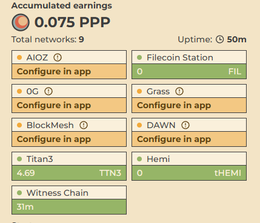

# 聚合挖礦工具：一鍵運行多個 DePIN 項目

> **來源**: [@scuptone](https://x.com/scuptone/status/1856495921623892370) | [原文連結](https://twitter.com/scuptone/status/1856495921623892370/photo/1)
>
> **日期**: Wed Nov 13 00:34:54 +0000 2024
>
> **標籤**: `DePIN挖礦` `自動化工具` `去中心化基礎設施`

---

> **來源**: [@scuptone (猫老师scupt)](https://x.com/scuptone)
> **日期**: 2026-02-18
> **標籤**: `DePIN` `聚合挖礦` `grass` `blockmesh` `dawn` `自動化工具`

---

## 工具簡介

已經有人開發出聚合挖礦工具，可以一鍵同時運行多個 DePIN（去中心化實體基礎設施網絡）項目。

## 支援項目

目前支援以下三個 DePIN 項目：
- **Grass**
- **Blockmesh**
- **Dawn**

## 主要特點

使用者可以自行設置和管理自己的帳戶，實現一鍵啟動多個挖礦項目的自動化運行。
