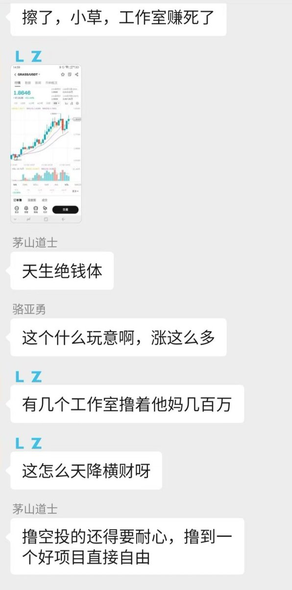
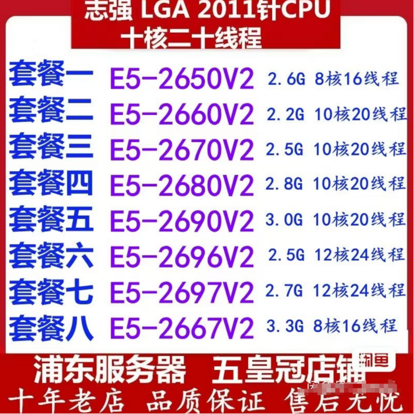
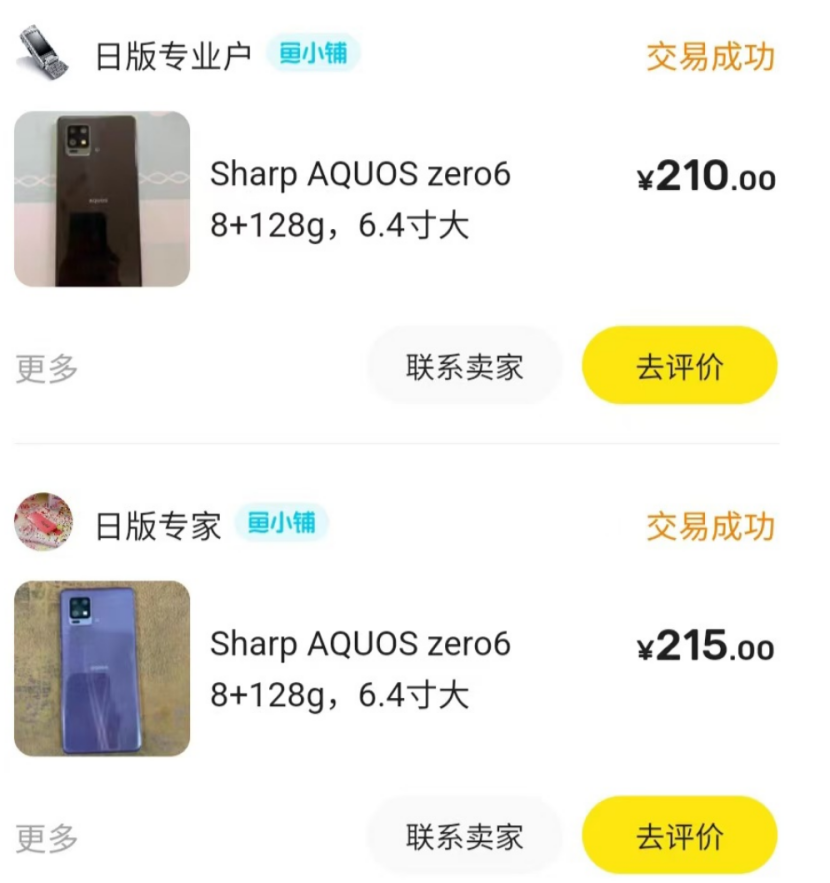
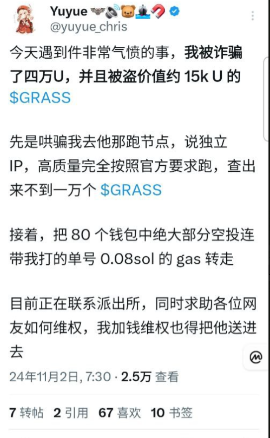
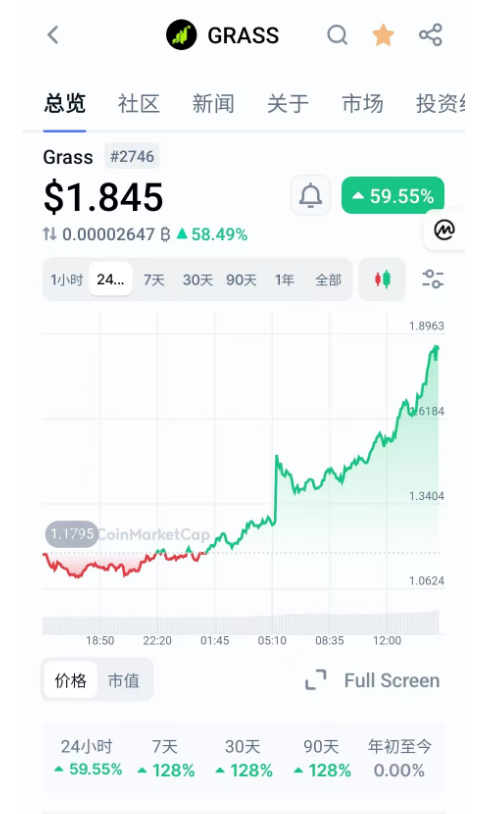
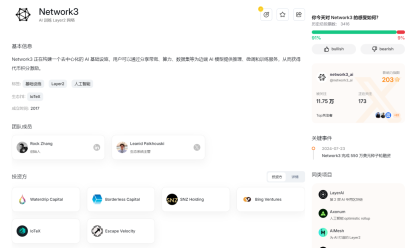
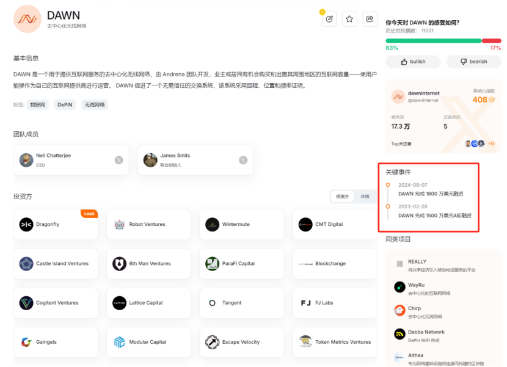

# DePIN 帶寬挖礦項目批量掛機指南——7 個項目一鱼多吃

> **來源**: [@NFTCPS](https://x.com/NFTCPS/status/1852676802197815358) | [原文連結](https://www.hubstudio.cn/register/index.html?ref=n7GqIwRJ)
>
> **日期**: Sat Nov 02 11:39:05 +0000 2024
>
> **標籤**: `DePIN 挖礦` `帶寬項目` `批量掛機`

---

> **來源**: [@NFTCPS (鳥哥 | 藍鳥會🕊️)](https://twitter.com/NFTCPS)
> **標籤**: `DePIN` `帶寬挖礦` `Grass` `空投` `批量掛機`

---

## 背景

Grass 小草暴富案例引發關注，有工作室擼了幾百萬，也有人找代掛被騙 4 萬 U。本文分享如何解決 DePIN 帶寬挖礦項目批量掛機的設備、代理 IP、腳本、註冊等問題，以及 7 個可以同時掛機的項目，一魚多吃，瓜分未來 10 億美金空投。

## 設備選擇

### 電腦端

✅ 閒魚搜索「志強 2680 v2 主機」，最好買雙通道（2 個 CPU）的，內存 64G，成本約 1000 多元。這種洋垃圾很便宜，幾十個線程，掛 100 個都不會卡。

### 手機端

✅ 閒魚搜索「日版」安卓手機，對屏幕沒要求的話 200 多元就可以買一台，默認有 Google Play 框架，可以直接下載各種國外應用。

## 掛機軟件

### 電腦端瀏覽器插件

✅ 使用指紋瀏覽器 Hubstudio：
- 下載地址：https://www.hubstudio.com/
- 邀請碼：`n7GqIwRJ`

### 電腦端安卓客戶端

✅ 使用雷電模擬器：
- 下載地址：https://www.ldmnq.com/

### 安卓手機端

✅ 下載狐猴瀏覽器安裝 Google 插件去掛機：
- 下載地址：https://lemurbrowser.com/

## 避坑指南

### ✅ 避免代掛詐騙

代掛 Grass 小草等 DePIN 項目要注意安全，容易跑路，盡量自己去掛，已經有人被騙了，不要考驗人性。

### ✅ IP 選擇

不要用梯子的 IP，梯子是萬人騎，掛不出分來的。小草 Grass 可以去天翼雲買服務器買 IP 自己搭代理 IP，教程自己去網上找。

### ✅ 註冊注意事項

- 註冊這幾個 DePIN 挖礦項目的時候需要開著梯子，不然人機驗證顯示不出來
- 註冊賬號最好用 Gmail，海外的業務就用海外郵箱，國內郵箱可能會收不到驗證碼

## 7 個 DePIN 挖礦項目

以下是精選的 7 個 DePIN 0 擼挖礦項目，可以同時掛機，一魚多吃。這幾個項目加在一起，未來市值可能上百億美金。

### 1️⃣ Network3

跟小草 Grass 同類的 DePIN 帶寬挖礦項目，可能成為下一個小草。

- **融資**：水滴資本、IoTex 等機構投資種子輪融資 550 萬美金
- **特點**：支持 MAC、Windows、安卓、iOS、Linux 全系統客戶端挖礦，不挑系統
- **註冊**：https://network3.io/

### 2️⃣ DAWN

融資 3300 萬美金，比 Grass 小草還要猛。

- **註冊**：https://dawn.org/
- **邀請碼**：`k2z6p1tw`（必填）

### 3️⃣ Nodepay

去中心 AI 訓練網絡。

- **投資方**：Animoca Brands、Jump Crypto、Elevate Ventures、OKX Blockdream、Mirana Ventures、NGC Ventures 等
- **註冊**：https://nodepay.ai/

### 4️⃣ Gradient Network

頂級 VC 投資項目。

- **投資方**：紅杉投資、Pantera、Multicoin
- **註冊**：https://gradient.network/

### 5️⃣ Grass 小草二期

剛剛又融資了 2000 萬美金（說明資本很看好），第二階段已經開始。

- **空投**：後面還有 17% 的代幣空投，按照目前的價格還有 3 億美金空投
- **註冊**：https://getgrass.io/

### 6️⃣ BlockMesh Network

類似 Grass（小草）玩法。

- **成績**：獲得 Solana「Renaissance」黑客松 DePIN 賽道第一名
- **合作**：與知名交易所 BackPack 宣布合作
- **註冊**：https://blockmesh.xyz/
- **邀請碼**：`995ff2cf-73f5-48f7-b4c6-403103694c57`

### 7️⃣ Teneo

0 擼早鳥 DePIN 帶寬挖礦項目，註冊就給 2500 分。

- **特點**：小草 Grass 同類掛機項目，剛剛上線，融資金額不詳，但從官網的 UI 上看背景不俗
- **建議**：至少先註冊一下佔個坑，從小草 Grass 的每期空投分配的比例上可以看出，越早參與的獎勵份額越多
- **下載插件**：在插件中有郵箱進行註冊，填寫邀請碼，即可掛機
- **插件地址**：https://teneo.pro/
- **邀請碼**：`3u0BX`（使用有 2500 積分贈送）
- **官網**：https://teneo.pro/

## 關於腳本

Github 有些項目也有開源的腳本，比如 DAWN 的腳本。懂技術的自己去研究一下，不過用腳本有被女巫的風險，大家自己做決定。

- DAWN 腳本：https://github.com/

## 掛機策略總結

### 多窗口多 IP 策略

電腦可以用指紋瀏覽器多窗口 + 多 IP 去挖（不需要註冊很多賬號，多窗口多 IP 登錄一個賬號即可）：

- **電腦端**：使用指紋瀏覽器開多窗口掛機
  - 下載地址：https://www.hubstudio.com/
  - 邀請碼：`n7GqIwRJ`

- **手機端**：下載狐猴瀏覽器（安卓）
  - 下載地址：https://lemurbrowser.com/

### 一魚多吃

以上項目除了 Grass 都沒有首次空投，目前這個賽道還是早期。6-7 個項目一台設備可以同時去挖，多一個項目多一份收入，一魚多吃。這些都是精挑細選的有融資、有背景、大概率會上交易所的項目。

### 市場前景

以上 6-7 個項目，至少瓜分 10 億美金空投！
