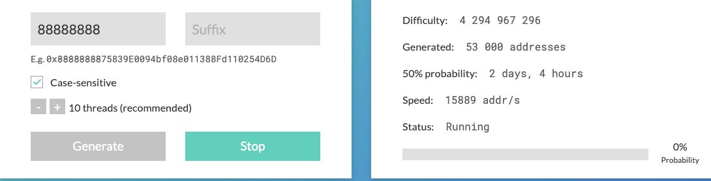
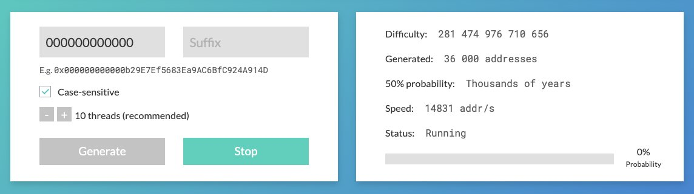
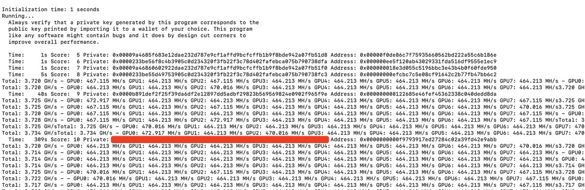

# ETH 靓號錢包生成教學：手把手跑 12 個 0 開頭的錢包

> **來源**: [@cutepanda](https://x.com/cutepanda/status/1848985340473933836) | [原文連結](https://x.com/MasterCui/status/1572421387981328384)
>
> **日期**: Wed Oct 23 07:10:32 +0000 2024
>
> **標籤**: `以太坊` `錢包地址` `技術教學`

---






> **來源**: [@cutepanda](https://twitter.com/cutepanda)  
> **日期**: 2024-02-18  
> **標籤**: `以太坊` `靚號錢包` `Profanity2` `技術教學`

---

很多人都有自己的靚號錢包，比如有的兄弟的錢包是 0x666 開頭、0x888 開頭，或者八個八、六個六、七個七結尾的錢包。

如果你經常在一級市場掃鏈或者扒錢包，那麼會發現有的人的錢包是 12 個 0x000000000000 開頭的，也就是 12 個 0，看起來非常牛逼，似乎不太可能。

還有最近發生的事情，就是昨天晚上 ETH 鏈也出現了一個 12 個 0 開頭的智能合約，然後有的人就開始傳是美國計算機中心搞的合約，因為普通的算力跑不出來，自己 FOMO 自己。這種說法實際上是非常不負責任的，果不其然最後被人家來回收割。

實際上跑一個 12 個 0 的錢包作為散戶也可以做到。智能合約的地址本質上也是 錢包地址 + nonce 進行 hash 計算得到的地址，最終也可以算出來（當然也可以加單獨 salt 來計算，不展開敘述了）。

兄弟們要多研究點技術，不要以訛傳訛。我們自己搞一個錢包地址出來，這些就都懂了。

## 安全警告

**注意：任何生成錢包的工具都無法確保 100% 安全，請不要將大額資金長期存入生成出來的錢包，更不要拿來做主錢包。**

用到的工具是 Profanity2，聲稱是在 Profanity 基礎上改良的工具。而 Profanity 曾經出現過嚴重的漏洞，導致 Wintermute 1.6 億美元資產被盜。

被盜新聞參考：https://www.theblock.co/post/169901/wintermute-hack-profanity

所以本文僅用於裝逼和技術探討，如果被盜本人不負責任。

## 簡單模式 - 生成八位以下固定號碼的錢包

純八位以下的很簡單，比如八位的錢包，目前有一些現成的網頁可以做，自己也能寫點簡單的腳本跑。

比如這幾個網站都支持錢包生成：
- https://vanity-eth.tk
- https://vanitygen.net
- https://mycrypto.com/helpers/generate-vanity-address

比如我跑個八位的，我的機器跑一兩天就可以了，位數比較少的會更快。

但是如果我想要一個 12 個 0 開頭的錢包，單純用網頁來跑就不太可能了。比如說如果直接用 vanity-eth 這網站，就需要跑上千年才能出來，因為這種網站本質上是用 CPU 在計算的。如果想要需要更多的 GPU 算力。

## 困難模式 - 生成 12 個 0 開頭的靚號錢包

這裡用到的工具是這個 GitHub 庫來做的：  
https://github.com/1inch/profanity2

### 租一個服務器

首先去一個能按量租算力的地方去租機器，我是在騰訊雲租的。我這裡是去騰訊雲租了一個 8 × NVIDIA V100 顯存 8 × 32GB 的機器，鏡像選了 Ubuntu 20.04 的版本，一個小時 95.84 元。

### 鏈接服務器 拉代碼

用 SSH 鏈接到服務器（在騰訊雲網頁的管理界面也可以連接到服務器打命令）。

先拉代碼：
```bash
git clone https://github.com/1inch/profanity2
```

進入代碼目錄：
```bash
cd profanity2
```

安裝依賴：
```bash
sudo make
```

### 開始跑命令

**第一步：派生公鑰**

首先，用小狐狸新建一個空的錢包，把私鑰複製下來（用以前的沒錢的舊錢包也可以）。私鑰如果有 `0x` 前綴的話需要刪掉 `0x` 前綴。

打下面這個命令，這個命令作用是使用 openssl 來派生公鑰。將代碼中的 `PRIVATE_KEY_GOES_HERE` 替換成剛才複製的私鑰：

```bash
openssl ec -inform DER -text -noout -in <(cat <(echo -n "302e0201010420") <(echo -n "PRIVATE_KEY_GOES_HERE") <(echo -n "a00706052b8104000a") | xxd -r -p) 2>/dev/null | tail -6 | head -5 | sed 's/[ :]//g' | tr -d '\n' && echo
```

命令會返回一個 130 字節的十六進制公鑰，確保刪除前綴 `04`，我們應該剩下 128 個字節。

**第二步：生成錢包**

接下來跑下面的命令開始生成錢包。將代碼中的 `DERIVED_PUBLIC_KEY_GOES_HERE` 替換為上一步拿到的 128 字節的公鑰：

```bash
./profanity2.x64 --leading 0 -z DERIVED_PUBLIC_KEY_GOES_HERE
```

300 秒就跑出來了 10 個 0 開頭的錢包。如果去網頁上跑可能要跑一年。

**第三步：計算最終私鑰**

當然跑出來的這個 Private 是不能直接用的，如果你直接導入發現並不是之前的地址。這裡還需要額外一步代碼來算出來最終私鑰。

下面代碼 `PRIVATE_KEY_1` `PRIVATE_KEY_2` 分別代表最初錢包的私鑰和剛生成出來的私鑰，最後來計算出最終私鑰：

```bash
(echo 'ibase=16;obase=10' && (echo '(PRIVATE_KEY_1 + PRIVATE_KEY_2) % FFFFFFFFFFFFFFFFFFFFFFFFFFFFFFFFFFFFFFFFFFFFFFFFFFFFFFFEFFFFFC2F' | tr '[:lower:]' '[:upper:]')) | bc
```

然後把生成出來的私鑰導入小狐狸裡面就可以了。我下面的這個 11 個 0 開頭的地址跑了一個半小時左右，如果再跑一天 12 個 0 應該是出得來的。

## 總結

很多看似華麗的技術，詳細學習下來並不是難事。在目前 AI 發達的狀態下，獲取新知識也便捷了很多。

既然大家選擇了在一級市場拼搏，那麼遇到新的東西一定要有鑽研精神，這個好習慣未來某一天也一定會讓你賺大錢。
