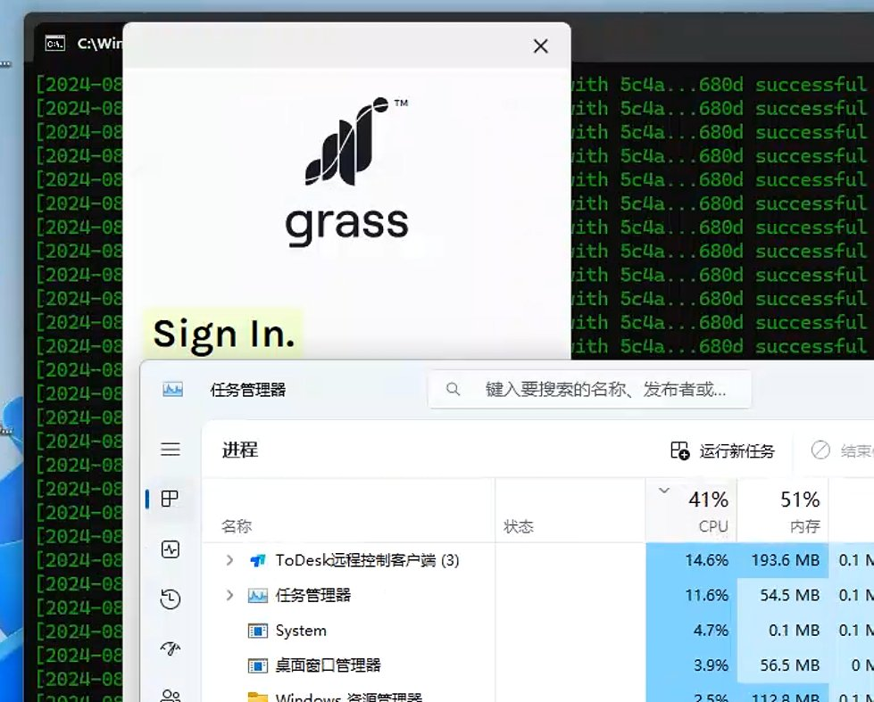
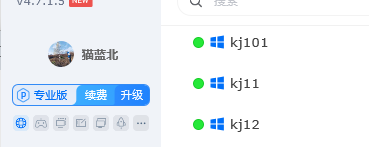

# 低成本批量挖小礦：Windows 11 極致優化與機器配置指南

> **來源**: [@scuptone](https://x.com/scuptone/status/1829789033540763898) | [原文連結](https://github.com/ntdevlabs/tiny11builder?tab=readme-ov-file)
>
> **日期**: Sat Aug 31 07:51:16 +0000 2024
>
> **標籤**: `礦渣機器` `系統優化` `DePIN挖礦`

---




> **來源**: [@scuptone (猫老师scupt)](https://x.com/scuptone)
> **日期**: 2026-02-18
> **標籤**: `DePIN` `挖礦` `Windows優化` `批量部署`

---

## 概述

本文介紹如何低成本批量起機器挖小型 DePIN 礦，主要針對使用礦渣機器（上一代挖礦機器）進行批量部署的方案。

## 硬體配置

### 礦渣機器規格
- **配置**：4-8核 CPU、8-16GB 記憶體、64-256GB SSD
- **價格**：200-400 人民幣
- **優勢**：價格低廉，適合批量部署

## 系統優化

### Windows 11 極致優化版

推薦使用 [tiny11builder](https://github.com/ntdevlabs/tiny11builder) 專案的精簡系統，理由：

1. **降低資源佔用**：精簡系統大幅減少 CPU 和記憶體佔用
2. **特定項目需求**：某些 BTC 錢包項目只支援 Windows 11
3. **批量優勢**：當你有數百台這樣的機器時，能領先其他人

### tiny11builder 特點

**移除的元件**（tiny11maker 版本）：
- Clipchamp、News、Weather
- Xbox、GetHelp、GetStarted
- Office Hub、Solitaire、PeopleApp
- PowerAutomate、ToDo、Alarms
- Mail and Calendar、Feedback Hub
- Maps、Sound Recorder、Your Phone
- Media Player、QuickAssist
- Internet Explorer、Tablet PC Math
- Edge、OneDrive

**移除的元件**（tiny11coremaker 版本，更激進）：
- 以上所有元件
- Windows Component Store (WinSxS)
- Windows Defender（僅禁用，可重新啟用）
- Windows Update
- WinRE

**注意事項**：
- tiny11coremaker 版本無法新增語言、更新或功能
- tiny11maker 版本保留可維護性，適合一般使用
- tiny11coremaker 適合快速測試或開發環境

## 可運行的 DePIN 項目

1. **Grass 桌面版**
2. **Rivalz nodejs 版本**
3. **DAWN 插件**（邀請碼：gv3esa9g）
4. **限制 1 機器 1 程序的 DePIN 項目**（暫時保密）
5. **其他**：joker、前端過 CF、爬蟲等項目

## 網路配置方案

### 代理 IP 解決方案（低延遲、高利用率）

1. **一級路由**：使用全局代理出去
2. **每台機器**：使用 Clash 全局靜態代理
   - 優勢：IP 可標註為家庭 IP，降低被封風險

## 批量管理方案

### 遠端管理工具

- **推薦**：開通 ToDesk 付費版本
- **原因**：因為已經使用全局海外代理，ToDesk 可以穩定連線管理所有機器

## tiny11builder 使用說明

### 安裝步驟

1. 從 Microsoft 官網或 Rufus 下載 Windows 11
2. 使用 Windows Explorer 掛載下載的 ISO 映像
3. 以系統管理員身分開啟 PowerShell 5.1
4. 變更腳本執行策略：
   ```powershell
   Set-ExecutionPolicy Bypass -Scope Process
   ```
5. 執行腳本：
   ```powershell
   C:/path/to/your/tiny11/script.ps1 -ISO <letter> -SCRATCH <letter>
   ```
6. 選擇映像掛載的磁碟機代號（僅字母，不含冒號）
7. 選擇要基於的 SKU
8. 等待完成，產生的映像檔名為 `tiny11.iso`

### 腳本版本

- **tiny11maker.ps1**：一般版本，移除大量冗餘但保持系統可維護性，建議一般使用
- **tiny11coremaker.ps1**：核心版本，移除更多元件但無法維護，建議用於快速測試或開發

### 已知問題

- Edge 移除後在設定中仍有殘留
- 使用前可能需要透過 Microsoft Store 更新 Winget
- Outlook 和 Dev Home 可能在一段時間後重新出現
- arm64 版本執行腳本時可能會看到錯誤（因為 arm64 映像的 System32 資料夾中不包含 OneDriveSetup.exe）
