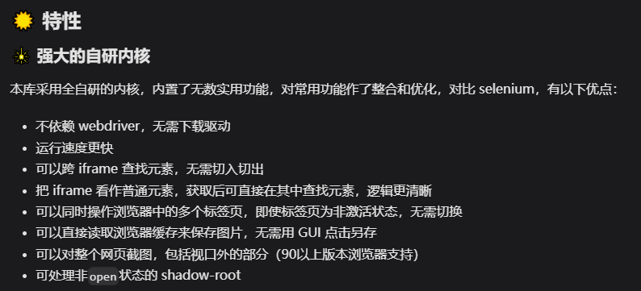

# DrissionPage：Python 網頁自動化工具效能對比

> **來源**: [@lumaoyangmao](https://x.com/lumaoyangmao/status/1813960656808477179) | [原文連結](https://twitter.com/lumaoyangmao/status/1813960656808477179/photo/1)
>
> **日期**: 
>
> **標籤**: `網頁自動化` `Python 工具` `效能優化`

---

> **來源**: [@lumaoyangmao (撸毛养猫lumao.eth)](https://twitter.com/lumaoyangmao)
> **標籤**: `Python` `網頁自動化` `工具比較` `效能優化`

---

## 工具對比

一直以來用的都是 Python + Selenium 實現自動化。

偶然接觸到了 DrissionPage，實際用過之後：
- 寫腳本速度提高了 100%
- 執行效率提高了 50%

## 特點

- 程式碼簡潔
- 功能強大
- Selenium 程式碼遷移很絲滑

## 後續計畫

之後大概率會把之前的成品腳本全轉過去。

---

**工具連結**: DrissionPage（Python 網頁自動化框架）
