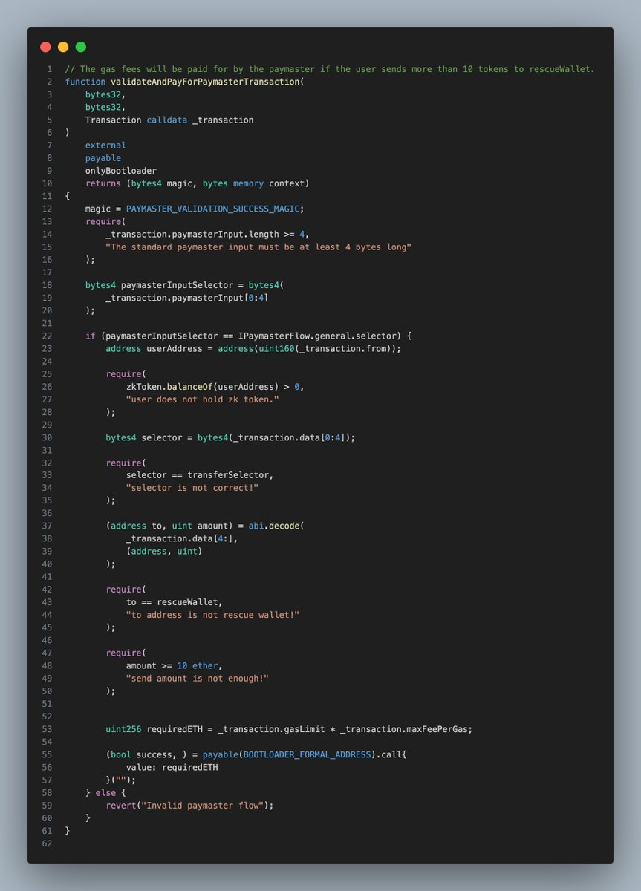
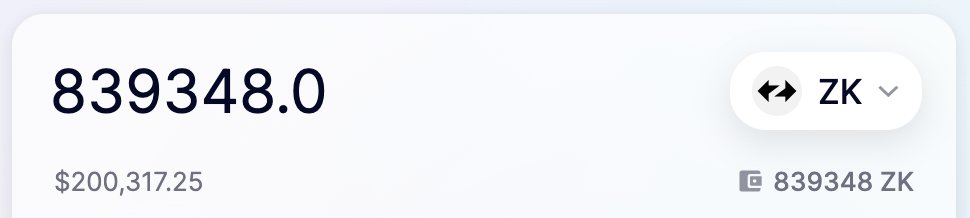

# zkSync 救援空投 Paymaster 合約開源

> **來源**: [@0xAA_Science](https://x.com/0xAA_Science/status/1804901150044680441) | [原文連結](https://github.com/AmazingAng/zkSync-Paymaster-RescuETH)
>
> **日期**: Sun Jun 23 15:35:42 +0000 2024
>
> **標籤**: `智能合約` `帳戶抽象` `Paymaster`

---

> **來源**: [@0xAA_Science (0xAA)](https://twitter.com/0xAA_Science)
> **日期**: 2024-06-18
> **標籤**: `zkSync` `Paymaster` `Account Abstraction` `智能合約` `開源`

---

## 專案背景

鏈上救援隊 @ourRescuETH 在 zkSync 空投期間，從近百名粉絲委託的幾百個被盜錢包中救援了近 84 萬枚 $ZK 代幣。這次行動使黑客少盜取了 20 萬美元，同時讓用戶和白帽救援人員獲得了 20 萬美元。

## Paymaster 合約開源

救援行動使用的兩個 Paymaster 合約已在 GitHub 開源。Paymaster 合約是賬戶抽象（Account Abstraction, AA）中的重要組成部分，可以幫助用戶支付特定交易的 gas 費用。

### 1. wlPaymaster.sol

**功能**：替白名單中的錢包支付 gas 費用

這個合約專門為預先設定的白名單地址提供 gas 費用補貼，確保這些特定錢包可以執行交易而無需自行支付手續費。

### 2. zkPaymaster.sol

**功能**：替任何向救援錢包轉帳超過 10 $ZK 的交易支付 gas 費用

這個合約採用條件觸發機制，只要交易中向目標救援錢包（rescueWallet）轉帳的金額超過 10 個代幣，合約就會自動為該筆交易支付 gas 費用。

## 技術特點

Paymaster 機制允許第三方（合約）為用戶支付交易手續費，這在賬戶抽象架構中非常關鍵。在這次救援行動中，透過 Paymaster 合約的部署，被盜錢包即使沒有 ETH 支付 gas，仍能成功轉移空投代幣到安全地址。

## 開源資源

- **GitHub 倉庫**: [zkSync-Paymaster-RescuETH](https://github.com/AmazingAng/zkSync-Paymaster-RescuETH)
- **授權協議**: MIT License
- **主要檔案**:
  - `contracts/wlPaymaster.sol` - 白名單 Paymaster
  - `contracts/zkPaymaster.sol` - 條件轉帳 Paymaster
