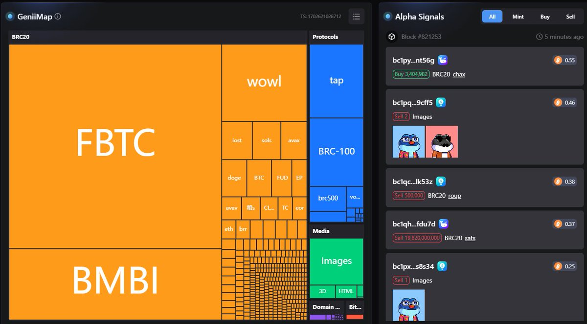
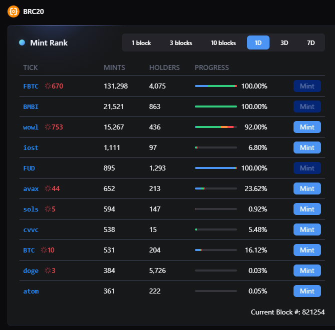

# 銘文工具完整指南——監控、刻寫、交易市場

> **來源**: [@sanyi_eth_](https://x.com/sanyi_eth_/status/1735546691938656643)
>
> **日期**: Fri Dec 15 06:25:50 +0000 2023
>
> **標籤**: `銘文` `開發工具` `區塊鏈`

---

> **來源**: [@sanyi_eth_ (sanyi.eth)](https://twitter.com/sanyi_eth_)
> **日期**: 2024-01-15
> **標籤**: `銘文` `工具` `BRC-20` `監控` `交易市場`

---

最近銘文這塊確實太多新東西了，下面是我日常在用的一些工具（僅記錄）。

## 熱點銘文監控

- ⭐️⭐️⭐️ https://geniidata.com/user/sanyi（能看全，但不直觀）
- ⭐️⭐️ https://unisat.io/brc20（直觀但只支援 BRC）
- ⭐️ https://ordspace.org（只支援 BTC 和 ETH）

## BRC 銘文銘刻工具

單獨推薦：https://looksordinal.com

主要是能退款，這個在 BRC 打銘文的時候很重要！Unisat 雖然有些時候也能退，但是退的很少！

## Bot 工具

⭐️ **提醒**：所有 bot/工具都不代表絕對安全！此推薦只是列舉工具，非推薦！

- https://github.com/cybervector/inscription-bot（開源工具，作者：@cybervector_；支援多鏈，免費）
- https://mctxyz.com（作者：@mctxyz 要付費）
- https://jianshubiji.com（作者：@jianshubiji 要付費）

額外嘴一句，這類工具能少用少用。一方面，有可能索引的時候會排除掉 bot；另一方面，因為 bot 需要上傳私鑰，很容易出現作惡的情況。

## 手搓工具（多開手搓）

### 安卓模擬器
- 雷電模擬器：https://ldplayer.net（適用於 IOST 這種需要移動端配置的銘文）

### 指紋瀏覽器
- **MoreLogin**：https://morelogin.com（一個新的指紋瀏覽器，他們過了慢霧的審計，目前我也在用）
- **AdsPower**：https://adspower.com（老牌指紋瀏覽器了，不過比較貴）
- **HubStudio**：https://hubstudio.cn（這個也是老牌的，挺便宜的）

這次就沒有說比特了，那個之前鬧過問題。

## 重要交易市場

### 綜合市場
- **UniSat**：https://unisat.io
- **Atom**：https://atommarket.io（這裡支援銘刻的）
- **SatsX**：https://satsx.io（合集了 Pipe、Atom 這些不同的協議）

### 以太坊銘文市場
- **Etch Market**：https://etch.market（主要是以太這邊的一些銘文/NFT 的購買）
- **IERC**：https://ierc20.com（以太銘文銘刻+市場功能）

### 協議專屬市場
- **BRC-420**：https://brc420.io
- **BRC-100**：https://brc100.org
- **Cook Protocol**：https://cook.com
- **Nostrassets**：https://nostrassets.com

其實還有好多新出來的新協議，所以要拋棄偏見，擁抱新事物。
