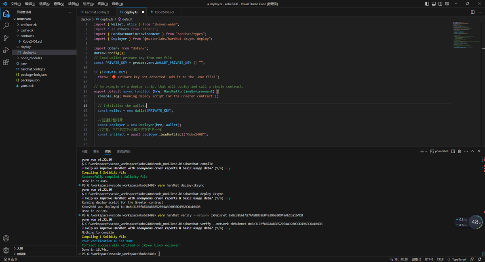

# zkSync 空投低 Gas 成本策略與自部署合約優化

> **來源**: [@xc_kobe](https://x.com/xc_kobe/status/1659822157654786048) | [原文連結](https://twitter.com/cr7_hacker/status/1659822157654786048/photo/1)
>
> **日期**: Sat May 20 07:23:35 +0000 2023
>
> **標籤**: `zkSync` `空投農場` `Gas 優化`

---

> **來源**: [@xc_kobe (宣城小科比2408)](https://twitter.com/xc_kobe)
> **標籤**: `zkSync` `空投` `Gas優化` `合約部署` `女巫風險`

---

## 低 Gas 成本策略

在 zkSync 主網上自行部署合約進行交互，Gas 成本約 0.16U 左右，相比一般方式更加經濟。

## 穷撸版交互問題

許多小伙伴使用「穷撸版」的方式，讓大小號之間互相轉帳：

- Gas 成本並不便宜
- 所有帳號關聯性很高
- 被女巫（Sybil）檢測的風險很大

## 優化建議

在 Gas 價格較高時，使用自部署合約的方式進行交互，可以：

- 降低 Gas 成本
- 保持周活躍/月活躍
- 降低帳號之間的關聯性
- 減少女巫風險
