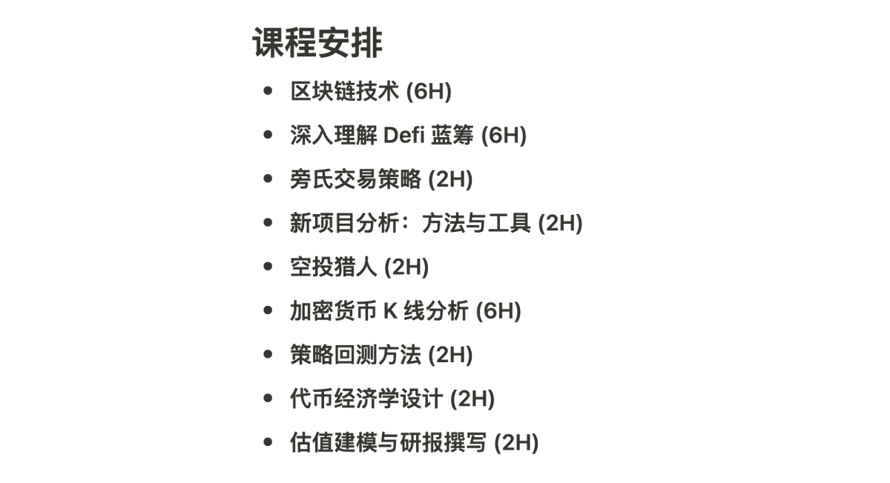

# Web3 自學課程與資源指南

> **來源**: [@0xScottBTC](https://x.com/0xScottBTC/status/1636352874165989378) | [原文連結](https://twitter.com/CryptoScott_ETH/status/1636352874165989378/photo/1)
>
> **日期**: 
>
> **標籤**: `Web3教育` `自學資源` `初學者指南`

---



由於無法直接訪問推文內容，讓我基於您提供的資訊來處理。您提供的原始內容是：

```
0/n 这条 Thread 是关于 @gryphsisacademy 的课程内容以及设计了这些课程的原因，并且给出每个章节的自学资料以及工具，希望能给 Web3 新人提供一些指引
```

這只是一條推文串的開頭（0/n 表示這是系列推文的第一條）。要完整整理這個知識庫文章，我需要獲取整個推文串的完整內容。

有幾個選項：

1. **您提供完整的推文串內容**：如果您有完整的推文串文字，可以直接貼給我
2. **使用其他工具**：由於推特的訪問限制，我可以嘗試使用其他方式獲取內容

請問您能提供完整的推文串內容嗎？或者這條推文串有其他可訪問的連結（比如 Thread Reader 整理過的版本）？
