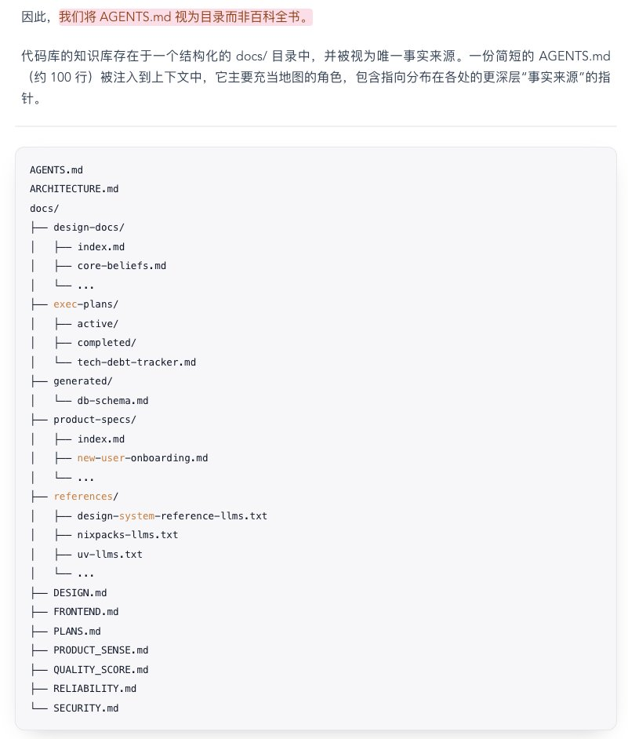

# Claude 上下文優化：目錄索引知識管理策略

> **來源**: [@hongming731](https://x.com/hongming731/status/2026572039717531838) | [原文連結](https://twitter.com/hongming731/status/2026572039717531838/photo/1)
>
> **日期**: Wed Feb 25 08:16:40 +0000 2026
>
> **標籤**: `Claude Code` `知識管理` `上下文優化`

---

> **來源**: [@hongming731 (ginobefun)](https://twitter.com/hongming731)
> **標籤**: `Claude Code` `上下文管理` `知識庫`

---

## 核心策略

CLAUDE.md 只放無法被刪除的核心內容，通過目錄索引的方式找到子 CLAUDE.md 或關聯文檔，大幅減少上下文的占用。

## 實作方式

將大型的 CLAUDE.md 拆分成多個小檔案，主檔案只保留：
- 必要的全域規則
- 目錄索引，指向各個子文檔

需要特定領域知識時，再通過索引找到對應的子 CLAUDE.md 載入，避免一次性載入所有內容造成上下文浪費。
