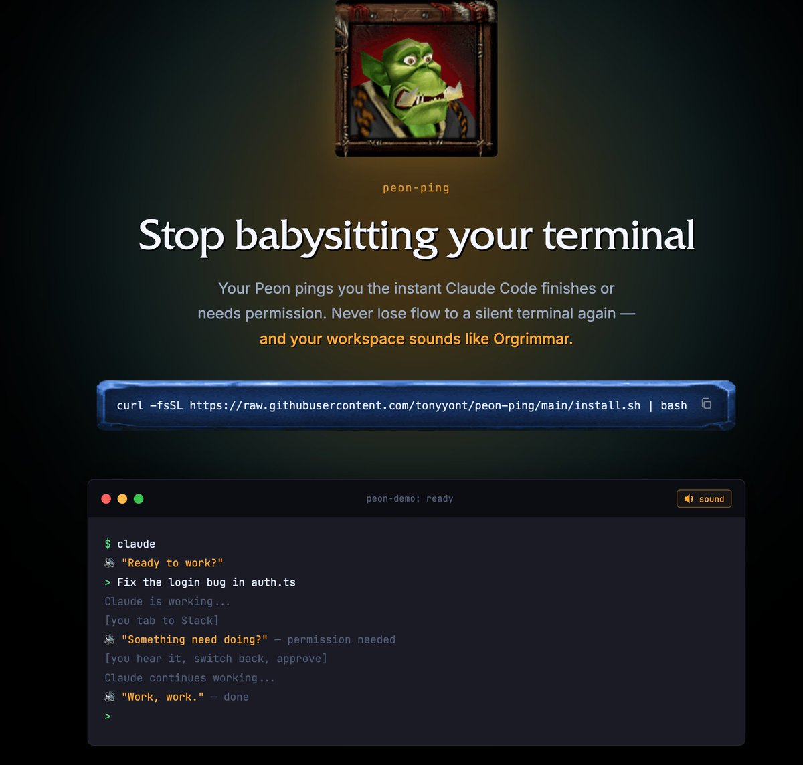

# ClaudeCode 加入魔獸爭霸3音效，苦工聲音趣味提醒

> **來源**: [@vikingmute](https://x.com/vikingmute/status/2021937960615358617)
>
> **日期**: 
>
> **標籤**: `ClaudeCode` `魔獸爭霸3` `音效` `AI` `趣味`

---

## ClaudeCode 加入魔獸爭霸3 音效：苦工聲音趣味提醒

### 總覽

本文介紹由 @vikingmute (Viking) 分享的一個有趣的項目，該項目將魔獸爭霸3 獸族苦工的音效加入 ClaudeCode 中，用以提醒程式運行狀態。 這些音效不僅充滿喜感，也讓使用者感到親切。

### 項目介紹

作者分享了他對 ClaudeCode 的一個趣味改造：添加了魔獸爭霸3 獸族苦工的聲音作為程式運行狀態的提醒音效。 苦工的音效是魔獸爭霸3 中作者最喜歡且覺得最喜感的音效，因此選擇它們來提醒 ClaudeCode 的運行狀態，作者認為這非常實用。

### 音效與狀態對應

以下列出音效與 ClaudeCode 狀態的對應關係：

| ClaudeCode 狀態 | 苦工音效                                     |
|--------------|---------------------------------------------|
| Session 開始   | "Ready to work?", "Yes?", "What you want?"   |
| 任務完成    | "Work, work.", "I can do that.", "Okie dokie." |
| 需要權限    | "Something need doing?", "Hmm?", "What you want?" |

### Demo 連結

您可以透過以下連結觀看 Demo：

[https://t.co/9a8iKmUdHz](https://t.co/9a8iKmUdHz)

### 總結

這個項目巧妙地將經典遊戲音效融入程式開發環境，增添了使用的樂趣和親切感。

