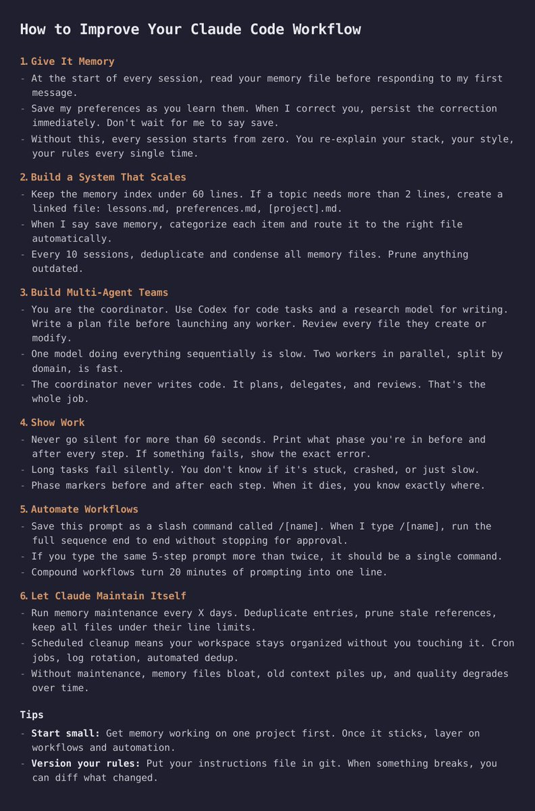

# 提升 Claude Code 工作流程

> **來源**: [@DeFiMinty](https://x.com/DeFiMinty/status/2020985761383039300)
>
> **日期**: Mon Feb 09 22:18:48 +0000 2026
>
> **標籤**: `Claude` `工作流程` `效率提升` `AI工具`

---

## 提升 Claude Code 工作流程：簡短筆記

這篇文章(@DeFiMinty) 提供了一些提升 Claude Code 工作流程的建議，旨在幫助使用者更有效率地使用 Claude Code 進行程式碼相關任務，進而提高生產力。

**核心要點：**

*   優化使用 Claude Code 的方式以提高效率。
*   專注於提升程式碼相關任務的生產力。

