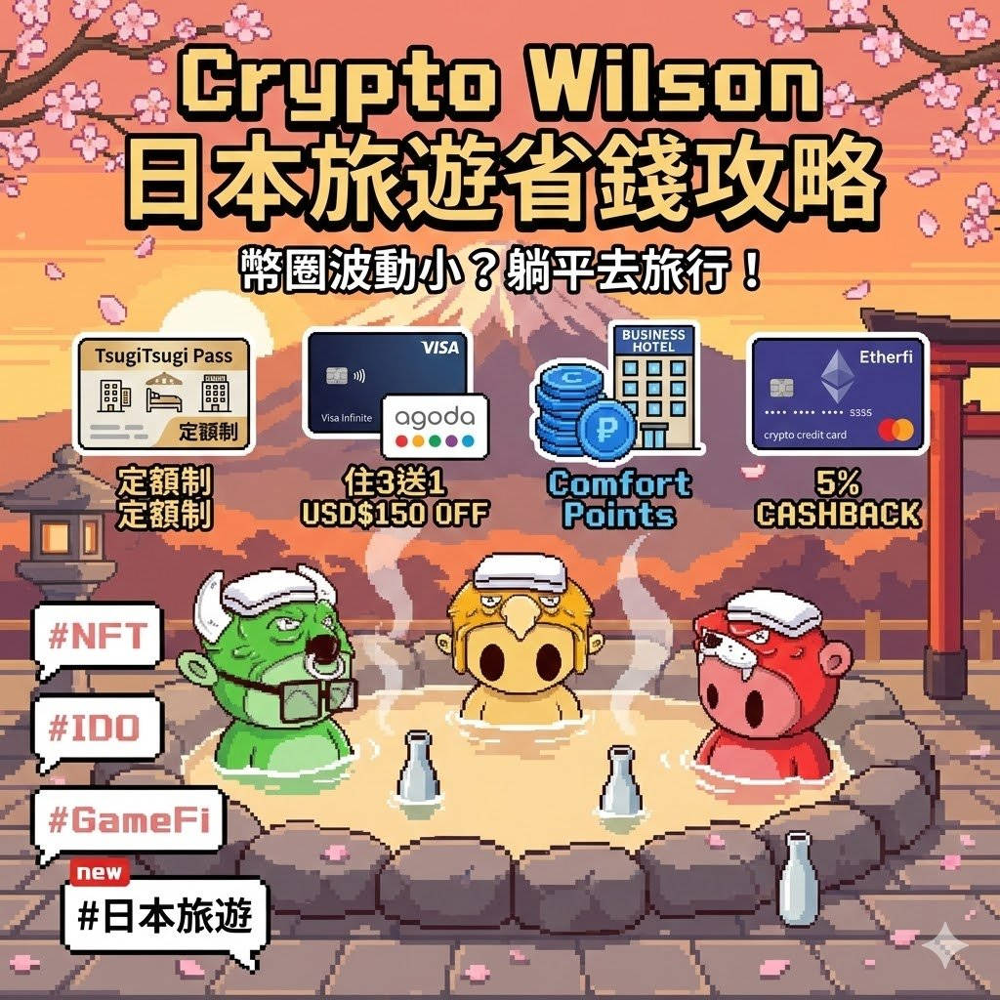

# 2026 日本旅遊訂房攻略：小資族高 CP 值飯店選擇

> **來源**: [@cryptowilson_](https://x.com/cryptowilson_/status/2016814315605537135)
> **日期**: 
> **標籤**: `日本旅遊` `訂房攻略` `飯店` `優惠` `小資族`

---

## 2026 日本旅遊訂房攻略：小資族高 CP 值飯店選擇

這篇文章分享四種在日本預訂高 CP 值飯店的方法，特別適合預算有限的小資族，讓你用更划算的價格享受美好的日本之旅。

### 一、省錢訂房方案總覽

| 訂房方案            | 特色                                                                   | 適用對象                                                               | 缺點                                                                      |
| ------------------- | --------------------------------------------------------------------- | --------------------------------------------------------------------- | ------------------------------------------------------------------------ |
| 宿喜宿嬉           | 東急集團住宿方案，定額費用，兩人入住，房型多元。                                                 | 適合臨時起意、說走就走的旅行者，以及想入住東急集團旗下飯店者。                                        | 只能入住前兩個月預訂，熱門飯店可能需要搶。                                                 |
| Agoda Visa 無限卡優惠 | 預訂 3 晚免費贈送 1 晚，上限折扣 150 美金。                                                     | 喜歡在 Agoda 上訂房，且持有台灣發行的 Visa 無限卡者。                                          | 需要 Visa 無限卡（無限商務卡不行），優惠方案數量有限。                                              |
| Comfort 集團點數房   | 平價商務旅館，透過點數特賣，可用低價點數兌換住宿。                                               | 預算有限，不追求高級住宿，且能提前規劃行程者。                                                    | 一般商務旅館，房型不大。                                                               |
| Etherfi Travel     | 透過 Etherfi 訂房，享有 5% 現金回饋。                                                       | 持有 Etherfi 幣圈卡，或不排斥使用幣圈卡訂房者。                                                    | 住宿價格可能高低不一，需要比價。                                                             |

### 二、各訂房方案詳細介紹

#### 1. 宿喜宿嬉

*   **簡介：** 由東急集團運營的住宿方案，主打定額費用、兩人入住，房型涵蓋渡假村、溫泉旅館到豪華商旅。
*   **價格：** 最便宜兩人房一晚只要 14600 日圓 (約 3000 台幣)。
*   **範例：**
    *   大阪東急卓越酒店 (日常均價 5000 ~ 6000 台幣一晚)
    *   GRIDS PREMIUM HOTEL (日常均價 6000 台幣起跳一晚)
*   **優勢：**
    *   可用相對划算的價格入住高價酒店。
    *   入住東急集團旗下酒店，可享有會員福利（提早入住、延後退房、迎賓飲料等）。
*   **注意事項：**
    *   只能入住前兩個月預訂。
    *   熱門飯店可能需要搶。
    *   部分飯店日常均價不高，建議多比價。
*   **適用情境：** 適合臨時起意的旅行，或是在熱門旅遊季節尋找高 CP 值住宿。
*   **連結：** [https://t.co/bdKfcbOVmV](https://t.co/bdKfcbOVmV)

#### 2. Visa 無限卡的 Agoda 優惠方案 (限定台灣發卡)

*   **簡介：** Agoda 提供的 Visa 無限卡優惠方案，針對台灣發卡銀行。
*   **優惠內容：** 2026 年底前，每月有限制數量的「預訂 3 晚免費贈送其中 1 晚」方案，上限折扣 150 美金。
*   **範例：** Dormy Inn 溫泉商旅，基本價格落在折扣區間內，等於住三晚就免費送一晚。
*   **優勢：**
    *   可搭配 Shopback 等現金回饋網，獲得更多回饋。
*   **注意事項：**
    *   必須持有台灣發行的 Visa 無限卡 (無限商務卡不適用)。
    *   優惠方案數量有限。
*   **適用情境：** 喜歡在 Agoda 上訂房，且持有符合資格的信用卡者。
*   **連結：** [https://t.co/ebCpvAcmNs](https://t.co/ebCpvAcmNs)

#### 3. Comfort 集團點數房

*   **簡介：** Comfort 集團是平價商務旅館，常態性提供較低價格的住宿。
*   **點數取得：** 透過不定時的點數特賣 (例如一月剛結束的點數特賣有 40% Bonus)，平均一點的價格落在 0.23 台幣。
*   **兌換比例：** 日本 Comfort 點房平均兌換比率在 1 晚 8000 ~ 12000 點之間，可入住兩人。
*   **價格：** 最便宜一晚不到 2000 台幣，最貴也不超過 3000 台幣。
*   **特色：** 旗下不同住宿系列有不同的特色，例如免費早餐、溫泉浴場、房型大小等。
*   **範例：**
    *   京都櫻花季期間，コンフォートイン京都四条烏丸現金價漲到 7000 台幣左右，用點房仍不到 3000 台幣 (且有溫泉)。
    *   長岡花火節期間，周圍住宿皆漲破萬台幣，用點房仍可預訂房間且附早餐。
*   **優勢：**
    *   可提前 365 天預訂房卡位，在期限內取消也不會扣點數。
*   **注意事項：**
    *   一般的商務旅館，大部分房型不大。
*   **適用情境：** 預算有限，且能提前規劃行程者。

#### 4. Etherfi Travel

*   **簡介：** 使用幣圈卡訂房的選擇。
*   **優惠內容：** 透過 Etherfi 訂房，享有 5% 現金回饋。
*   **優勢：**
    *   不需要出金成台幣可以直接刷。
    *   如果用美金結算也不用額外扣除外幣手續費。
*   **注意事項：**
    *   住宿價格需要與其他 OTA 平台比價。
*   **適用情境：** 持有 Etherfi 幣圈卡，或不排斥使用幣圈卡訂房者。
*   **註冊連結：** [https://t.co/L2ZI7app4S](https://t.co/L2ZI7app4S)
*   **訂房連結：** [https://t.co/3X6IVd7GAx](https://t.co/3X6IVd7GAx)

如果大家有更常用、更划算的訂房策略也歡迎分享，有時候出國放鬆比硬要交易還省錢！

