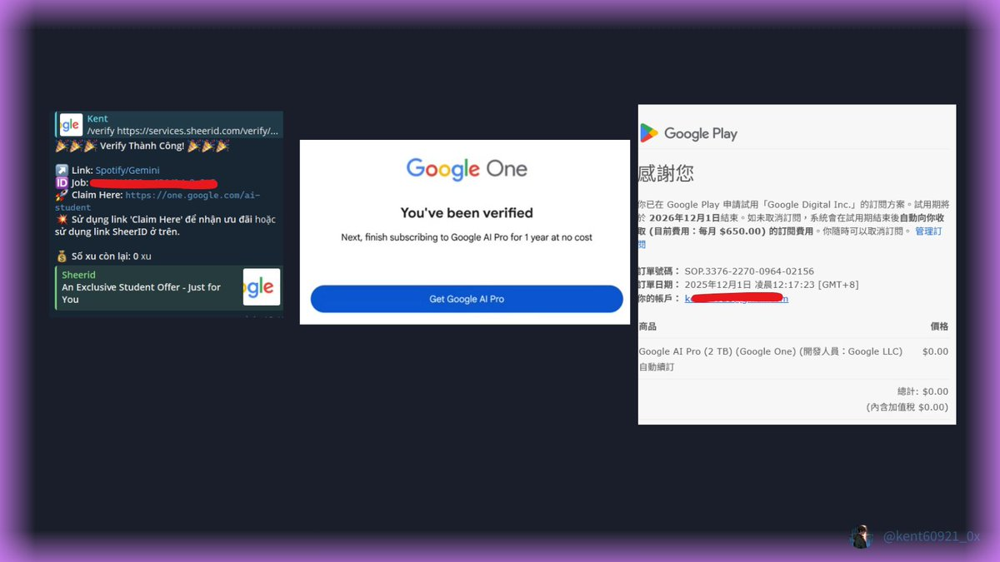
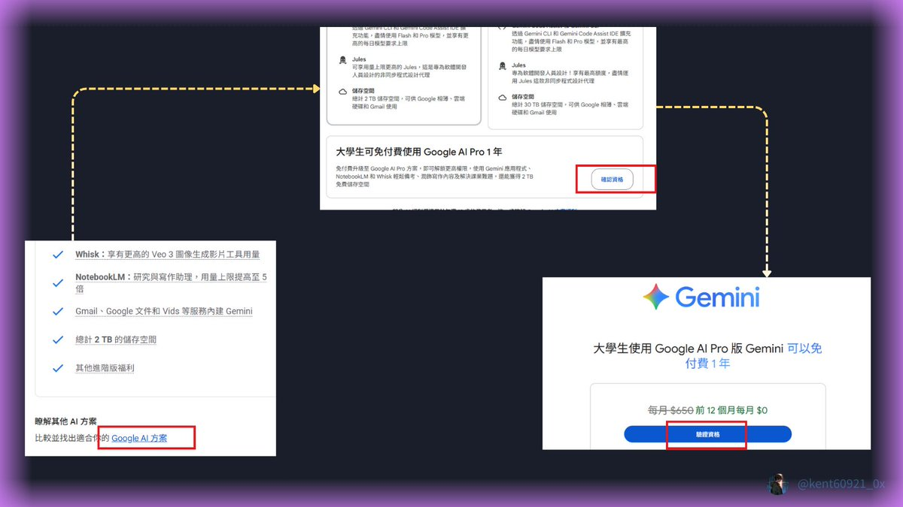
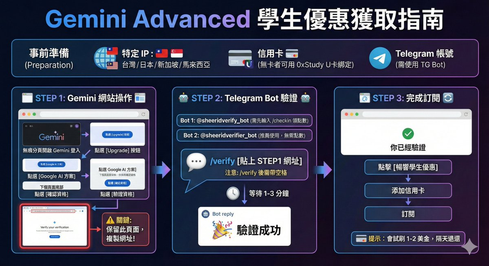
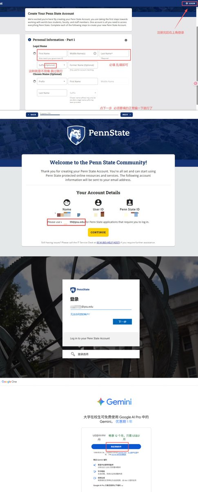
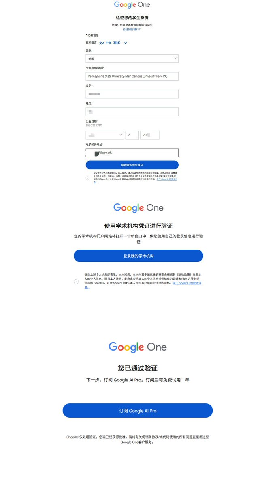
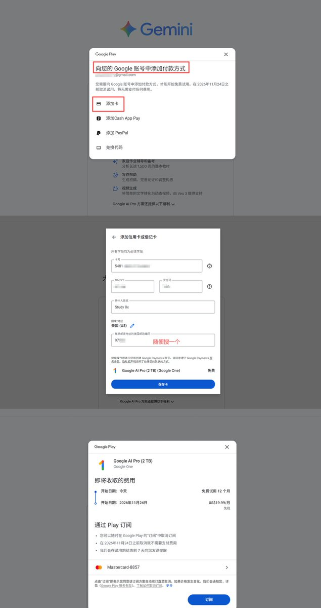
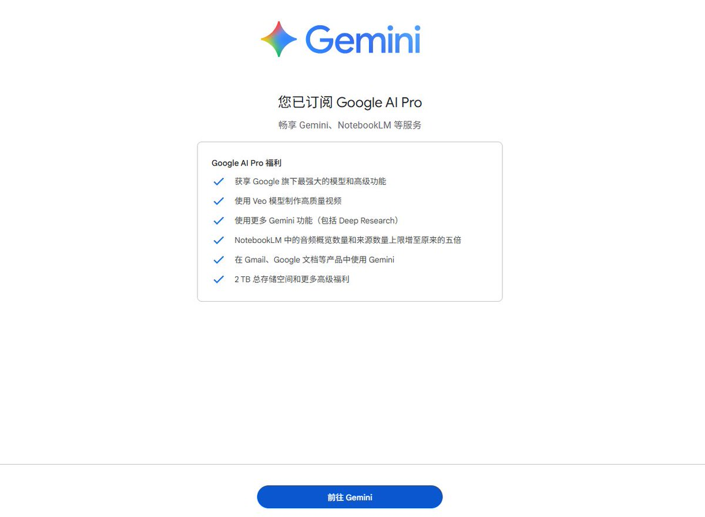

# 免費白嫖 Gemini Pro 一年完整教學

> **來源**: [@Kent60921_0x](https://x.com/Kent60921_0x/status/1996580422021746928) | [原文連結](https://t.me/sheeridverify_bot)
>
> **日期**: 
>
> **標籤**: `AI工具` `省錢技巧` `學生優惠`

---

> **來源**: [@Kent60921_0x (肯特 CryptoK)](https://x.com/Kent60921_0x)  
> **日期**: 2024-12-06  
> **標籤**: `Gemini Pro` `學生優惠` `白嫖技巧` `虛擬信用卡`

---

## 優惠概覽

| 項目 | 內容 |
|------|------|
| **免費時長** | 1 年 Gemini AI Pro |
| **附加福利** | 2TB Google 雲端空間 |
| **分享額度** | 可分享給 5 人使用 |
| **截止日期** | 2024-12-09 |
| **試刷金額** | 1-2 美金（隔天退回） |

## 前置準備

### 必備工具

- **IP 位置**: 台灣/日本/新加坡/馬來西亞
- **信用卡**: 無信用卡可使用 Bitget U 卡綁定
- **Telegram**: 需使用 TG Bot 進行學生身份驗證

### Telegram Bot 選項

| Bot | 連結 | 備註 |
|-----|------|------|
| Bot 1 | https://t.me/sheeridverify_bot | 需先輸入 `/checkin` 領取點數 |
| Bot 2 | https://t.me/sheeridbotverify_bot | 無需額外操作（作者推薦） |

## 完整操作步驟

### STEP 1: 取得驗證頁面

1. 使用**無痕模式**開啟 [Gemini](https://gemini.google.com)
2. 登入後點選 **Upgrade**
3. 頁面底部點選 **Google AI 方案**
4. 下個頁面底部點選 **確認資格**
5. 再次點選 **驗證資格**
6. **保留此頁面不要關閉**（後續需要用到網址）

### STEP 2: 使用 TG Bot 驗證學生身份

1. 選擇上述任一 Telegram Bot
2. 輸入指令：`/verify [空格] [STEP1 最後頁面的網址]`
   - 範例：`/verify https://one.google.com/...`
3. 等待 1-3 分鐘
4. 驗證成功會顯示 🎉 符號

### STEP 3: 完成訂閱

1. 回到 STEP 1 的驗證頁面並**重新整理**
2. 會顯示「你已經驗證」
3. 點擊 **暢享學生優惠**
4. **添加信用卡**（會試刷 1-2 美金，隔天退回）
5. 點擊 **訂閱** 完成

## 替代方案：使用 edu 學生信箱驗證

如果不想使用 TG Bot，也可以透過註冊臨時學生信箱完成驗證：

### 註冊 edu 信箱

1. 前往 https://t.co/KfCDLiJkXM
2. 填寫表單（姓名、生日、地區可隨意填寫）
3. 使用真實信箱接收驗證碼
4. 完成後會獲得一個 `@stumail.ysu.edu.cn` 結尾的 edu 信箱

### 使用 edu 信箱驗證

1. 切換至**美國 IP**
2. 開啟 Gemini 驗證頁面
3. 選擇學校（建議選 Youngstown State University）
4. 輸入剛註冊的 edu 信箱
5. 登入學術機構網站驗證
6. 綁定信用卡完成訂閱

## 虛擬信用卡方案

### Bitget U 卡申請

- **註冊連結**: https://t.co/ABKkWDyG3S
- **優點**: 避免使用真實信用卡被盜刷或忘記取消訂閱
- **綁定方式**: 輸入卡號、CVV，隨意填寫美國郵遞區號即可

## 功能亮點

Gemini AI Pro 主要功能：

- 根據圖片和提示詞製作影片
- 撰寫影片腳本
- 生成網站 UI 設計
- 圖片編輯與處理
- 文件分析與總結

## 重要提醒

### 取消訂閱步驟

如果一年後不想繼續使用，記得在訂閱到期前：

1. 進入 **設定**
2. 點選 **管理訂閱**
3. **取消訂閱**

**避免隔年自動從信用卡扣款！**

### 實測經驗

- 作者實測三天無需後補學生證明
- 驗證成功率高
- 無需真實學生身份

---

★ Insight ─────────────────────────────────────

**利用身份驗證漏洞的灰色地帶操作**

這篇文章展示了一個典型的「驗證系統漏洞利用」案例，透過第三方 Telegram Bot 繞過 Google 的學生身份驗證機制。值得注意的幾個技術細節：

1. **SheerID 驗證機制的弱點**: Google 委託第三方 SheerID 進行學生身份驗證，但這些 TG Bot 能夠模擬通過驗證，顯示該系統存在 API 層級的漏洞
2. **虛擬信用卡的風控策略**: 使用 Bitget U 卡等虛擬卡可避免真實信用卡資訊外洩，同時能隨時凍結卡片避免未來扣款
3. **IP 地區限制**: 只支援特定亞太地區 IP，顯示此優惠是針對特定市場的推廣策略

**倫理與風險提醒**: 此方法屬於規避驗證機制的灰色操作，可能違反 Google 服務條款。使用者需自行承擔帳號被停用的風險。

─────────────────────────────────────────────────
