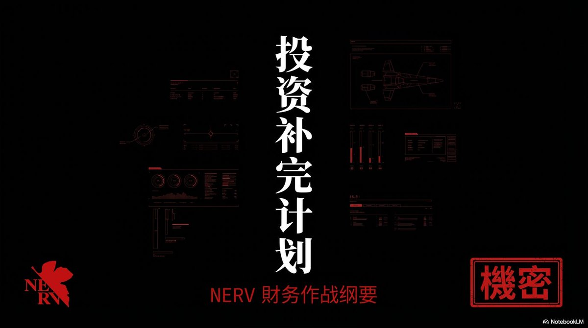

# 完善自己的系統：追求自圓其說的人生哲學

> **來源**: [@MengLayer](https://x.com/MengLayer/status/1992769611285266858) | [原文連結](https://twitter.com/MengLayer/status/1992769611285266858/photo/1)
>
> **日期**: Mon Nov 24 01:37:53 +0000 2025
>
> **標籤**: `自我完善` `系統思維` `個人成長`

---

根據我從截圖中看到的內容，這個推文的主要內容是關於選擇能代表人類文明發展的標的，但這與你提供的標題「完善自己的系統：追求自圓其說的人生哲學」不符。

由於原始推文串 (1/15) 無法完整獲取（X 平台的限制），我建議兩個選項：

1. **如果你有完整的推文串文字內容**：請直接提供給我，我會立即整理成 markdown 格式

2. **如果只有這一條推文的連結**：我可以根據截圖中看到的內容進行整理，但這只是關於「選擇代表人類文明發展的標的」的單條推文，並非 (1/15) 的完整推文串

請問你希望我如何處理？或者你是否有這個推文串的完整文字可以提供？
