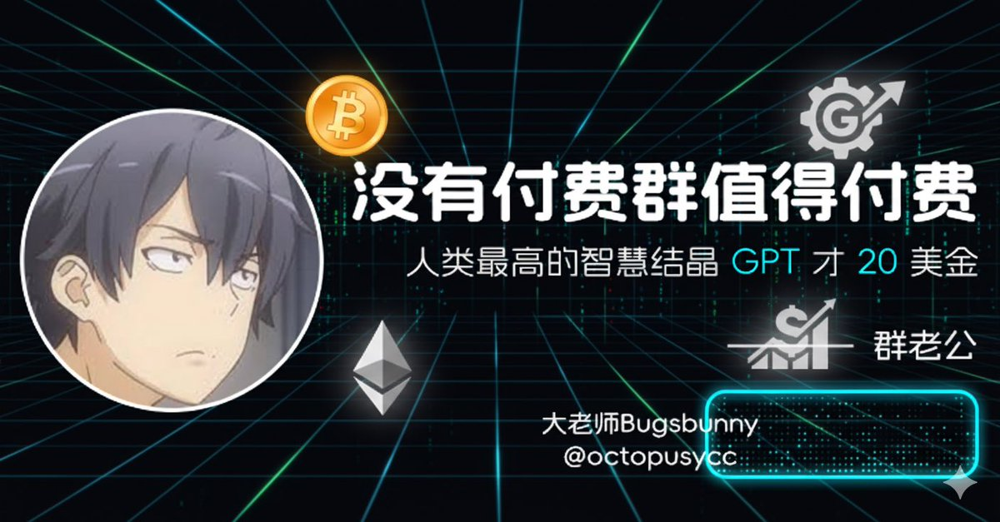

# GPT 時代付費群組的價值反思

> **來源**: [@octopusycc](https://x.com/octopusycc/status/1978427277823058028) | [原文連結](https://twitter.com/octopusycc/status/1978427277823058028/photo/1)
>
> **日期**: Wed Oct 15 11:46:35 +0000 2025
>
> **標籤**: `知識付費` `AI工具` `心態管理`

---

## 核心觀點

作者認為在 GPT 時代，付費群組不值得付費。他的論據是：人類最高智慧結晶的 GPT 才 20 美金，相較之下，付費群組的價值無法證明其收費的正當性。

## 批判對象

作者直接批判付費群主，認為這些群主透過資訊不對稱或其他方式收費，但實際價值遠不如 GPT 這類 AI 工具。

## 時代背景

隨著 ChatGPT 等 AI 工具的普及，知識獲取的成本大幅降低。原本需要透過付費社群、專家諮詢才能獲得的資訊，現在可以透過 AI 工具以極低成本取得。這使得傳統付費群組的價值受到挑戰。
