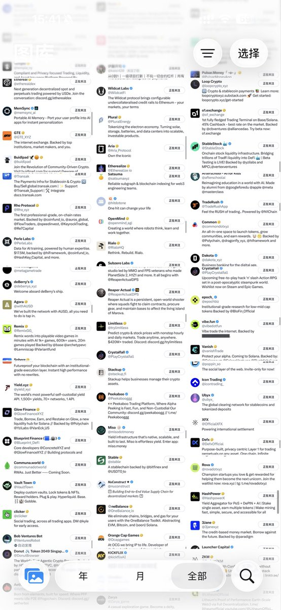
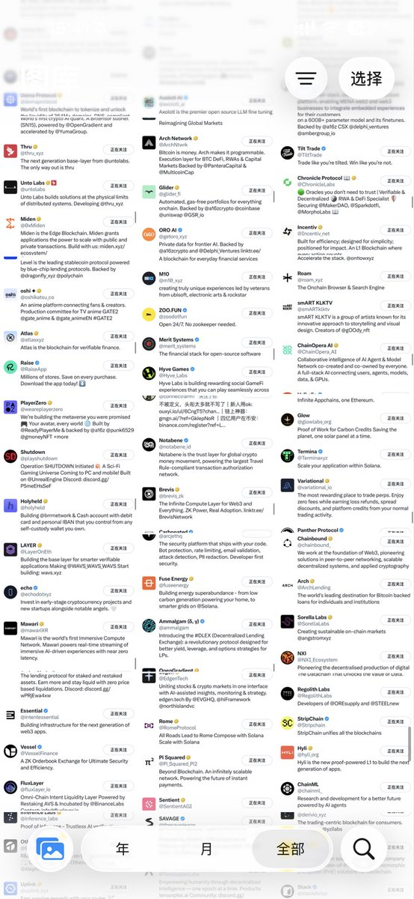

# Twitter 推文流清理策略 - 精準篩選感興趣的內容

> **來源**: [@0xleng1](https://x.com/0xleng1/status/1975467438948163727) | [原文連結](https://twitter.com/0xleng1/status/1975467438948163727/photo/1)
>
> **日期**: 
>
> **標籤**: `社群媒體管理` `資訊篩選` `效率提升`

---

> **來源**: [@0xleng1](https://twitter.com/0xleng1)  
> **日期**: 2026-02-18  
> **標籤**: `Twitter` `資訊管理` `社群媒體`

---

## Twitter 推文流清理策略

本來想把自己關注的項目一個一個發出來的，但是圖片太多了。

## 清理方法

具體怎麼清理的話，比如之前大熱的項目 aster 都在發，我就會點「不感興趣」不再推送類似的東西。不玩合約推送合約類就清理，大數據很好用。

看我推也是正兒八經希望你學點東西的。
