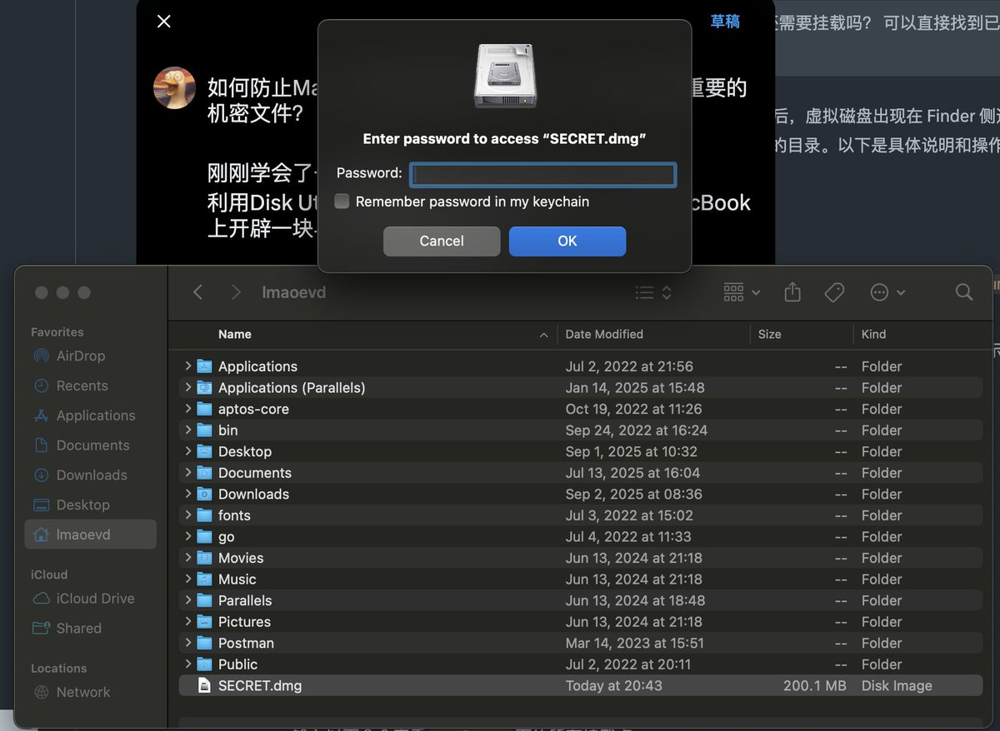
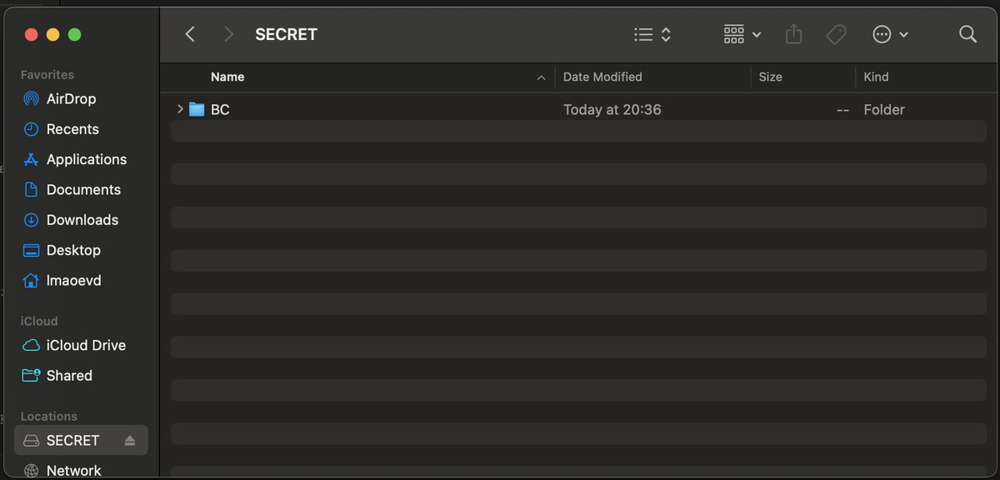
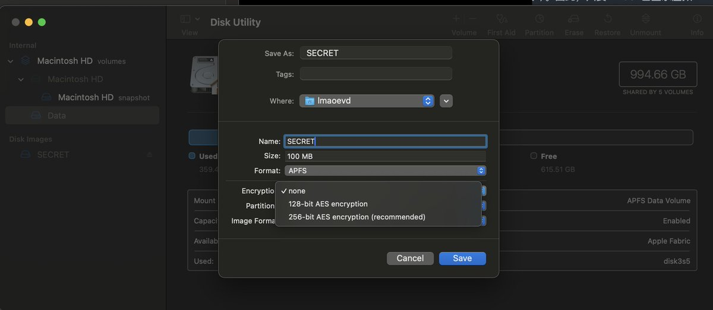

# macOS 加密鏡像檔防止資料外洩技巧

> **來源**: [@0x0_zero](https://x.com/0x0_zero/status/1967934752465490017)
>
> **日期**: 
>
> **標籤**: `資訊安全` `macOS` `檔案保護`

---

> **來源**: [@0x0_zero](https://x.com/0x0_zero)
> **日期**: 2026-02-18
> **標籤**: `macOS` `安全性` `加密` `資料保護`

---

## 防護原理

利用 macOS 的 Disk Utility 建立加密的可掛載鏡像檔（Encrypted Disk Image），在 MacBook 上開闢一塊與世隔絕的硬碟空間。即使黑客程式入侵系統，也無法存取這些重要機密檔案。

## 安全機制

掛載後的檔案目錄位於系統級的 `/Volumes` 目錄下。任何程式即使獲得 root 權限，或是取得日常授權的 `~` 目錄下的權限，也無法存取你的重要檔案。

## 使用流程

1. 需要使用時，掛載鏡像並輸入密碼
2. 使用完畢後，unmount 鏡像
3. 基本上 100% 排除了被 hack 掉重要資料的可能性

