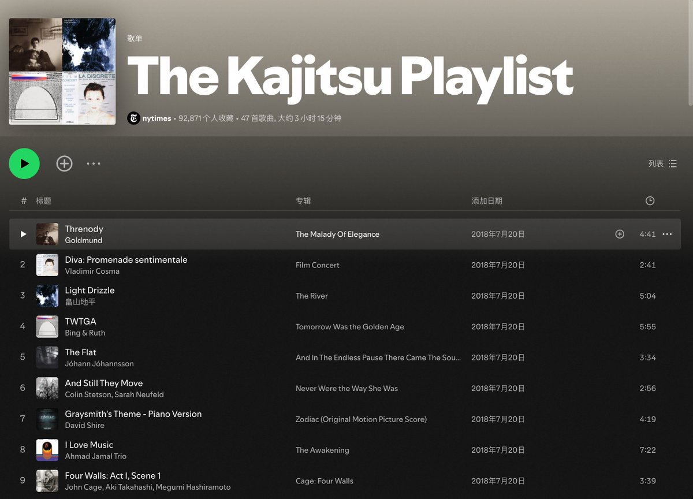

# 坂本龍一為餐廳創作的 Kajitsu 播放清單

> **來源**: [@HiTw93](https://x.com/HiTw93/status/1867897322840989727) | [原文連結](https://www.youtube.com/playlist?list=PLyF_H5mySFA3TqDp9uQZ0TJrjjJ_b38Ty)
>
> **日期**: Sat Dec 14 11:40:00 +0000 2024
>
> **標籤**: `音樂策劃` `餐飲文化` `生活美學`

---

> **來源**: [Tw93](https://x.com/HiTw93)  
> **日期**: 2026-02-18  
> **標籤**: `音樂` `坂本龍一` `播放清單`

---

坂本龍一生前很喜歡去一家日本料理餐廳吃飯，餐館很棒，但是音樂很糟，於是他免費幫助這個餐廳定制了一個合適的歌單，叫做 **The Kajitsu Playlist**，完全沒有用他自己的音樂，挺適合安靜場合聽聽。

🎵 [The Kajitsu Playlist curated by Ryuichi Sakamoto - YouTube](https://www.youtube.com/playlist?list=PLqXEGKIeQ6qOQJOOBXQVxJZDODJLDGqLz)
