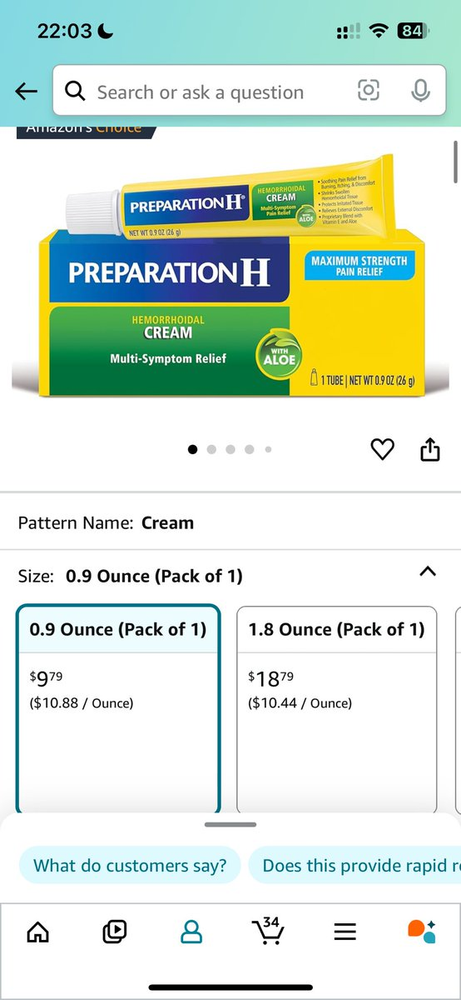

# 美國痔瘡膏使用心得：OTC 藥品療效對比

> **來源**: [@MianMaoKu](https://x.com/MianMaoKu/status/1835908422811996273) | [原文連結](https://twitter.com/MianMaoKu/status/1835908422811996273/photo/1)
>
> **日期**: 
>
> **標籤**: `健康用品` `海外購物` `用藥心得`

---

> **來源**: [@MianMaoKu (MMK)](https://twitter.com/MianMaoKu)
> **日期**: 2026-02-18
> **標籤**: `痔瘡治療` `OTC藥品` `美國藥妝` `用藥心得`

---

## 治療經歷

外痔手術之後大半年痔瘡又長出來了，在亞馬遜上買了一支 best seller 痔瘡膏使用一週後，痔瘡就縮沒了！

## 療效對比

之前上船前還特地買了一支新的馬應龍備用，現在看來完全沒必要。美國隨便買支 OTC 痔瘡藥都比味道刺鼻又沒什麼大效果的中成藥好用得多。

## 心得總結

美國市場上的痔瘡藥（特別是亞馬遜暢銷款）在療效上明顯優於國內常見的馬應龍等中成藥品。

