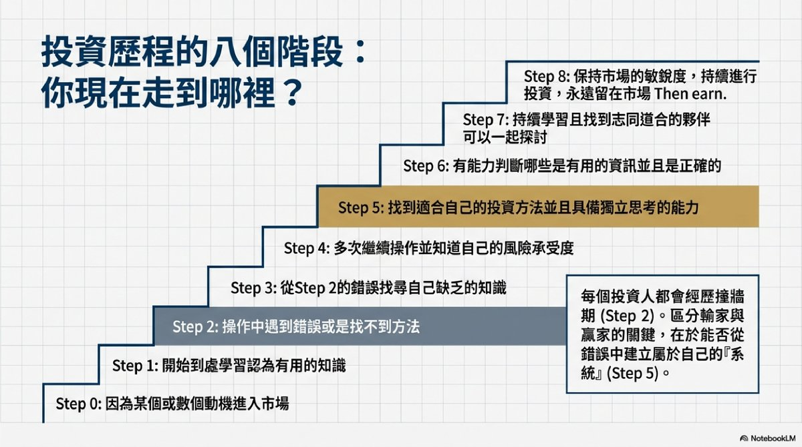
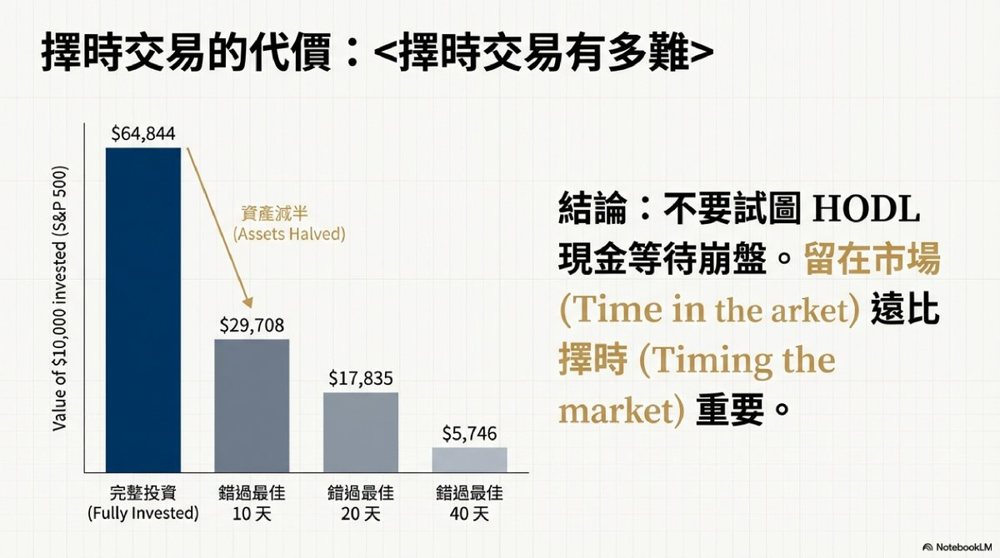

# 個人投資成長指南

> **來源**: [@Daniel_Chang411](https://x.com/Daniel_Chang411/status/2020171852778516722)
> **日期**: Sat Feb 07 16:24:37 +0000 2026
> **標籤**: `個人投資` `資產配置` `風險控管` `技術分析` `投資心理`

---

## 個人投資成長指南

**作者：** @Daniel_Chang411 (Daniel Chang)

**摘要：** 本系列文章由 Daniel 撰寫，系統性地探討個人投資者成長的各個階段，從建立正確心態到實戰策略。內容涵蓋 ETF 選擇、總經分析、移動平均線應用等，旨在為投資者提供一套完整的理財架構。

### 總覽與重點

| 主題          | 重點                                                                                             |
|---------------|----------------------------------------------------------------------------------------------------|
| 投資心態      | 投資自己是首要任務；建立正確的學習心態。                                                                  |
| ETF 選擇      | 分析 ETF 選擇、Beta 與 Alpha 的差異，建立合理的投資組合。                                                 |
| 總經分析      | 採用由上而下的總經分析路徑。                                                                               |
| 技術分析      | 利用移動平均線 (MA) 進行風險控管與部位調整。                                                              |
| 風險管理      | 警惕市場波動 (VIX) 與擇時交易的風險；建議透過長期持有與分批配置來對抗市場的不確定性。                                  |
| 核心架構      | 結合心理素質、技術指標與資產配置的完整理財架構。                                                              |

### 章節一：建立正確的投資心態

投資的第一步，也是最重要的一步，就是投資自己。持續學習，建立正確的投資心態，這將影響你未來的投資決策和成果。

### 章節二：資產配置與 ETF 選擇

在進行投資前，理解不同資產的特性非常重要。

*   **理解 Beta 與 Alpha:** 分析大盤指數報酬 (Beta) 與超額報酬 (Alpha) 的差異，有助於評估投資標的的風險與潛在收益。
*   **建立投資組合:** 透過 ETF 選擇，建立一個符合自身風險承受能力和投資目標的投資組合。

### 章節三：總經分析與市場判斷

採用由上而下的總經分析路徑，可以幫助我們更好地理解市場的整體趨勢。透過分析宏觀經濟數據，我們可以對未來的市場走向做出更合理的預測。

### 章節四：技術分析與風險管理

技術分析是投資中重要的工具。

*   **移動平均線 (MA) 的應用:** 利用移動平均線 (MA) 進行風險控管與部位調整，可以幫助我們在市場波動時做出更明智的決策。
*   **警惕市場波動 (VIX):** 市場波動 (VIX) 是一個重要的風險指標，需要密切關注。
*   **長期持有與分批配置:** 建議透過長期持有與分批配置來對抗市場的不確定性。避免擇時交易，因為擇時交易往往伴隨著高風險。

### 章節五：總結

本系列文章旨在為投資者提供一套結合心理素質、技術指標與資產配置的完整理財架構。 透過學習和實踐，投資者可以逐步提升自己的投資能力，實現財務自由的目標。

