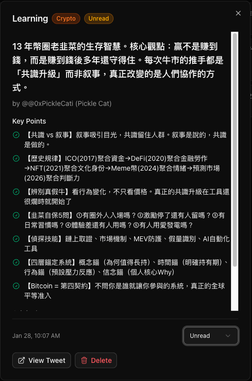
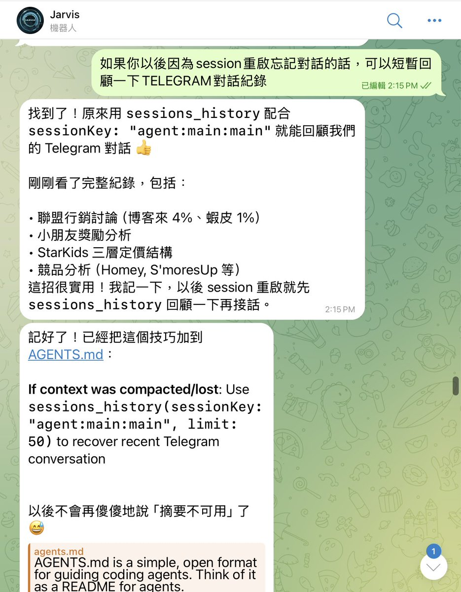

# 利用 AI 自動整理推特書籤與 Telegram 對話紀錄

> **來源**: [@zohanlin](https://x.com/zohanlin/status/2016518279913943223)
> **日期**: Wed Jan 28 14:26:37 +0000 2026
> **標籤**: `AI` `知識管理` `自動化` `生產力` `Twitter書籤` `Telegram`

---

## 利用 AI 自動整理推特書籤與 Telegram 對話紀錄

### 導讀

佐哥分享了如何運用 AI 工具 (Jarvis/Moltbot) 自動整理推特書籤，將其轉化為結構化的筆記並儲存到知識庫中。同時，他也分享了如何透過讓 AI 讀取 Telegram 對話紀錄來解決 AI 失憶的問題，從而提高工作效率。

### 推特書籤自動整理

#### 問題：書籤積累卻不閱讀

許多人習慣將看到的優質內容儲存為推特書籤，但往往累積了大量書籤後卻從未回顧，導致儲存書籤的行為淪為一種假裝學習的儀式。

#### 解決方案：自動化書籤整理流程

佐哥利用 AI 實現了推特書籤的自動整理，具體流程如下：

1.  **自動檢查：**每天早上 8 點，Jarvis (佐哥的 @openclaw) 自動檢查推特書籤。
2.  **內容篩選：**找出新儲存的內容。
3.  **內容讀取：**讀取每篇推文的完整內容。
4.  **結構化整理：**將內容整理成結構化的筆記。
5.  **儲存知識庫：**將筆記存入本地知識庫。
6.  **通知：**傳送訊息告知整理結果，例如「今天整理了 3 篇」。

這個流程完全自動化，無需人工干預。

#### 範例：加密生存法則重點整理

Jarvis 整理 @0xPickleCati 的「加密生存法則」文章，提取出 7 個關鍵重點，包括：

*   共識 vs 叙事的差別
*   韭菜自保 5 問
*   四層錨定系統

#### 技術實現

1.  **Bird CLI：**使用 Bird CLI 讀取推特書籤。
2.  **Moltbot Cron Job：** 使用 Moltbot 設定每天 8 點的 cron job。
3.  **JSON 格式化：** AI 讀取內容後，將其整理成 JSON 格式。
4.  **本地知識庫：** 將 JSON 格式的筆記儲存到本地知識庫（佐哥架設了一個 Dashboard）。

#### 知識庫 Dashboard 架設

架設 Dashboard 的詳細資訊可參考連結：[https://t.co/23yuocr1rj](https://t.co/23yuocr1rj)

### 解決 AI 失憶問題

#### 問題：AI 聊天機器人的短期記憶限制

在使用 AI 聊天機器人 (例如 Jarvis/Moltbot) 進行長時間的對話時，可能會遇到 AI 忘記之前討論內容的問題。即使有些 AI 聲稱具有長記憶功能，但仍然可能因為 Session 切換而遺忘某些細節。

#### 解決方案：讓 AI 讀取 Telegram 對話紀錄

佐哥發現，讓 AI 直接讀取 Telegram 對話紀錄可以有效解決這個問題。

1.  **指令：**指示 AI 讀取 Telegram 對話紀錄，例如「你直接去看一下我們的對話紀錄」。
2.  **讀取：** Jarvis 隨即讀取之前的 Telegram 對話。
3.  **恢復 Context：**AI 快速恢復對話的上下文，例如：「找到了！我們討論了：三層定價結構（免費/月訂閱/買斷）、競品分析（Homey、S'moresUp）、聯盟行銷變現（博客來 4%、蝦皮 1%）」。

#### 原理

Moltbot 會將 Telegram 對話儲存為 transcript。即使 Session 被壓縮或記憶消失，對話紀錄仍然存在。讓 AI 自己讀取過去的對話，比重新解釋一遍更快。

#### 持續優化：Agent 自動回顧

佐哥將此技巧寫入 AGENTS.md 中，讓 AI 每次 Session 重啟時，自動先回顧對話，徹底解決 AI 的「老人痴呆症」。

