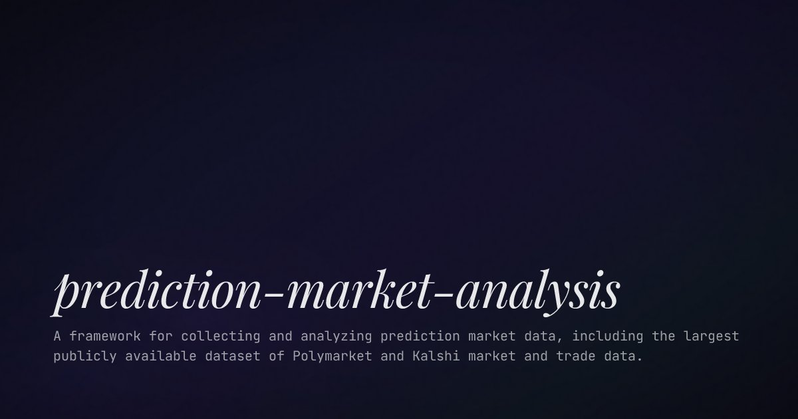

# Polymarket 全量歷史數據分析

> **來源**: [@runes_leo](https://x.com/runes_leo/status/2021600726112489627)
>
> **日期**: Wed Feb 11 15:02:27 +0000 2026
>
> **標籤**: `量化交易` `Polymarket` `數據分析` `市場微觀結構`

---

## Polymarket 全量歷史數據分析：數據中尋找 Alpha

**總覽：** 本文整理了關於 Polymarket 自 2020 年至今的全量歷史交易數據（超過 4 億筆交易）的相關資訊。作者 @runes_leo (Leo) 強調，透過深入研究這些數據，才能發掘真正的投資機會。許多基於地址追蹤的策略，經過回測後顯示其價值有限。在 AI 時代，數據分析能力至關重要。

### 數據來源

*   數據提供者：@beckerrjon
*   數據範圍：Polymarket 自 2020 年至今
*   交易筆數：超過 4 億筆
*   壓縮後大小：36GB
*   授權方式：MIT License，可透過 Cloudflare R2 免費下載。
*   下載連結：[https://t.co/L6gxqYTeu2](https://t.co/L6gxqYTeu2)

### 核心觀點

1.  **數據分析的重要性：** 作者認為，真正的 "Alpha" 藏在數據裡，而非僅僅依賴推文資訊。
2.  **地址追蹤策略的局限性：** 許多基於追蹤 "smart money" 地址的策略，經過回測後證明並不具備實際價值。
3.  **AI 時代的數據分析：** 在 AI 時代，即使不精通技術，也能夠透過工具分析數據，這使得數據分析能力更顯重要。

### 結論

在數位時代，特別是 AI 蓬勃發展的時代，掌握數據分析能力是至關重要的。透過深入研究 Polymarket 等平台的歷史數據，可以幫助投資者識別並利用潛在的市場機會，而非盲目跟隨社群媒體上的資訊。

