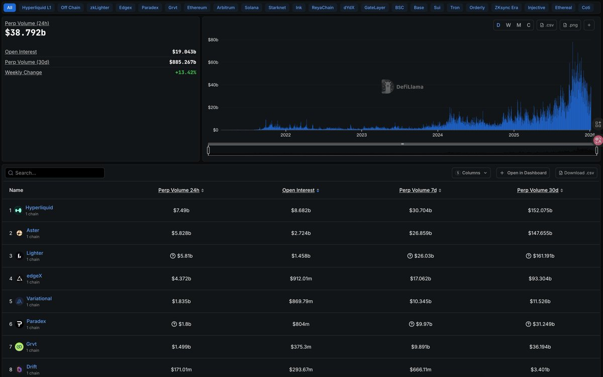

# StandX 做市商積分模式與 Perp 套利策略

> **來源**: [@ddazmon](https://x.com/ddazmon/status/2008768167724953671) | [原文連結](https://standx.com/referral?code=Dazmon88)
>
> **日期**: Wed Jan 07 05:10:26 +0000 2026
>
> **標籤**: `做市商` `積分機制` `Perp交易`

---

## 核心機制總覽

| 項目 | 說明 |
|------|------|
| **積分計算因子** | 倉位大小、掛單時長、價格距離盤口 |
| **目標效果** | 改善流動性，降低價差 |
| **套利策略** | 負成本套利，精確計算價差與資金費率 |
| **BTC 價差** | 改善前平均 200+ bps |

---

## StandX 做市商積分模式

### 積分權重規則

StandX 的做市商積分模式透過三個維度決定得分：

1. **倉位大小**：掛單金額越大、槓桿越高，得分越多
2. **掛單時長**：掛單時間越久，積分累積越多
3. **距離盤口**：越接近盤口的掛單權重越高

### 價格距離權重表

| 距離盤口範圍 | 權重 |
|-------------|------|
| 0 – 10 bps | 100% |
| 10 – 30 bps | 50% |
| 30 – 100 bps | 10% |

**設計邏輯**：這套機制鼓勵做市商在接近市價的位置提供流動性，有效改善交易所的流動性問題。

---

## Perp 套利策略要點

### 負成本套利思維

與其盲目刷量，不如專注於：
- **精確計算價差**：在開倉前評估買賣價差是否合理
- **資金費率管理**：計算資金費率成本，確保套利為負成本（收取資金費而非支付）
- **持倉年化收益**：GRVT 等平台的持倉年化其實不低，適合長期套利

### 實操建議

1. **算分方式差異**：不同 PerpDEX 的積分計算邏輯不同，需個別研究
2. **掛單優勢**：某些平台（如 GRVT）的掛單返手續費機制極具吸引力
3. **對沖腳本**：考慮使用前端對沖腳本或 var 對沖腳本提升效率

---

## 平台觀察

### GRVT
- **排名**：OI（未平倉合約）排名第 7
- **特色**：掛單返手續費機制
- **TGE 時間**：Q1 末
- **策略建議**：適合做市與套利結合，持倉年化收益可觀

### StandX
- **問題**：流動性曾經較差，BTC 點差平均 200+ bps
- **改善**：做市商積分模式推出後，流動性顯著提升
- **工具**：做市商腳本（作者預計釋出）

---

## 總結

PerpDEX 賽道持續升溫，StandX 的做市商積分模式是解決流動性問題的聰明設計。對於交易者而言，**負成本套利**才是立於不敗之地的關鍵——在刷量之前，務必精確計算價差與資金費率，避免盲目操作。
