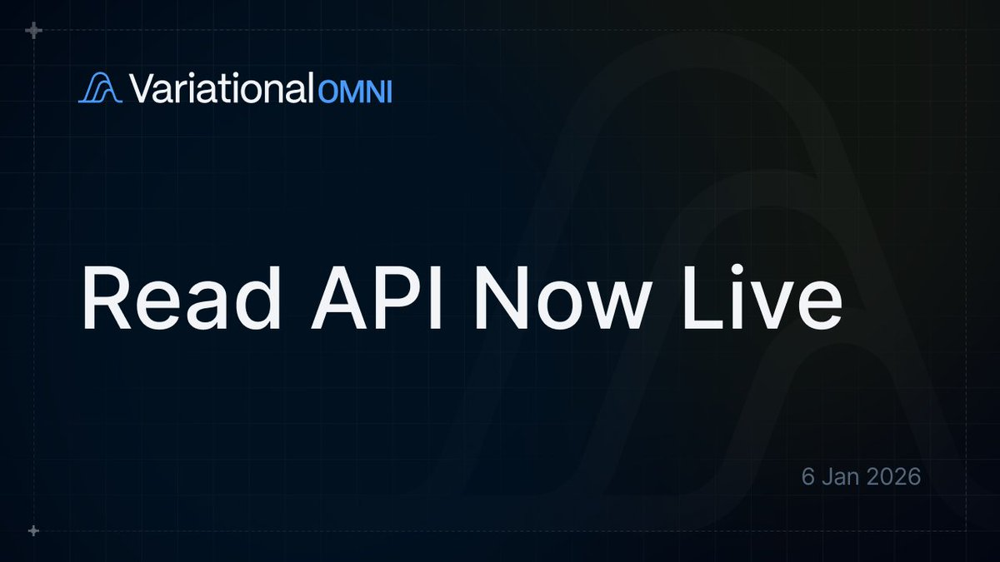

# Variational 資金費率套利地圖——多鏈永續合約對比工具

> **來源**: [@cas3333333](https://x.com/cas3333333/status/2008660921619784056) | [原文連結](https://varfunding.xyz/)
>
> **日期**: 
>
> **標籤**: `資金費率` `套利機會` `永續合約`

---

# 平台概述

Variational Funding Map 是一個基於 Variational Omni Read API 開發的資金費率套利地圖工具，可即時比較多個永續合約交易所的資金費率數據，幫助交易者快速識別跨平台套利機會。

## 核心功能

### 支援交易所（7 個）

| 交易所 | 類型 | 備註 |
|--------|------|------|
| Variational | 鏈上 DEX | 主要對比基準 |
| Hyperliquid | 鏈上 DEX | 高流動性鏈上平台 |
| Extended | 鏈上 DEX | - |
| Binance | 中心化 | CEX 基準參考 |
| dYdX | 鏈上 DEX | - |
| Drift | 鏈上 DEX | - |
| Lighter | 鏈上 DEX | - |
| Aster Paradex | 鏈上 DEX | - |
| Bybit | 中心化 | - |
| Pacifica | 鏈上 DEX | - |

### 主要數據維度

- **Funding Rate（資金費率）**: 各交易所實時資金費率
- **Delta（差價）**: 相對於基準平台的費率差異
- **Arbitrage（套利空間）**: 可識別的跨平台價差

## 應用場景

### 1. 資金費率套利

- 在低費率交易所開多倉
- 同時在高費率交易所開空倉
- 賺取費率差價（需考慮交易成本與滑點）

### 2. 市場情緒監控

- 觀察不同平台費率差異
- 識別市場微觀結構變化
- 發現特定代幣的平台偏好

### 3. 流動性分析

- 比較各平台報價效率
- 評估鏈上 DEX vs CEX 的競爭力
- 發現流動性不平衡的機會

## 技術特點

- **Real-time 更新**: 即時資金費率數據
- **Funding Matrix**: 矩陣式視圖，快速掃描所有代幣
- **Raw JSON**: 可匯出原始數據，方便自動化策略開發
- **基於 Omni Read API**: 使用 Variational 官方唯讀 API，數據可靠

## 使用建議

★ **套利風險提示**

1. **資金費率套利 ≠ 無風險**: 需考慮平台風險、滑點、提款延遲
2. **鏈上 DEX 特性**: Gas fee、清算機制與 CEX 不同
3. **市場波動**: 極端行情下，費率可能快速反轉
4. **持倉平衡**: 需精確對沖，避免單邊風險暴露

---

**工具連結**: [Variational Funding Map](https://dashboard.variational.io/funding)  
**API 文件**: [Omni Read API Docs](https://docs.variational.io/)
