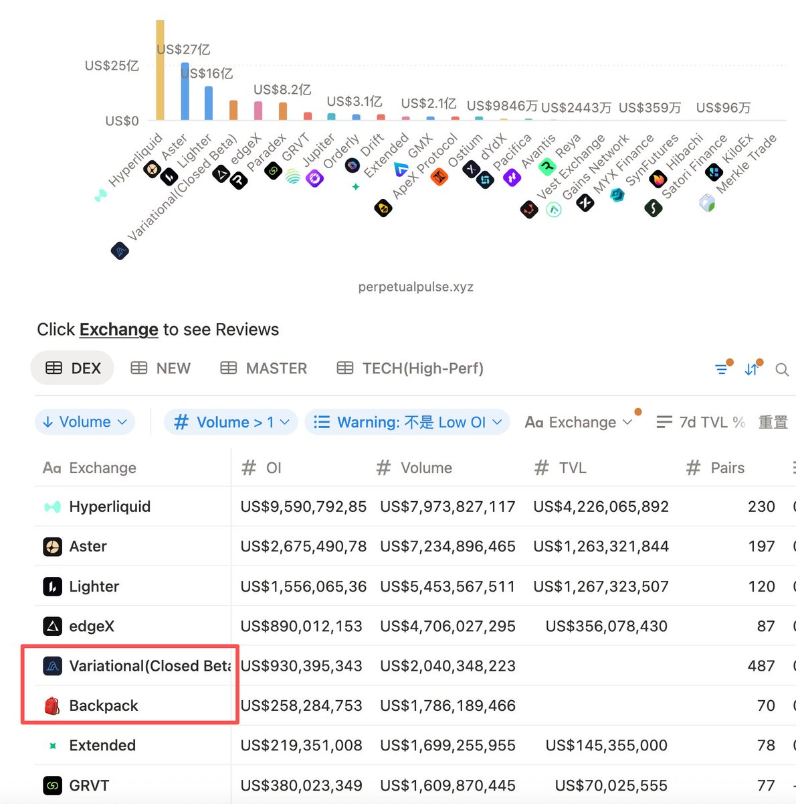

# 每日交易工作流：數據監控與風險評估

> **來源**: [@0Xlynn03](https://x.com/0Xlynn03/status/2008739484742148199) | [原文連結](https://www.perpetualpulse.xyz/)
>
> **日期**: Wed Jan 07 03:16:28 +0000 2026
>
> **標籤**: `交易策略` `數據分析` `風險管理`

---

