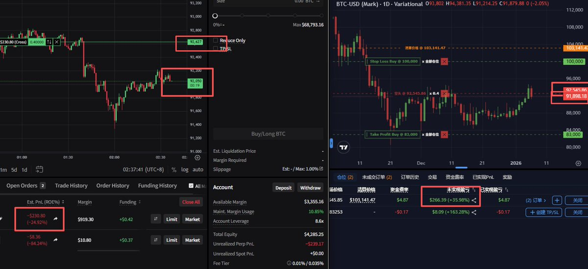
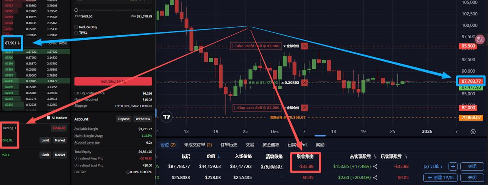

# Nado 和 Variational 資金費套利實戰分享

> **來源**: [@0xStudy](https://x.com/0xStudy/status/2008616135747662156)
>
> **日期**: 
>
> **標籤**: `資金費套利` `現貨合約對沖` `交易所差價`

---

> **來源**: [@0xStudy](https://x.com/0xStudy)  
> **日期**: 2026-02-14  
> **標籤**: `資金費套利` `Nado` `Variational` `合約對沖` `風險管理`

---

## 核心觀點

本文分享在 Nado 和 Variational 兩個交易所間進行資金費套利的實戰經驗，強調：
- **小額慢速開單**：避免插針導致價差過小造成虧損
- **資金費覆蓋手續費**：最佳狀態是每週資金費足以覆蓋開關大倉位的手續費
- **合約風險防範**：備足保證金、理解強平價與保證金不足機制
- **長期低磨損參與**：不硬刷、不上頭，重在參與

---

## 實戰案例：BTC 套利

### 價差與費率變化

| 時間 | Nado 費率 | Var 費率 | 價差 | 操作 |
|------|-----------|----------|------|------|
| 前晚 | 負費率 | 正費率 | - | Nado 開多 + Var 開空 |
| 今日 | +38% | +9% | 擴大 100+ | 平倉獲利 40U |

**觀察**：
- BTC 價差擴大了一百多，費率也發生反轉
- Nado 費率從負轉正至 +38%，Var 從負轉正至 +9%
- 價差與費率變化提供了平倉獲利機會

---

## 操作建議

### 開單策略

**市價小額慢速開單**（建議 0.005 BTC/單）：
- 正常價差範圍：100-150
- 避免掛單：Nado 手動 + Var 容易因插針導致開單價差過小 → 虧損
- 市價開單更安心，避免滑點風險

### 方向選擇

**Nado 空 + Var 多**（基於費率觀察）：
- Nado 費率 1 小時結算，Var 8 小時結算
- 平均而言 Nado 費率總是高於 Var
- 案例：兩天 0.4 BTC 可吃十幾 U 資金費，覆蓋部分手續費

### 幣種選擇

| 幣種 | 優點 | 缺點 |
|------|------|------|
| BTC | 費率相對穩定 | - |
| HYPE | 可行 | 費率經常反轉、流動性差、K 線跳動異常 |
| 小幣 | - | 流動性低，需謹慎 |

---

## 風險管理

### 合約風險提醒

1. **對沖風險**：小心反被套
2. **保證金管理**：長時間持倉需備足保證金確保安全
3. **強平風險**：理解強平價與保證金不足機制
4. **流動性風險**：小幣流動性低需謹慎

### 新手建議

**如果沒玩過合約**，建議：
- 先在兩個交易所開模擬盤
- 搞懂資金費、對沖、強平價、保證金不足等概念
- 再上手真倉操作
- **珍愛生命，遠離合約**

---

## 其他交易所選擇

**Lighter + Nado 對吃**：
- 適合玩過 Lighter（打火機）的用戶
- 可作為替代組合

---

## 項目資訊與心態

### Nado 毛估計

- 目前僅給 ink 代幣，數量未知
- 不期待 Aster 或 Lighter 級別的大毛
- 畢竟不是團隊自己發幣

### Cascade 參與

- 錯過首批（Perennial 換殼項目）
- 有熱度，團隊或許會轉型成功
- 建議：先導出私鑰保存，防郵件封號

### 長期心態

- **別上頭，0 損拿分才是真**
- 正常交易為主，感覺還很久（預估至少半年）
- 低磨損長期玩：漲跌幅度大、價差或費率大時入場
- 套套、刷刷、玩玩，先等過年

---

## 最佳狀態目標

**每週吃到的資金費 ≥ 開關幾次大倉位的手續費**

這樣才能實現真正的「低磨損」長期參與，而非頻繁開關單導致手續費吃掉利潤。
