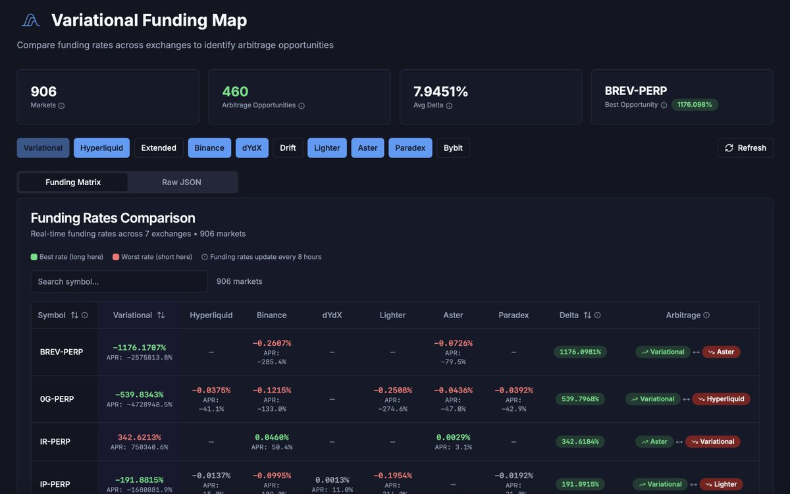

# 資金費率套利查詢工具匯總

> **來源**: [@tieqi7](https://x.com/tieqi7/status/2008706907679408177)
>
> **日期**: Wed Jan 07 01:07:01 +0000 2026
>
> **標籤**: `資金費率套利` `多平台` `交易工具`

---

# 工具介紹

一個整合多平台資金費率套利查詢的開源工具，由開發者 @cas3333333 使用 AI coding 開發，支援即時查詢主流交易平台的永續合約資金費率差異。

## 支援平台

| 平台 | 類型 |
|------|------|
| Binance (幣安) | CEX |
| Hyperliquid | DEX |
| Bybit | CEX |
| Lighter | DEX |
| Aster | DEX |
| Paradex | DEX |
| Variational | DEX |

## 功能特色

- **跨平台資金費率對比**：同時顯示同一幣種在不同平台的資金費率
- **套利機會發現**：快速識別資金費率差異大的交易對
- **即時數據**：使用各平台的 read API 獲取最新資金費率
- **開箱即用**：無需自行開發，直接使用現成工具

## 使用場景

適合以下交易者：

1. **量化交易者**：尋找跨平台資金費率套利機會
2. **套利策略開發者**：驗證和監控套利策略的可行性
3. **多平台交易者**：優化持倉平台選擇，降低資金成本

## 工具連結

- 線上版本：https://t.co/1yPktI8M7a
- 開發者分享的截圖：https://t.co/4XNCAGfWkF

## 開發啟發

原作者 @tieqi7 原本自己寫了一個針對 Lighter 和 Variational 的資金費率套利查詢程序，發現這個工具後認為「更牛」，因為：

- 平台覆蓋更全面（7+ 平台 vs 2 平台）
- 社群開源共享，省去重複造輪子的時間
- 展示了 AI coding 在量化工具開發上的應用潛力

---

> **註**：這是一個開發者分享的實用工具，適合快速驗證資金費率套利策略。使用前建議先小額測試，並注意各平台的提現限制、手續費等成本因素。
