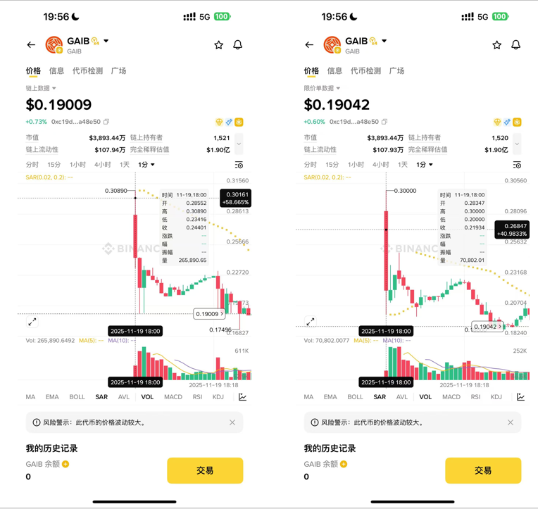
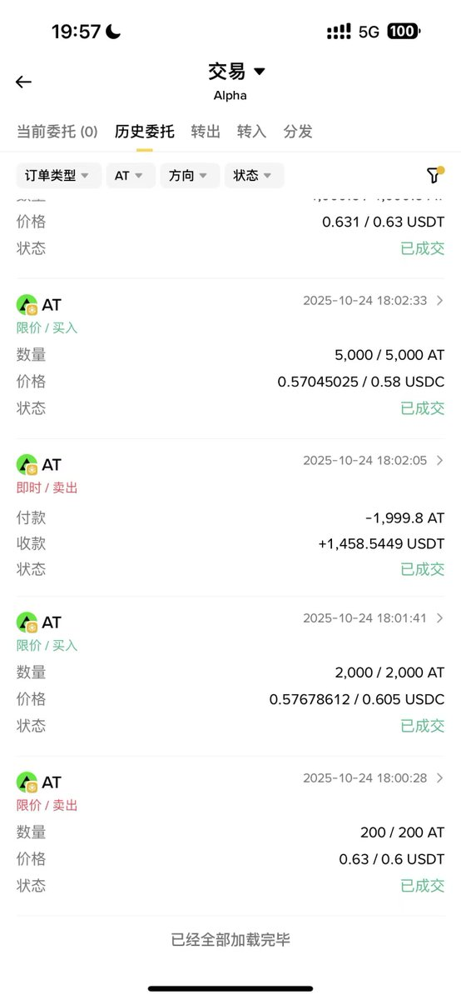

# 幣安 Alpha 套利策略：新幣限價套利與盤前合約套利

> **來源**: [@fivepointwater5](https://x.com/fivepointwater5/status/1991486483379953990)
>
> **日期**: 
>
> **標籤**: `套利` `幣安Alpha` `市場微觀結構`

---

> **來源**: [@fivepointwater5 (五点水)](https://x.com/fivepointwater5)
> **日期**: 2026-02-14
> **標籤**: `binance-alpha` `套利` `新幣上線` `盤前合約` `限價單`

---

## 策略總覽

| 策略類型 | 風險等級 | 收益潛力 | 容量 | 適用時機 |
|---------|---------|---------|------|---------|
| 新幣限價套利 | 高 | 高 | 小 | 新幣上線初期（限價單與即時單價差大時） |
| 盤前合約套利 | 低 | 高 | 大 | 有盤前合約且低開/平開時 |

---

## 策略一：新幣限價套利（高風險高報酬）

### 原理

新幣開盤時，市場參與者傾向於砸限價單而非鏈上即時單，導致：
- 限價單價格遠低於即時單價格
- USDC 交易對因流動性較少，價格被砸得更嚴重

### 操作步驟

1. **觀察開盤價格**：關注新幣上線初期的價格波動
2. **限價單買入**：在幣安 Alpha 使用限價單低價買入
3. **即時單賣出**：立即透過鏈上即時單高價賣出
4. **時機選擇**：避開開盤前幾秒（此時鏈上與限價單都在快速下跌）

### 風險點

| 風險 | 說明 |
|------|------|
| **價格砸盤過快** | 幾秒鐘內價差已消失，操作時間不足 |
| **即時單繁忙** | 幣安系統提示繁忙，無法及時賣出，幣砸在手中 |

### 實戰注意

- 操作速度要求極高，需在數秒內完成買賣
- 系統延遲（如提示繁忙）可能導致套利失敗
- 適合經驗豐富且反應快速的交易者

---

## 策略二：盤前合約套利（低風險高報酬）

### 前提條件

必須同時滿足兩個條件：
1. **有盤前合約**：該幣種已開放盤前合約交易
2. **低開或平開**：幣安 Alpha 價格 ≤ 盤前合約價格

### 原理

幣安上幣流程通常為：Alpha → 盤前合約 → 現貨
- 市場預期現貨上線後會有砸盤壓力，合約提前開空
- 歷史數據顯示，現貨開盤時合約價格通常等於或低於現貨價格（出現負溢價）
- 例如：KITE 和 MMT 開盤時合約出現 1-10% 負溢價

### 操作步驟

1. **監控價差**：比對幣安 Alpha 價格與盤前合約價格
2. **發現機會**：當 Alpha 價格 ≤ 盤前合約價格時
3. **建立對沖**：
   - Alpha 現貨買入
   - 合約開空（同等數量）
4. **等待收斂**：持有至價格收斂或現貨上線
5. **進階操作**：膽大者可持有至幣安現貨上線

### 風險點

| 風險 | 說明 |
|------|------|
| **手續費虧損** | 價差未如預期收斂，最多虧損手續費 |
| **合約高溢價** | 理論上可能出現合約高於現貨（但作者表示從未遇過，且會被套利者迅速抹平） |

### 優勢

- **低風險**：對沖倉位鎖定風險
- **高確定性**：歷史數據支持價格收斂邏輯
- **容量大**：相較於策略一，可容納更大資金量
- **Alpha 未開放交易 API**：目前仍有套利空間

---

## 關鍵提示

1. **策略一適合追求極致收益且能承受高風險的短線交易者**
2. **策略二適合穩健型交易者，但需耐心等待合適機會**
3. **兩種策略都要求對幣安 Alpha 機制有深入了解**
4. **Alpha 未開放交易 API 是目前套利空間存在的重要原因**
