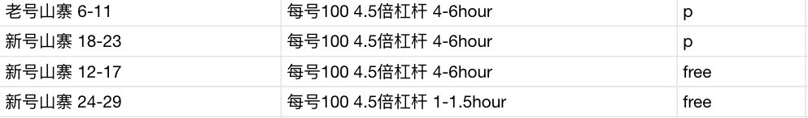
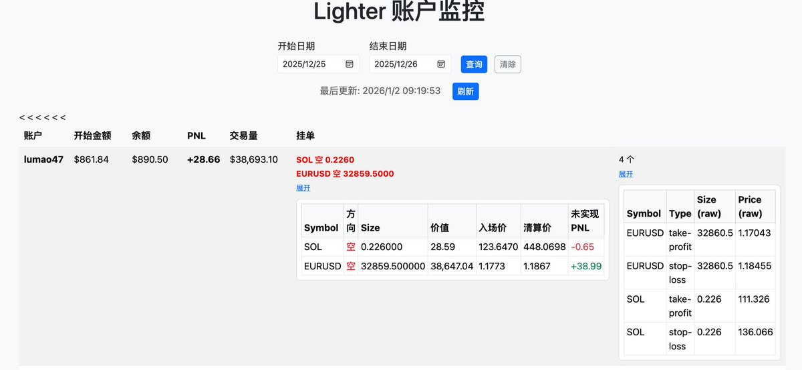

# Lighter 空投撸毛策略與風控實踐

> **來源**: [@crazytidy](https://x.com/crazytidy/status/2006906248663294297)
>
> **日期**: Fri Jan 02 01:51:50 +0000 2026
>
> **標籤**: `套利策略` `風險管理` `女巫防護`

---

# Lighter 空投撸毛策略與風控實踐

> **來源**: [@crazytidy (套利法则 && Rule Of Arbitrage)](https://x.com/crazytidy)
> **日期**: 2025-02-14
> **標籤**: `Lighter` `空投策略` `量化交易` `風控機制` `女巫防護`

---

## 專案背景

作者從 2024 年 8 月開始參與 Lighter 空投活動，初期隨意操作後暫停，11 月正式投入並將成本控制在 10u/分。整個策略開發歷時半個月，包含策略設計、風控機制與女巫防護三大核心。

## 一、核心策略設計

### 1. 五因子積分模型

Lighter 的積分計算不僅考察交易量，還包含持倉量和幣種選擇，核心公式為：

**積分 = a1×持倉量 + a2×持倉時間 + a3×幣種 + a4×交易量 + a5×帳號類型**

測試方法：
- 每個因子使用 6 個帳號進行獨立測試（見圖一）
- 6 個帳號設計用於對沖交易與隨機策略（防女巫）
- 每週篩選權重最大的因子

### 2. 測試結論

| 因子 | 權重評估 | 實測數據 | 結論 |
|------|----------|----------|------|
| **交易量** | 極低 | 400u×20 倍槓桿，淨持倉一週 0.7 分；刷 4-6 小時交易僅 1 分，損耗萬三 | 幾乎無用，損耗巨大 |
| **持倉量** | 最高 | 最後一週 3w 淨持倉給 7 分；3w 持倉刷 4-6 小時交易給 10 分，損耗 20u/分 | 淨持倉幾乎無損耗，最佳選擇 |
| **高頻做市** | 負收益 | 損耗 = 2×積分 | 完全不可行 |

**關鍵發現**：刷交易量完全沒用，這也是「想加錢都不行」的原因。

### 3. 最佳幣種選擇

**策略原則**：小幣 + 低波動率

#### 黃金（PAXG）
- **優勢**：小幣積分多、波動率極低（外匯市場 100 倍槓桿標準）
- **操作**：10 倍槓桿開倉可持倉一週不需調整
- **風險**：歷史上有兩次暴力插針事件，必須做好風控

#### 外匯（EUR）
- **優勢**：
  - 槓桿更高（上線即 25 倍，後期開放 50 倍）
  - 波動極小（20 倍槓桿可持倉一週）
- **實測**：30 倍槓桿持倉 2 週，PnL 僅 40（見圖二）
- **現狀**：因俄羅斯假期導致流動性不足，暫無法平倉

### 4. 持倉時間衰減機制

**發現**：持倉積分會隨時間遞減
- 理論上 20 倍槓桿外匯可持倉一個月
- 但積分會逐漸衰減
- **解決方案**：每週至少開關倉一次

---

## 二、四層風控機制

**核心理念**：風控比策略更關鍵，沒有風控遲早虧光

### 第一層：SL/TP 止盈止損
- 每單設置同等步數的止盈止損
- **重大陷阱**：API 下單的 SL/TP 與界面操作完全不同！
  - 即使設置 `enter_price` 和 `price` 也可能不觸發
  - 滑點設置到 10% 仍可能失效
  - **損失**：作者在此損失 1000u

### 第二層：程序化止損止盈
- 用程序實現完整的止盈止損邏輯
- 當價格監控到位時，自動減倉
- 彌補 API SL/TP 的不可靠性

### 第三層：持倉監控
- 監控兩腿持倉是否一致
- 發現不一致時：
  - 自動減倉
  - 發送告警通知

### 第四層：最終風控（緊急熔斷）
- 獨立監控模組
- 監測劇烈價格波動（如 10/11 大餅暴跌）
- 觸發條件時：
  - 全部自動平倉
  - 發送告警通知

---

## 三、女巫防護策略

**成果**：50+ 帳號無一被女巫

### 常見誤區澄清

| 誤區 | 真相 |
|------|------|
| **IP 會被女巫** | Lighter 必須用 VPN，都是公共 IP，無法以此為依據 |
| **多帳號本身有問題** | 關鍵是避免「一致性」而非帳號數量 |

### 核心原則：隨機性設計

**檢測邏輯**：平台主要檢測是否多個帳號在同時間、同幣種交易

**防護方案**：
1. **帳號池隨機**：從帳號池中隨機選取帳號
2. **幣種隨機**：隨機選擇幣種進行對沖
3. **時間隨機**：避免固定時間操作

### 帳戶平衡問題

**問題描述**：
- 對沖一段時間後，帳戶資金分佈不均
- 最高帳戶達到 300u，最低僅剩 20u
- 隨機選到極端帳戶會導致效率極低（只能以最低帳戶為基準開倉）

**解決方案**：排序 + 隨機
- 先對帳戶資金排序
- 在排序基礎上加入隨機性
- 平衡效率與防女巫需求

---

## 四、技術實施經驗

### 開發週期
- 斷斷續續開發半個月
- 修修改改過程中有慘烈損失

### 技術難點

**Lighter 客戶端特殊性**：
- 底層使用 C 庫
- 兩個 Lighter 客戶端會衝突
- **解決方案**：
  - 每個 Lighter 客戶端使用前必須重新實例化
  - 或修改源碼（代價極大）

### 架構建議
- 需要高內聚低耦合的設計理念
- 重構成本高，前期設計要充分

### 致謝
- **@gch_enbsbxbs**：展示非科班也能用 AI 完成複雜開發
- **@yourQuantGuy**：參考其程式碼架構

---

## 關鍵要點總結

| 維度 | 核心策略 | 關鍵數據 |
|------|----------|----------|
| **因子權重** | 持倉量 >> 幣種 >> 帳號類型 >> 持倉時間 >> 交易量 | 淨持倉 3w 給 7 分，刷量損耗 20u/分 |
| **幣種選擇** | 外匯（EUR）> 黃金（PAXG）> 其他 | EUR 30 倍槓桿持倉 2 週 PnL 僅 40 |
| **操作頻率** | 每週至少開關倉一次 | 避免積分時間衰減 |
| **風控層數** | 四層防護機制 | API SL/TP 不可靠，損失 1000u |
| **女巫防護** | 隨機性 > IP/設備指紋 | 50+ 帳號無一被女巫 |
| **成本控制** | 10u/分 | 淨持倉策略幾乎無損耗 |
