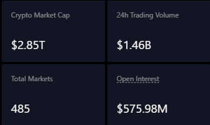
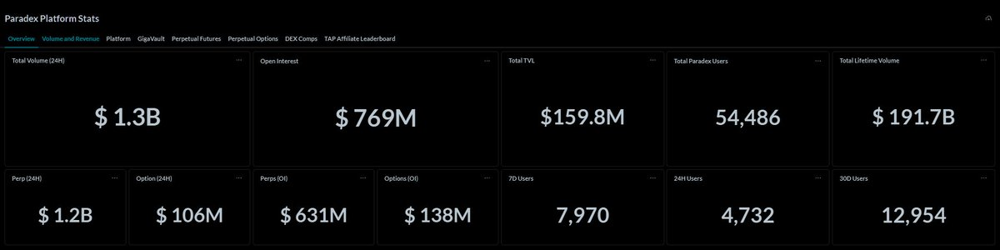

# Paradex 和 Variational：下一個 Lighter 的領跑者

> **來源**: [@Akriixx](https://x.com/Akriixx/status/2006676272676495589)
>
> **日期**: 
>
> **標籤**: `永續期貨` `套利機會` `生態分析`

---

# 市場下一個領跑者：Paradex 與 Variational

> **來源**: [@Akriixx](https://x.com/Akriixx)  
> **日期**: 2026-01-15（推估）  
> **標籤**: `perpetual-dex` `paradex` `variational` `lighter` `airdrop`

---

## 核心觀點總覽

| 項目 | Paradex | Variational |
|------|---------|-------------|
| **定位** | Lighter 模式的即時複刻 | Lighter 早期階段的翻版 |
| **成長階段** | 快速擴張，OI 已達 Lighter 的 50% | 健康成長曲線，靜默吸引大資金 |
| **核心優勢** | 零手續費、隱私、創新、精英代幣經濟學 | 巨量交易增長、清晰激勵設計、點數機制完美對齊 |
| **一月預期** | 指標翻倍或三倍不意外 | 在主流發現前持續吸引規模資金 |

---

## Paradex：Lighter 模式的即時複刻

市場不斷有人問：「下一個 Lighter 是誰？」Extended？Edgex？Pacifica？

實際上，有兩個名字遠遠領先其他競爭者，其中 **Paradex** 最為顯眼。

### 關鍵指標

- **未平倉合約（OI）**：已達 Lighter 的一半規模
- **成長趨勢**：每週指標持續加速
- **產品優勢**：
  - 零手續費交易
  - 隱私保護
  - 持續創新
  - 精英級代幣經濟學設計

### 成長預期

Paradex 正在「即時重現 Lighter 的成長路徑」。對於關注市場動態的人來說，**一月份指標翻倍甚至三倍都不會令人意外**。

---

## Variational：Lighter 早期階段的翻版

如果說 Paradex 是「Lighter 藍圖」的複刻，那麼 **Variational** 就是「Lighter 早期階段」的再現。

### 核心特徵

- **交易量**：呈現大幅成長
- **激勵設計**：清晰且有效的點數系統
- **點數生態**：與市場熱點完美對齊
- **用戶曲線**：在整個永續期貨生態中最健康之一

### 市場定位

Variational 在主流市場察覺之前，**正靜默地吸引大規模資金入場**，展現出與 Lighter 早期相似的成長軌跡。

---

## 市場輪動方向

**停止過度複雜化分析，直接看市場資金流向：**

- 兩者都擁有強勁動能（momentum）
- 兩者都展現實際牽引力（traction）
- 兩者的資金流都在 Lighter 之後持續對齊市場趨勢

**結論：Paradex 和 Variational 正在領跑 post-Lighter 時代的永續期貨交易所競爭。**
