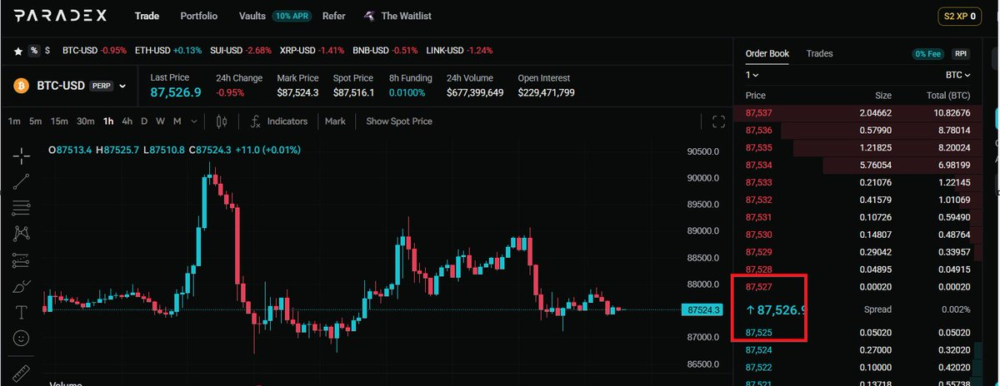

# Paradex 積分刷分策略與實踐指南

> **來源**: [@LumaoDoggie](https://x.com/LumaoDoggie/status/2006742759621931026)
>
> **日期**: 
>
> **標籤**: `持倉對沖` `交易刷量` `RPI機制`

---

# Paradex 積分刷分策略與實踐指南

## 概覽

| 項目 | 說明 |
|------|------|
| **TGE 時間** | 預計 1 月底 |
| **OTC 價格** | 0.2U/分 |
| **核心策略** | 對沖持倉為主 + 交易刷量輔助 |
| **持倉效率** | 山寨幣 > BTC/ETH（約 5 倍以上） |
| **衰減周期** | 每 5 天效率減半，需定期換血 |
| **刷量磨損** | 理論萬 0.1，RPI 機制可降至萬 0.05 |

---

## 持倉策略

### 基本設定

- **對沖持倉組合**：BTC/ETH/BNB/SOL + 部分山寨幣混合
- **槓桿倍數**：約 15 倍，安全過夜
- **帳戶配置**：兩個帳戶對沖（類似 Grvt 模式）
- **監控工具**：建議自己 vibe coding 一個監控腳本

### 幣種選擇策略

| 幣種類型 | 給分效率 | 磨損風險 | 適用場景 |
|----------|----------|----------|----------|
| BTC/ETH/SOL 大幣 | 基準 | 低 | 穩健型 |
| 山寨幣 | 5 倍以上 | 較高 | 效率優先型 |
| BNB | 高於 BTC/ETH | 中 | 平衡型 |

**重點**：不要全部用大幣持倉，適當增加小幣 OI 持倉可大幅提升效率，但需自行權衡磨損風險。

### 衰減周期與換血機制

- **衰減規律**：同樣倉位，每 5 天積分效率減少一半
- **應對策略**：每幾天進行一次「換血」（開倉減倉）
- **關鍵技巧**：開平倉時需計算並減小磨損

---

## 交易刷量策略

### 基本原理

在行情穩定時，利用 bid/ask 價差進行對沖交易。

**範例計算**：
- 買賣 1 BTC 價差 2U
- 理論磨損：8.7 萬交易量磨損 1U（約萬 0.1）
- RPI 機制優化後：可降至萬 0.05

### RPI 機制

**什麼是 RPI**：
在行情極穩定時，可能出現帳戶 A 買價 87527、帳戶 B 賣價也是 87527 的情況，達成 0 磨損。交易記錄中會顯示 RPI 字樣。

**捕捉方式**：
- **手動**：肉眼盯盤發現機會
- **自動**：監聽官方 WebSocket，自動下單
  - ⚠️ **注意**：不要用官方 API（有萬 2 手續費）

### 大幣 vs. 小幣刷量對比

| 幣種 | 磨損率 | 給分倍數 | 綜合效率 |
|------|--------|----------|----------|
| BTC 大幣 | 萬 0.5 | 1x | 基準 |
| 小幣 | 萬 3 | 10x | 可能更划算 |

**風險提示**：
- 免費帳戶下單有 500ms 延迟
- 小幣流動性差，容易被機器人夾子夾單
- 測試小幣刷量時先小額試水

---

## 最佳實踐總結

### 核心策略

1. **持倉為主**：山寨幣對沖持倉效率 > BTC/ETH 對冲持倉
2. **刷量輔助**：每天在相對穩定時段，花半小時刷交易量
3. **交易量目標**：每天刷到持倉 OI 的 20% 左右
4. **組合效應**：持倉 + 交易 的給分效率 >> 單純持倉或單純交易（看起來更像真實用戶）

### 幣種優先級

- **大幣中**：BNB 給分 > BTC/ETH
- **整體**：適量山寨幣 > 純大幣組合

### 週期性測試

- **時間點**：每週四（週五出分前）
- **操作**：新建十幾個小號測試不同策略
- **測試內容**：各種幣的 OI/交易/爆倉最後給的分
- **原因**：Paradex 每隔幾週會改變給分規則

### 積分變現策略

- **即時變現**：OTC 出 75%
- **長期持有**：剩餘 25% 拿著等 TGE

---

## 注意事項

⚠️ **關鍵風險點**：
- 小幣夾子嚴重，測試時先小額
- 免費帳戶下單延遲 500ms
- 需要良好的手速同步兩邊下單
- 持倉衰減需定期調整

💡 **效率提升技巧**：
- 自建監控腳本
- 利用 WebSocket 而非 API
- 週期性測試新策略
- 持倉與交易結合
