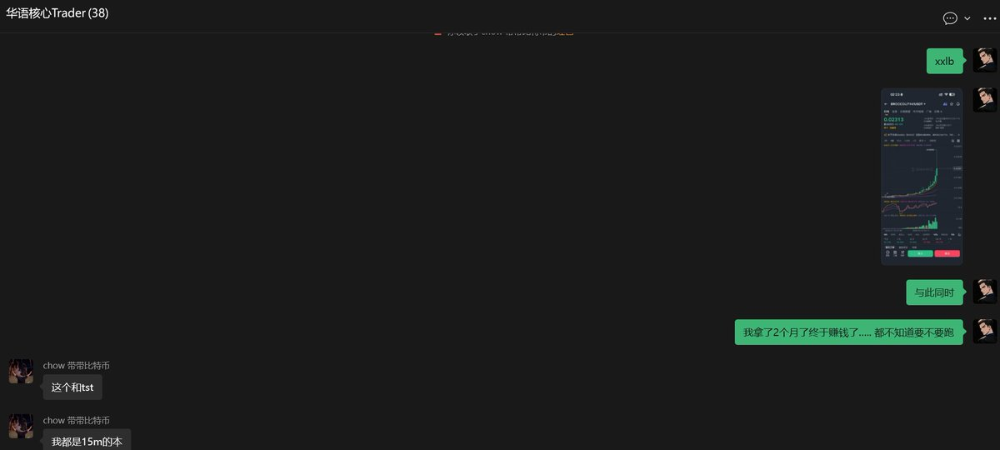
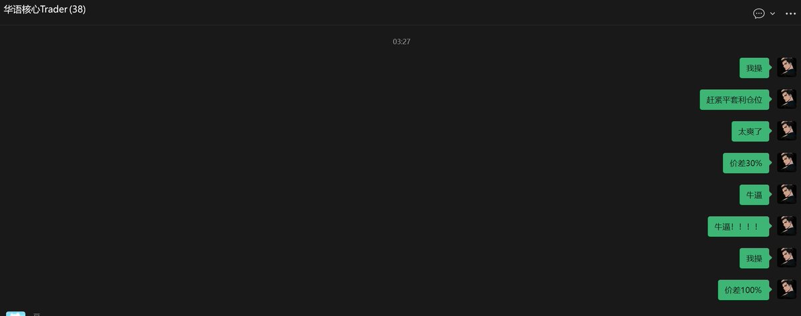
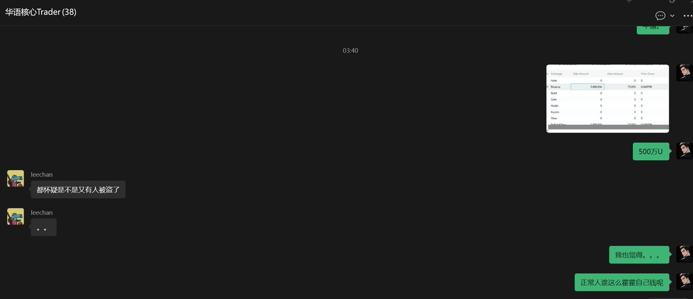

# BROCCOLI714 駭客事件套利復盤：100 萬美元交易記錄

> **來源**: [@Vida_BWE](https://x.com/Vida_BWE/status/2006476958360809930)
>
> **日期**: Wed Dec 31 21:26:00 +0000 2025
>
> **標籤**: `現貨合約套利` `市場異常監測` `風險管理`

---





# BROCCOLI714 駭客事件套利復盤：100 萬美元交易記錄

> **來源**: [@Vida_BWE (Vida)](https://twitter.com/Vida_BWE)
> **日期**: 2026-02-14
> **標籤**: `套利` `資金費率` `訂單簿分析` `風險監測` `現貨合約價差`

---

## 交易概述

| 項目 | 數據 |
|------|------|
| 總收益 | 100 萬美元 |
| 初始持倉 | 20 萬美元（0.016 成本） |
| 套利倉位 | 50 萬美元（開倉均價 0.015） |
| 執行時間 | 數分鐘內 |
| 套利類型 | 現貨合約價差 + 資金費率套利 |

## 前置準備

### 持倉結構

- **長期囤幣倉位**：20 萬美元的 BROCCOLI714（成本 0.016，建倉於 11 月初）
  - 現貨 + 合約組合持倉
  - 建倉後即被套牢

- **資金費率套利倉位**：50 萬美元 BROCCOLI714USDT 永續合約
  - 開倉均價：0.015
  - 幣安合約資金費率套利策略

### 監測系統

1. **快速拉升警報**
   - 觸發條件：1800 秒內漲幅超過 30%
   - 設置原因：莊家操盤風格為快速拉升後大陰線出貨

2. **價差警報**
   - 監測現貨與合約價差異常
   - 即時通知機制

## 事件時間軸

### 1. 異常發現（價差出現）

當現貨和合約巨大價差出現時：
- 短時間漲幅警報程序觸發
- 現貨合約價差警報同步觸發
- 立即進入實戰狀態

### 2. 初步判斷（訂單簿分析）

**幣安現貨 vs 合約深度對比**：

| 市場 | Bid 10% 深度 |
|------|--------------|
| 幣安現貨 | 500 萬 USDT |
| 幣安合約 | 5 萬 USDT |

**關鍵發現**：
- BROCCOLI714 當時市值僅 40M
- 幣安主站訂單簿 Bid 掛單高達 2600 萬 USDT
- 深度比例嚴重失衡（現貨：合約 = 100:1）

### 3. 異常判斷（風險識別）

**三大異常信號**：

1. **莊家行為不符常理**
   - 歷史操盤風格：不會不顧價差暴力拉升現貨
   - 正常莊家不會在現貨市場做慈善式掛單

2. **訂單簿異常**
   - 小市值代幣出現巨額買盤
   - 深度分佈極度不平衡

3. **市場推論**
   - 高度懷疑帳戶被盜
   - 或做市程序出現嚴重 Bug

### 4. 執行決策（快速平倉）

**套利倉位變化**：
- 原本：現貨 50 萬 U + 合約 50 萬 U（對沖平衡）
- 價差後：現貨 80 萬 U + 合約 50 萬 U
- **立即平倉所有套利�寸 → 落袋為安 30 萬 U**

## 實戰要點

★ Insight ─────────────────────────────────────

**1. 預警系統的價值**
- 提前設置多維度警報（漲幅、價差、深度）
- 關鍵時刻爭取到寶貴的決策時間
- 自動化監控 > 人工盯盤

**2. 訂單簿深度分析**
- 現貨/合約深度比例是異常判斷的核心指標
- 小市值代幣出現超比例買盤 = 高風險信號
- Bid/Ask 深度分佈可識別莊家行為模式

**3. 套利倉位的即時決策**
- 價差擴大時對沖倉位會產生浮盈
- 識別異常後立即平倉鎖定利潤
- 不貪戀繼續擴大的價差（風險 > 收益）

─────────────────────────────────────────────────

## 關鍵經驗

### 風險監測

| 監測維度 | 具體指標 | 異常閾值 |
|----------|----------|----------|
| 價格波動 | 短時間漲幅 | 1800 秒內 >30% |
| 價差監控 | 現貨/合約差價 | 異常擴大 |
| 深度分析 | Bid/Ask 深度比 | 嚴重失衡 |
| 市值比例 | 掛單/市值比 | >50% |

### 決策邏輯

```
異常發現 
  → 訂單簿深度分析 
  → 莊家行為判斷 
  → 風險識別（帳戶被盜/程序 Bug）
  → 立即平倉鎖定利潤
```

### 成功因素

1. **完善的監測系統**：提前設置多維度警報
2. **深度分析能力**：快速識別訂單簿異常
3. **果斷執行**：確認異常後立即平倉
4. **套利對沖倉位**：提前佈局的資金費率套利倉位成為主要收益來源

## 教訓總結

- 小幣種需要更嚴格的監控體系
- 價差異常 ≠ 套利機會，可能是重大風險信號
- 訂單簿深度是識別市場異常的核心工具
- 落袋為安優先於繼續博弈更大價差
