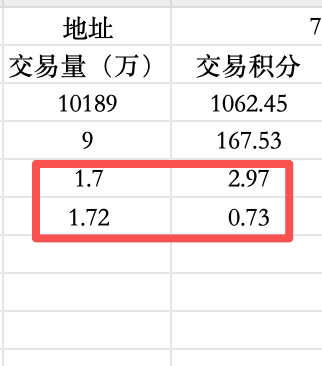

# 多幣種積分農耕策略測試

> **來源**: [@Dex_Jiufeite](https://x.com/Dex_Jiufeite/status/2004409679078994425) | [原文連結](https://twitter.com/Dex_Jiufeite/status/2004409679078994425/photo/1)
>
> **日期**: Fri Dec 26 04:31:22 +0000 2025
>
> **標籤**: `積分農耕` `多幣種持倉` `交易量`

---



```markdown
## 策略概述

交易者 @Dex_Jiufeite 分享了在 Variational.io 平台上進行**多幣種持倉積分農耕**的初步測試結果。策略特點如下：

| 要素 | 說明 |
|------|------|
| **策略類型** | 多幣種持倉（小額交易量） |
| **快照時間** | 每週四早上 8 點 |
| **發放時間** | 每週五早上 8 點 |
| **測試階段** | 初期測試，尚未計算盈虧 |
| **下一步** | 加大交易量規模，觀察效率變化 |

## 操作重點

1. **持倉為主**：主要透過持倉多種幣種累積積分，非高頻交易刷量
2. **小額起步**：初期以小額交易量測試機制可行性
3. **定時快照**：配合平台每週四的交易量快照時間
4. **規模測試**：計畫逐步加大交易量，驗證積分獲取效率

## 關鍵觀察

- 採用**多幣種分散持倉**策略，降低單幣種風險
- 交易量較小的情況下仍可參與積分農耕
- 尚未進行盈虧計算，重點在驗證機制
- 後續將加大規模以測試最佳參數

---

**備註**：作者提供的數據圖表包含個人持倉與積分數據，具體數值未公開詳述。策略仍在測試階段，適合作為多幣種積分農耕的初步參考案例。
```
