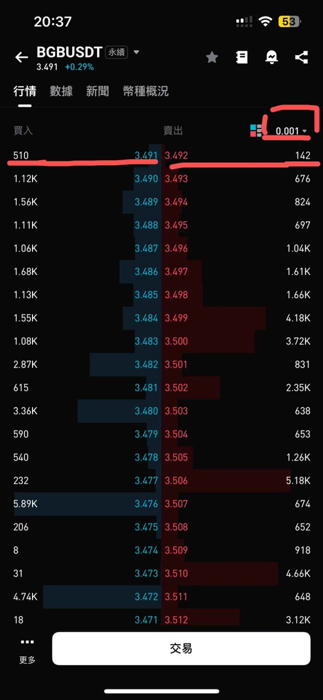
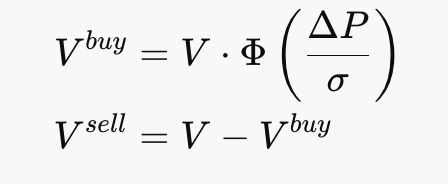
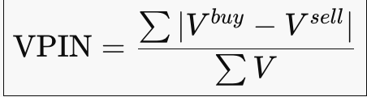

# 進擊的做市商 2：訂單簿與訂單流

> **來源**: [@bc1qDave](https://x.com/bc1qDave/status/2003638312201044072)
>
> **日期**: Wed Dec 24 01:26:14 +0000 2025
>
> **標籤**: `做市商` `訂單簿` `訂單流`

---






★ Insight ─────────────────────────────────────
這是一篇關於做市商運作機制的深度技術文章。核心概念包括：
1. **限價訂單簿 (LOB)** - 做市商的實際戰場，而非 K 線圖
2. **點差的三大成本** - 不只是利潤，背後是風險與成本的定價
3. **訂單流毒性 (Toxic Flow)** - 做市商如何防範「知情交易者」的攻擊
─────────────────────────────────────────────────

## 一、限價訂單簿 (Limit Order Book, LOB)

做市商的戰場不是 K 線圖，而是**限價訂單簿 (LOB)**。

### 核心概念

| 概念 | 說明 |
|------|------|
| **深度 (Depth)** | 每一層價格上的掛單量 |
| **步長 (Tick Size)** | 價格變動的最小單位，在高頻環境中對排隊策略至關重要 |
| **價格改進 (Price Improvement)** | 當你提供的價格優於當前最優買賣價 (NBBO) 時，你就為市場創造了價值 |

**價格改進範例**：假設 BTC bid 是 10 萬，ask 是 11 萬，若你以 10.1 萬價格出價，你就縮小了 spread，為市場創造了價值。

### 訂單簿結構觀察

以 BGB 的真實訂單簿為例：

- **最小步長**：0.001
- **盤口深度**：約 1000 多美元
- **價差控制**：控制在最小 tick size
- **深度分布**：
  - **小步長視角**：呈現「聖誕樹」形狀，越遠離盤口單量越大
  - **大步長視角**：呈現「喇叭」形狀，離盤口越近單量越大、流動性越足

> 💡 **關鍵洞察**：10/11 事件中的「流動性真空」，部分原因就是遠離盤口的掛單稀少。

---

## 二、做市商盈利來源：點差 (Spread)

點差不僅僅是利潤，它主要由**三部分成本**構成：

| 成本類型 | 說明 |
|----------|------|
| **訂單處理成本 (Order Processing)** | 交易所手續費、硬件延迟、人力 |
| **庫存風險 (Inventory Risk)** | 持有頭寸期間價格對自己不利的風險（上一集已講） |
| **逆向選擇成本 (Adverse Selection)** | **最核心** - 成交時對方可能掌握了你不知道的信息（被內幕哥陰了） |

### 點差的三種類型

1. **Quoted Spread（報價點差）**：最直觀的 ask - bid 價差
2. **Effective Spread（有效點差）**：實際成交價與中位價的差距
3. **Realized Spread（實現點差）**：衡量做市商在價格調整後實際留下的利潤

**實現點差公式**：
```
2 × (P_trade – P_futuremid)
```
這裡包含了**未來的中位價**，有點像考慮機會成本。

---

## 三、訂單流 (Order Flow)

訂單流是做市商收到的下單。做市商會對訂單流進行各種操作（對沖、匹配、調整掛單等），以管理自己的賬本 (book)。

這是一個相當深的主題，涉及專業概念和操作技巧，甚至還會涉及法律問題。例如：
- **Agency trade 不能和 Principle trade 做對手方**，due to conflict of interest（但幣圈不管這塊）

本文重點介紹**訂單流毒性**與 **VPIN 指標**。

### 訂單流的兩種類型

| 流量類型 | 說明 | 做市商態度 |
|----------|------|------------|
| **有毒流量 (Toxic Flow)** | 來自知情交易者的訂單，他們知道價格即將變動，造成 realized spread 損失 | ⚠️ 需要防範 |
| **無毒流量 (Noise/Retail Flow)** | 來自散戶或被動調整權重的基金 | ✅ 最喜歡的「口糧」 |

### 做市商的防毒機制

**簡單防禦策略**：
假設所有主動訂單都是有毒的。假設有人買入 → MM 立刻下調 reservation price，報價整體下移。

> 💡 **這解釋了為什麼散戶常買在高點**：因為做市商會風控調整報價。

**但如果內幕哥大量買入呢？**
仗著信息優勢頭鐵沖擊盤口 → 這可能就是 10/11 事件發生的原因，也是資產百億的大 MM 沒接住盤的原因。

---

## 四、核心指標：VPIN (Volume-weighted Probability of Informed Trading)

### VPIN 的含義

**VPIN ≈ 當前市場中，做市商被「單向流量持續擊中」的概率**

當出現大量單邊壓力時：
- MM inventory 單邊累積
- Mean reversion（均值回歸）假設失效
- MM 會**撤單 (Pull quotes)**，暫時不提供流動性，等待 order flow 恢復對稱

### VPIN 異常時的應對策略

| 策略 | 說明 |
|------|------|
| **撤單 (Pull quotes)** | 暫時不提供流動性 |
| **擴大點差 (Widen spread)** | 相當於多賺點服務費來彌補價位賠錢 |
| **縮小 size** | 控制 inventory 累積速度 |

### 10/11 慘案的成因

**萬一沒等來 order flow 恢復對稱？或者 order flow 偏移太離譜直接把自己爆倉？**
→ 這就是 10/11 慘案。

---

## 五、從散戶視角到機構視角

### 散戶常見疑問的解答

1. **為什麼買入山寨幣後短時間內老是水逆？**
   → 做市商的防毒機制會在你買入後立即下調報價

2. **為什麼看似資金巨無霸的做市商接不住 10/11 的賣單？**
   → VPIN 異常 + 單邊流量持續擊中 + Mean reversion 失效

3. **為什麼 10/11 後聊的 MM，每個都雲淡風清的說自己當天沒虧/反倒賺了？**
   → 專業的風控機制：提前撤單、擴大點差、控制倉位

### 下集預告

> 如果我們進入咒術回戰的世界，訂單流是「咒力」，報價操作是「術式」，那麼下一篇，我們將看看做市中的「**領域展開**」。

---

## 關鍵術語對照

| 中文 | 英文 | 說明 |
|------|------|------|
| 限價訂單簿 | Limit Order Book (LOB) | 做市商的戰場 |
| 深度 | Depth | 每層價格上的掛單量 |
| 步長 | Tick Size | 價格變動最小單位 |
| 價格改進 | Price Improvement | 提供優於 NBBO 的價格 |
| 點差 | Spread | ask - bid 的價差 |
| 訂單處理成本 | Order Processing Cost | 手續費、延遲、人力 |
| 庫存風險 | Inventory Risk | 持倉期間價格不利風險 |
| 逆向選擇成本 | Adverse Selection Cost | 被知情交易者攻擊的成本 |
| 有毒流量 | Toxic Flow | 來自知情交易者的訂單 |
| 無毒流量 | Noise/Retail Flow | 來自散戶的訂單 |
| VPIN | Volume-weighted Probability of Informed Trading | 單向流量持續擊中的概率 |
